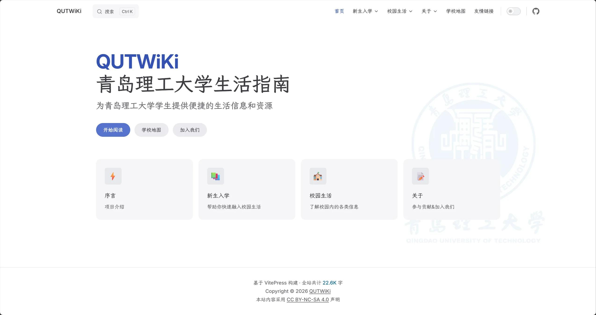

# Friend Links

This site and various university Wiki sites watch over each other, sharing bits of campus life. Below are our friend sites; click the card to visit.

<h3 class="friend-card__name">Qingdao University of Technology Life Guide</h3>

wiki.quters.top

Provides convenient life information and resources for Qingdao University of Technology students.

!!! tip "Apply for Friend Links"
    We welcome university Wiki sites to apply for mutual friend links. For details, please see [Friend Link Application Guide](guide.md).
