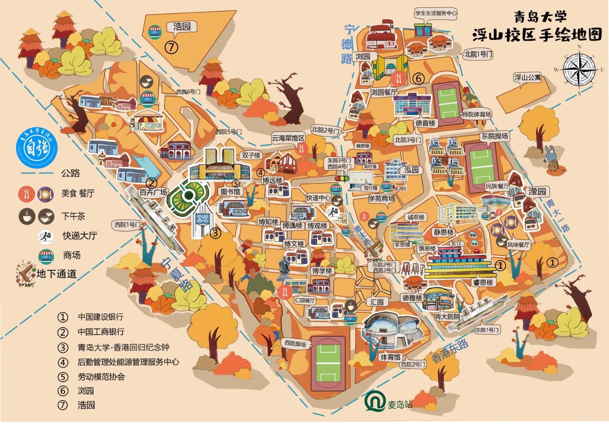
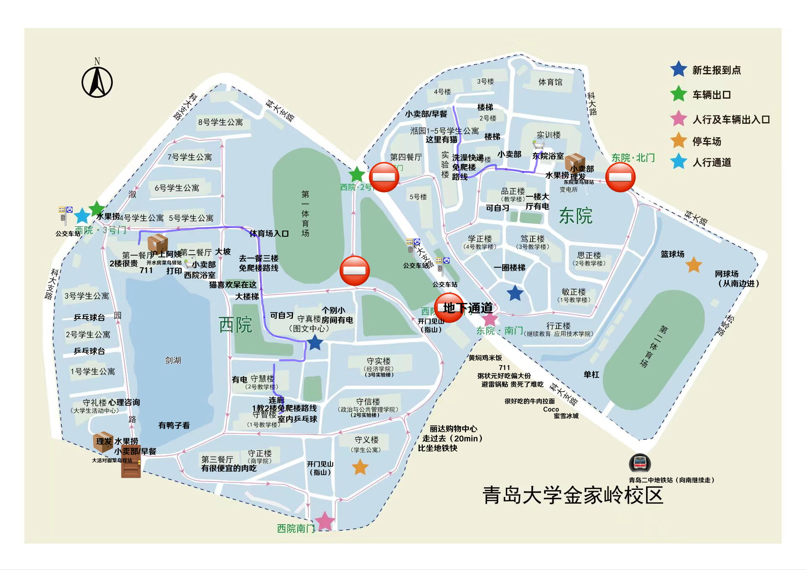

# Campus Map

# Campus Map 🗺

> This page summarizes the distribution of Qingdao University's campuses, affiliated colleges, major buildings, and common locations for quick campus orientation. Information is compiled from QDU-Wiki (github.com/IceofTea/QDU-Wiki) source content; please refer to the university's latest official notices.

---

## Overview of Three Campuses

### Fushan Campus (Main Campus)

- Address: No. 308 Ningxia Road, Shinan District, Qingdao (Zip Code 266061)
- Position: Main campus (formerly central campus), where most colleges register
- Colleges: School of Marxism, School of History, School of Education Sciences, School of Physical Education, School of Mathematics and Statistics, School of Chemistry and Chemical Engineering, School of Life Sciences, School of Mechanical and Electrical Engineering, School of Automation, School of Electronic Information, School of Textiles and Clothing, Qingdao Medical College, School of Arts, Drake Joint College, etc.

### Jinjialing Campus (Freshman Concentration Campus)

- Address: No. 62 Keda Branch Road, Laoshan District, Qingdao (West Campus) / No. 93 Songling Road, Laoshan District, Qingdao (East Campus) (Zip Code 266061)
- Position: Former East Campus, where freshmen are concentrated
- Colleges: School of Economics, School of Law, School of Politics and Public Administration, School of Literature and Journalism, School of Foreign Languages, School of Physical Sciences, School of Materials Science and Engineering, School of Electrical Engineering, School of Computer Science and Technology (freshmen at Jinjialing, sophomores move to Fushan), School of Environment and Geosciences, School of Business

### Songshan Campus (Medical School)

- Address: No. 38 Dengzhou Road, Shibei District (Zip Code 266021)

---

## College → Registration Campus Overview (Reference for 2026 Freshmen)

| College | Main Campus | Notes |
| --- | --- | --- |
| School of Marxism | Fushan | Ideological Education, Marxist Theory |
| School of History | Fushan | History (Teacher Education/Regular) |
| School of Educational Science | Fushan | Primary Education, Preschool Education, AI Education, Applied Psychology |
| School of Physical Education | Fushan | Physical Education |
| School of Mathematics & Statistics | Fushan | Mathematics & Applied Mathematics, Applied Statistics, etc. |
| College of Chemistry & Chemical Engineering | Fushan | Applied Chemistry, Chemical Engineering, Chemistry (Teacher Education), etc. |
| School of Life Sciences | Fushan | Biotechnology, Food Science & Engineering |
| College of Mechanical & Electrical Engineering | Fushan | Mechanical Engineering, Intelligent Manufacturing, Measurement & Control, etc. |
| School of Automation | Fushan | Automation, Robotics Engineering |
| School of Electronic Information | Fushan | Electronic Info Engineering, Communication Engineering, Microelectronics, IC, etc. |
| College of Textiles & Clothing | Fushan | Textile Engineering, Light Chemical Engineering, Fashion Design, etc. |
| Qingdao Medical School | Fushan | Clinical Medicine, Oral Medicine, Medical Laboratory, Pharmacy, Nursing, etc. |
| School of Art | Fushan | Music, Music Performance, Dance, Painting, Environmental Design, Visual Communication |
| Drake Joint College | Fushan | CS (Sino-foreign), Biotechnology (Sino-foreign) |
| School of Economics | Jinjialing | Economics, Finance, Public Finance, Economic Statistics, International Economics & Trade |
| Law School | Jinjialing | Law, Law (Outstanding Innovation Class for Foreign-related Rule of Law) |
| School of Politics & Public Administration | Jinjialing | Administration, International Politics |
| School of Literature & Journalism | Jinjialing | Chinese Language & Literature, Journalism, TV Directing, etc. |
| School of Foreign Languages | Jinjialing | English, Japanese, German, Korean, French, Spanish, etc. |
| School of Physical Sciences | Jinjialing | Applied Physics, Optoelectronic Info Science & Engineering, New Energy, etc. |
| School of Materials Science & Engineering | Jinjialing | Polymer Materials, Composite Materials, Intelligent Materials & Structures |
| School of Electrical Engineering | Jinjialing | Electrical Engineering and Automation |
| College of Computer Science & Technology | Jinjialing (freshmen) | Moving to Fushan from sophomore year |
| School of Environmental & Geographic Sciences | Jinjialing | Environmental Science & Engineering |
| Business School | Jinjialing | Business Administration, Accounting, Tourism Management, Standardization Engineering, etc. |
