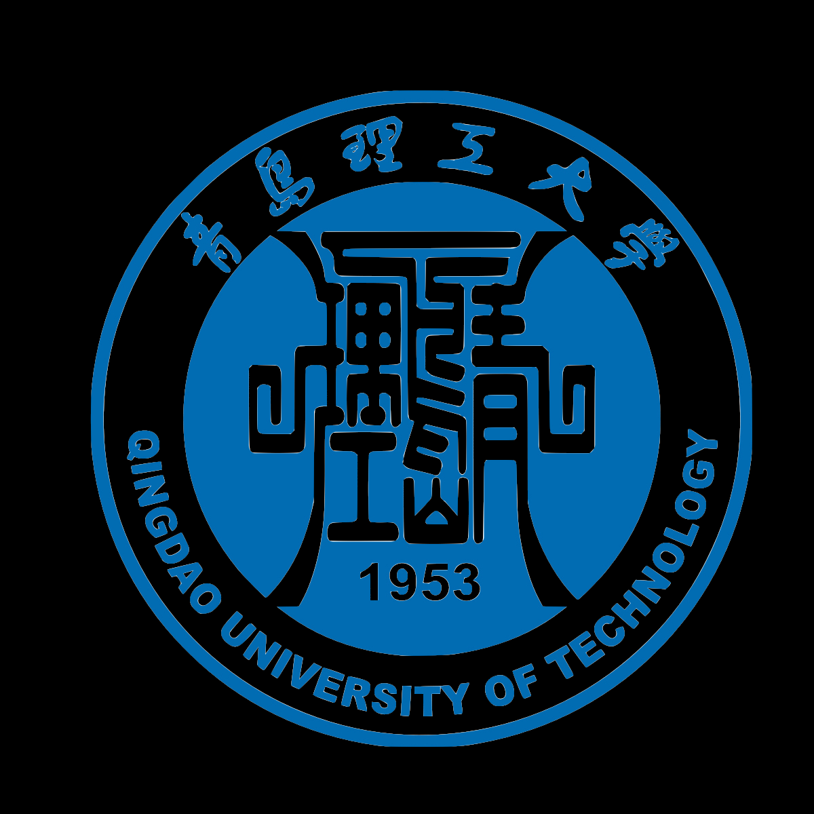
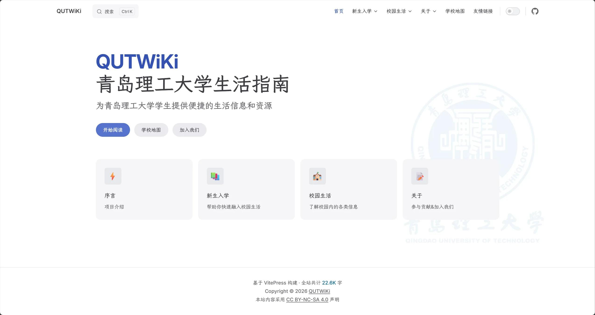

# 友情链接

本站与各高校 Wiki 站点互相守望，分享校园生活的点滴。以下是我们的好友站点，点击名称即可访问。

<a href="https://wiki.quters.top" target="_blank" class="friend-card" markdown>

{ loading=lazy }

<h3 class="friend-card__name">青岛理工大学生活指南</h3>

wiki.quters.top

为青岛理工大学学生提供便捷的生活信息和资源。

{ loading=lazy }

</a>

!!! tip "申请友链"
    我们欢迎各高校 Wiki 站点申请互换友链。详情请查看 [申请友链说明](guide.md)。