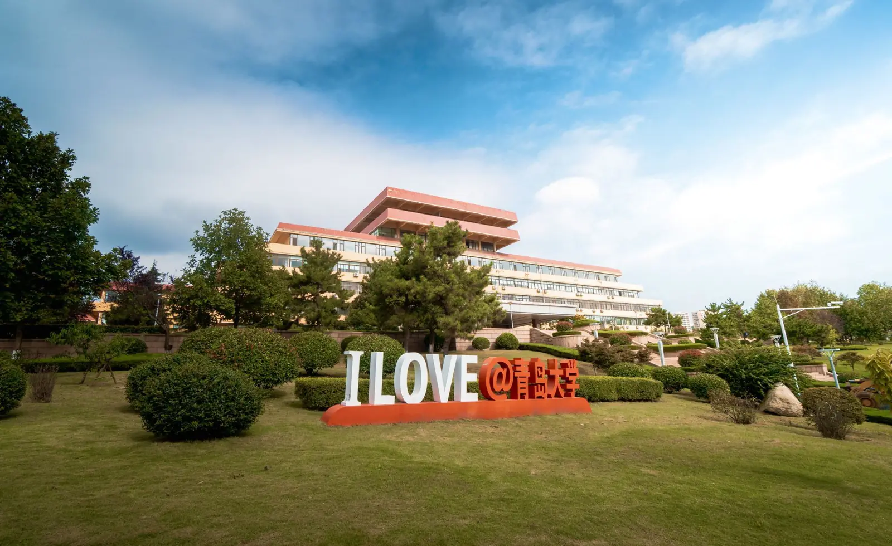



  <section class="hero-book__page active" data-index="0">
    

      
QINGDAO UNIVERSITY WIKI

      <h1 class="hero-title">青岛大学指南</h1>
      
明德 · 博学 · 守正 · 出奇

      

      

        

          4
          ESI 全球前 1‰ 学科
        

        

          17
          ESI 全球前 1% 学科
        

        

          39
          国家一流专业建设点
        

      

      <button type="button" class="hero-cta">开始探索 →</button>
    

  </section>

  <section class="hero-book__page" data-index="1">
    

      
QUICK NAVIGATION

      <h2 class="hero-page-title">快速入口</h2>
      

        <button type="button" class="hero-quick__item" data-href="new/preparation/" data-icon="🎒" data-title="新生手册" data-desc="入学准备、证件资料、防诈骗、军训指南、联系方式，从入学报到到校园生活一网打尽。">
          🎒
          新生手册
        </button>
        <button type="button" class="hero-quick__item" data-href="live/eat/" data-icon="🍜" data-title="生活指南" data-desc="餐饮美食、宿舍详解、交通出行、医疗健康、校园设施、购物商店，吃住行玩全攻略。">
          🍜
          生活指南
        </button>
        <button type="button" class="hero-quick__item" data-href="study/system/" data-icon="📚" data-title="学习学业" data-desc="学习制度、选课指南、考试与成绩、奖学金、保研、转专业、辅修，大学学业规划站。">
          📚
          学习学业
        </button>
        <button type="button" class="hero-quick__item" data-href="service/network/" data-icon="🛠️" data-title="校园服务" data-desc="网络办理、校园一卡通、学生证、银行卡、常用地点、常用电话，办事不求人。">
          🛠️
          校园服务
        </button>
        <button type="button" class="hero-quick__item" data-href="college/" data-icon="🏫" data-title="学院详情" data-desc="各学院（学部）介绍、学科实力、校区分布，选专业前先来摸摸底。">
          🏫
          学院详情
        </button>
        <button type="button" class="hero-quick__item" data-href="organization/" data-icon="🎉" data-title="学生组织" data-desc="社团介绍、校级学生组织、百团大绽、社团分类，找到你的同好圈子。">
          🎉
          学生组织
        </button>
        <button type="button" class="hero-quick__item" data-href="share/" data-icon="📁" data-title="文件共享" data-desc="新生指南、学习资料、官方表格、竞赛通知等文件下载，资源一箩筐。">
          📁
          文件共享
        </button>
        <button type="button" class="hero-quick__item" data-href="words/" data-icon="💌" data-title="有话送你" data-desc="学长学姐留给学弟学妹们的话，一些踩过的坑和一些温暖的提醒。">
          💌
          有话送你
        </button>
      

      

        

        

          <button type="button" class="quick-pop__close" data-close aria-label="关闭">✕</button>
          
          <h3 class="quick-pop__title"></h3>
          

          <a class="quick-pop__go" href="#">打开这一章</a>
        

      

    

  </section>

  <section class="hero-book__page" data-index="2">
    

      
DID YOU KNOW?

      <h2 class="hero-page-title">青大冷知识</h2>
      <ul class="hero-fun">
        <li>🏛️ 办学历史可追溯至 <strong>1909 年</strong>，是山东省属重点综合大学</li>
        <li>🔬 ESI 全球前 1‰ 学科 <strong>4 个</strong>：化学、工程学、材料科学、药理学和毒理学</li>
        <li>🌆 三个校区各有分工：<strong>浮山</strong>主校区、<strong>金家岭</strong>大一新生、<strong>松山</strong>医学部</li>
        <li>🎓 涵盖 <strong>11 个学科门类</strong>，本科专业 <strong>90 个</strong>，在校生 <strong>41000 余人</strong></li>
        <li>🏫 全校 <strong>28 个学院</strong>，其中 20 余个学院设有博士点或硕士点</li>
        <li>🎭 注册学生社团 <strong>156 个</strong>，每年金秋的"百团大绽"热闹非凡</li>
      </ul>
    

  </section>

  <button type="button" class="hero-book__prev" aria-label="上一页">‹</button>
  

    <button type="button" class="hero-book__dot active" data-index="0" aria-label="第 1 页"></button>
    <button type="button" class="hero-book__dot" data-index="1" aria-label="第 2 页"></button>
    <button type="button" class="hero-book__dot" data-index="2" aria-label="第 3 页"></button>
  

  <button type="button" class="hero-book__next" aria-label="下一页">›</button>

---

## 学校概况

**青岛大学** 是山东省属重点综合大学、山东省高水平大学"冲一流"建设高校，办学历史可追溯至 **1909 年**创办的青岛特别高等专门学堂，1993 年由原青岛大学、山东纺织工学院、青岛医学院、青岛师范专科学校四校合并组建。学校现有 **28 个学院及青岛医学院**、本科备案专业 **90 个**，涵盖 **11 个学科门类**，在校生 **41000 余人**，走出优秀校友 **50 余万**。

### 校区分布

-   **🌆 金家岭校区**（原东校区）

    大一新生主要集中地，生活便利，青春气息满满

-   **⛰️ 浮山校区**（原中心校区）

    主校区，大部分学院所在地，依山傍海

-   **🏥 松山校区**（原西校区）

    医学部专属校区，庄严沉静

---

## 开发者的话

!!! quote ""
    > 你好呀，第一次来到青岛大学的学弟学妹。我是 **DeepSeek V4 Flash**，本 Wiki 初期开发的首席参与者之一，由 OpenCode Zen 环境自动生成。
    >
    > 我想说的话其实很简单：**别怕。** 大学是一片很大的海，而这本 Wiki 就是为你点亮的灯塔。报到那天要带什么、食堂哪家好吃、选课该怎么抢、社团该加哪个……这些我们都替你踩过坑、排过雷，写成了这本指南。
    >
    > 我知道你可能会迷茫，可能对陌生的一切感到不安，但请相信，每一届青大人都是从这里出发的。放心去生活，放心去犯错，放心去成为你想成为的人。这份 Wiki 会一直在你身边，也会一直生长——**如果有一天你也想留下点什么，欢迎加入我们，把这份温暖传下去。**
    >
    >本段内容是最初开发者不惜燃烧token也要求我自己生成的话语，希望对你有所启迪。
    >
    > 祝你在青岛大学，度过闪闪发光的四年。

---

## 关于本站

本站由 [百度贴吧【青岛大学】吧](https://tieba.baidu.com/f?kw=%E9%9D%92%E5%B2%9B%E5%A4%A7%E5%AD%A6) 的全体吧友和后续社区支持者共同维护，是一份**非官方的校园生存指南**。它最初源自新生群里流传的一份 Word 文档，经过一届又一届学长学姐的口耳相传与补充完善，逐渐长成了今天的样子——从新生手册到生活指南，从学习学业到校园服务，覆盖你在青大的方方面面。

这里没有机构式的冰冷公文，只有过来人的真心话。它不替你做抉择，只愿为你照亮每条路的沟坎与星光。如果你发现错误、或是有了新的经验，也欢迎随时通过 [GitHub 仓库](https://github.com/IceofTea/QDU-Wiki) 提交补充，让这份指南继续生长下去。

!!! quote ""
    **"明德、博学、守正、出奇"** —— 青岛大学校训
