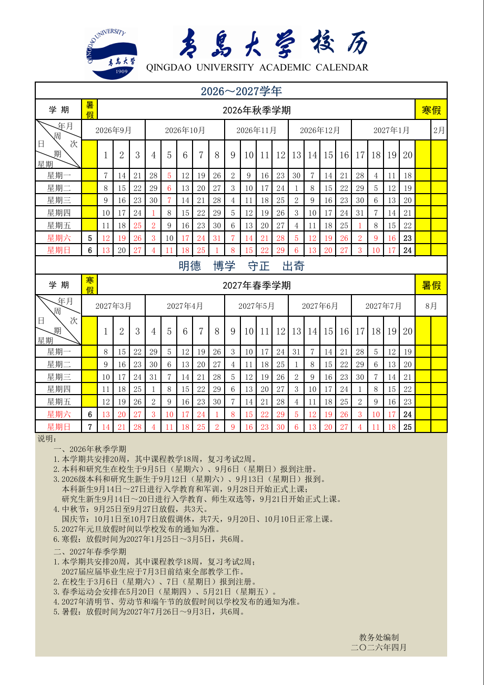
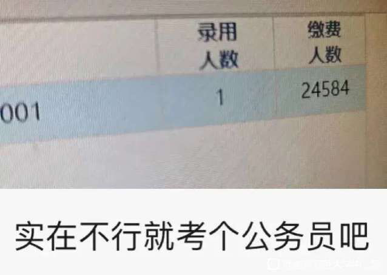

# 青岛大学 Wiki · 校园生存指南（共享文档版）

> 本文档由 **QDU-Wiki**（[github.com/IceofTea/QDU-Wiki](https://github.com/IceofTea/QDU-Wiki)）全站内容整理而成，
> 由百度贴吧【青岛大学吧】吧友与热心校友共同维护，是一份**非官方**的校园生存指南。
> 内容覆盖报到准备、校区选择、军训、选课、考试、宿舍、餐饮、社团等方方面面。
> 信息逐年可能调整，请以学校官方最新通知为准。
>
> **校训：明德、博学、守正、出奇**


---

## 一、学校概况

**青岛大学** 是山东省属重点综合大学、山东省高水平大学"冲一流"建设高校，办学历史可追溯至 **1909 年**创办的青岛特别高等专门学堂，1993 年由原青岛大学、山东纺织工学院、青岛医学院、青岛师范专科学校四校合并组建。学校现有 **28 个学院及青岛医学院**、本科备案专业 **90 个**，涵盖 **11 个学科门类**，在校生 **41000 余人**，走出优秀校友 **50 余万**。

### 校区分布

| 校区 | 原名 | 说明 |
| --- | --- | --- |
| 🌆 **金家岭校区** | 东校区 | 大一新生主要集中地，生活便利，青春气息满满 |
| ⛰️ **浮山校区** | 中心校区 | 主校区，大部分学院所在地，依山傍海 |
| 🏥 **松山校区** | 西校区 | 医学部专属校区，庄严沉静 |

### 青大冷知识

- 🏛️ 办学历史可追溯至 **1909 年**，是山东省属重点综合大学
- 🔬 ESI 全球前 1‰ 学科 **4 个**：化学、工程学、材料科学、药理学和毒理学
- 🌆 三个校区各有分工：**浮山**主校区、**金家岭**大一新生、**松山**医学部
- 🎓 涵盖 **11 个学科门类**，本科专业 **90 个**，在校生 **41000 余人**
- 🏫 全校 **28 个学院**，其中 20 余个学院设有博士点或硕士点
- 🎭 注册学生社团 **156 个**，每年金秋的"百团大绽"热闹非凡


---

## 二、新生手册

---

### 入学准备
#### 报到流程

##### 报到当天需要做什么

报到当天主要是：**新生签到、领取校园卡、领取宿舍钥匙、搬宿舍、熟悉校园、开见面会**等。具体报到时间学校会另行通知，至于几点到——哪个点去人都多，不必纠结。

##### 报到地点

- **计算机科学技术学院等理工科院系**：大一在金家岭校区（东校区），大二统一搬到浮山校区
- **其他学院**：根据录取通知书上的校区信息确定

> **💡 不知道自己该去哪个校区？**
> 点击查看 **报到校区与学院联系方式**，按照录取通知书上的学院直接检索你的报到校区和学院学工办电话。

##### 报到流程详解

1. 到达学校后，找到自己院系的迎新人员（他们会举着院系旗帜），他们会领你到新生接待处
2. 在接待处进行新生资格审核，出示**身份证、录取通知书和准考证**，自带档案的同学需上交档案
3. 领取报到证，上面注明院系和学号
4. 凭报到证办理住宿手续，到宿舍管理中心或公寓宿管处领取宿舍钥匙
5. 将行李放到宿舍
6. 到集中办公地点办理入学手续：
   - 缴交学杂费（已通过银行代扣的同学可凭通知书领缴费收据）
   - 户口迁移（保卫处，交户口迁移证）
   - 办理保险（学生处，自愿原则）
   - 办理校园一卡通（后勤集团）
   - 办理党团关系（团委，交党团组织介绍信）
   - 绿色通道（学工处，贫困家庭学生可先入学后资助）

##### 家长能否进校

开学迎新现场家长可以进入，也可以进入宿舍帮忙收拾。开车入校可能需要办理通行证。

##### 能否提前报到

不可以提前一两天到校，需按学校迎新时间统一报到。但可以提前到青岛安置。

#### 证件资料

1. **身份证**（原件）
2. **高考准考证**
3. **录取通知书**
4. **团员证或党员证**
5. **档案袋**：内含学籍资料、团组织关系证明（信封）或党组织关系证明（信封）
6. **一寸照片**：10张左右（用于报名、填学籍卡、报学生组织、报社团、入党、简历、申请勤工助学金、学生证补办等），**建议留电子版，随用随打**
7. **两寸照片**：4\~8张（用到次数较少）
8. **身份证正反两面复印件、户口本复印件**（第一页及本人页）各2份
9. **银行存款回执单**（如果丢失可以去银行重开证明）
10. **半身照**：去照相馆说拍大学生证件照即可，一般红底、蓝底、白底都准备一些

> **💡 证件照提示**
> 证件照底色没有明确要求，尽量都准备一些，一寸二寸都需要。证件照最好不戴眼镜。电子版一定要保留好。

#### 助学贷款

##### 贷款办理

开始贷款后，各地贷款部门会有相关规定出台，准备相关材料（不同地方要求不同）。一般需要：
- 本人和共同借款人身份证原件及复印件
- 户口本原件
- 录取通知书原件及复印件
- 所在村/乡镇/街道办事处的证明

登录国家开发银行学生在线服务系统（http://www.csls.cdb.com.cn）注册申请表，填写并打印盖章。

##### 贷款后续

- 贷款后的合同和回执单开学时带着，学校开学会统计贷款的同学
- 大概两三个月后钱会到账
- **办了贷款后无需在学校的银行卡里存学费**，只存生活费即可
- 多余的贷款可做生活费自行安排

> **⚠️ 支付宝实名制**
> 助学贷款使用的支付宝账户必须实名制，否则钱会被冻结。冻结后只能用电脑查看，手机上看不到。

##### 贫困申请

通知书里带的申请表可用于开学后的贫困申请材料（和贷款无关），需要盖章。自己额外带一些证明也可以，不作要求。

#### 户口迁移

新生入学办理《户口迁移证》，**自愿办理，不强制**。如果不打算将来在青岛发展，没有必要迁户口。转户口用处不大，建议按家长意见抉择。

#### 学费制度

青岛大学的学费实行**学分制**收费。除了部分中外合作专业是按学年交且价格相同外，其他专业每学期交一次当前学期的学费，价格与该学期所学课程的学分数量相关。

- 因每学期学的课程数量不同，每个学期交的学费金额也不同
- 最终四年毕业所交学费总额是一致的
- 一般专业四年学费约**两万五左右**，医学稍贵
- 招生简章中的"平均每学年6000"是便于理解的近似数据
- 学校自动从建行卡扣款，也可自助线上缴纳

#### 火车票优惠

本人前往学校报道的第一趟火车票，在人工窗口凭**录取通知书**可享受学生票优惠（火车硬座半价、高铁七五折）。也可以在线上购买学生票，发车前任意时刻去人工窗口办理优惠。

> **💡 省钱技巧**
> 家乡离青岛较远的同学能省不少钱，记得利用好这次优惠。

#### 快递地址

开学前可以把行李和用品提前邮寄到学校：

##### 金家岭校区（大一新生主要校区）

| 区域 | 地址 | 邮编 |
| --- | --- | --- |
| 西院 | 山东省青岛市崂山区科大支路62号 | 266061 |
| 东院 | 山东省青岛市崂山区松岭路93号 | 266061 |

> **📌 东院快递备注**
> 金家岭东院收货地址建议备注：松岭路93号金家岭校区东院菜鸟驿站10号楼，**请发中通圆通韵达快递**，其他收不到差评退款。

##### 浮山校区（大二及以上）

| 区域 | 地址 | 邮编 |
| --- | --- | --- |
| 西院 | 山东省青岛市市南区宁夏路308号 | 266061 |
| 北院 | 山东省青岛市崂山区中韩街道青大一路16号青岛大学师范学院 | 266061 |

##### 松山校区（医学部）

市北区登州路38号（邮编266021）

#### 衣物准备

##### 夏装

军训期间及军训后天气炎热，但军训结束后天气将开始转冷。夏装不宜带多（夏季持续约一个月）。

##### 秋装

秋季来临，由于青岛的特殊地理位置，校园内会刮起阵阵**妖风**，建议穿防风性强的衣服，注意保暖。但不应过于密封，因室内外温差较大（秋季持续约两个月）。

##### 冬装

冬季刮风、潮湿，有时格外寒冷。建议穿羽绒服+薄衣服即可抵御大部分冬日。偶遇严寒天气可多穿一件毛衣（冬季持续约两个月）。

##### 鞋子

运动鞋、板鞋、篮球鞋、棉鞋（离家远的应带来棉鞋），拖鞋可在学校购买。

#### 物品清单

##### 洗刷用品

毛巾、香皂、洗发膏、牙刷、牙膏、刷牙杯、沐浴露、香皂盒、梳子、鞋刷、洗衣粉（可宿舍合买大袋）、洗衣液、脸盆、浴巾、浴兜、浴球、浴帽、护手霜、洗手液、洗面奶、护发素、防晒霜/防晒喷雾（**强烈建议携带，海边紫外线较强**）、面膜。

> **💡 小技巧**
> 带小瓶子装洗衣液/洗衣粉，洗衣服时携带更方便。

##### 餐饮用品

饭盒（吃泡面或装水果，非必需品）、餐具、水杯、水瓶、洗洁精。

##### 生活核心物品

- **少量现金**：一百足够（用于浮山校区水卡购买），不要带大量现金
- **手机**、耳机、充电线、充电宝
- **银行卡**：学校发的建行卡（用于扣学费）+ 自己办理一张银行卡。外省份的通过自己的银行卡转账，省去人工存钱的手续费
- **收音机**：英语考试会用到，学校可统一购买，也可以自行购买
- **蚊香、驱蚊器**（下学期真的很需要）

##### 生活自选物品

U盘、小功率台灯、插座板（每人一个插座）、指甲剪、掏耳勺、剪刀、水果刀、针线包、晾衣架、小手电、纸卷、纸巾、纸抽、卫生巾、胶棒、双面胶、镜子、热水袋、热贴、保鲜袋、垃圾袋、钱包、小挂钩、小锁（锁柜子用）、四米粗绳（预防没有晾衣绳）、大夹子（晒被子用）、环形衣架（晾袜子用）、樟脑丸

##### 电脑

**可以十一放假回来再带电脑**。军训期间学校人龙混杂，同学们大部分时间不在宿舍，贵重物品有微小可能丢失，十月份前基本不太会用到笔记本，但笔记本可以选课用，抢体育课和选修课还是比手机方便的。

> **⚠️ 电脑选购**
> 不推荐使用苹果Macbook笔记本电脑，学习所用软件全部基于Windows系统。不玩游戏的买集成显卡、CPU好的轻薄本即可。计算机专业推荐32G内存或可加装内存条。

##### 网购物品

床上电脑桌、小功率风扇（建议下学期购买）、窗帘（部分宿舍楼需要）、楼梯垫（上下铺可用）。

##### 药物用品

刚开学大多同学可能水土不服，校园附近药价稍高，建议自己携带：

- 风油精、花露水（下学期常用，也可提神醒脑）
- 维生素C、维生素B
- 西瓜霜喷雾、冰硼散（治疗口腔溃疡）
- 胃药（有胃病者必备）
- 消炎药（罗红霉素分散片、阿莫西林）
- 感冒药
- 退烧药（阿司匹林）
- 绷带、纱布、药用棉花、棉签
- 创口贴
- 止泻药
- 藿香正气水（防军训中暑）

##### 学习用品

只需要笔和本子，来学校自行购买即可。**不要在小卖铺以外的地方和人那里购买学习用品**。

##### 床上用品

学校统一配发（通知书中自带入学须知）：

棉被、被褥、羊毛垫、被套×2、床单×2、蚊帐、枕芯、枕巾×2、枕套×2、夏凉被、卧具袋。

学校床具只能成套订购，质量可以。也可以全部自带。

#### 选课说明

##### 大一选课

大一上学期**只需要选体育课**，大约在军训后期会通知进行选课。其他课程由教务安排好的，不需要自己选。

##### 通识选修课

选课分为核心课和非核心课。一般来说非核心课比较好过，如"青岛旅游地理"等热门课程。需修读核心课6学分、非核心课4学分、美育课2学分。大一的选课优先级较低，可等大二大三再选热门课。

##### 课表查询

课表排好后可以百度搜索**"青大教务处"**登录查看，也可使用微信公众号**"青小助"**查询。

#### 常用费用参考

- **生活费**：平时仅吃饭800\~1200元/月，具体看个人情况，但大学除了吃饭还有诗和远方
- **学费**：由选课学分决定，一般专业四年约25000元
- **书本费**：开学会统一发课本
- **体检**：学校统一安排，不需提前体检

#### 档案与党团关系

##### 高中档案

报到时将高中档案和团档带到学校。档案袋内含学籍资料、团组织关系证明（信封）或党组织关系证明（信封）。

##### 团关系转接

团关系由大学班级团支书负责通过**智慧团建**系统转接，**开学后统一办理**。高中催的话不用急。介绍信和转团关系的手续都放在一个信封里，开学要带来。

##### 入党申请

首先提交入党申请书，然后经过组织考察成为**积极分子**，再到**预备党员**，最终成为**正式党员**，其中每个季度要交思想汇报。一般军训期间或军训完成上交入党申请书。

#### 其他注意事项

- **分班**：在按照考生所在地和男女比例均衡的前提下随机分的，没有按成绩
- **银行卡激活**：通知书里的建行卡可以到青岛再激活，任意一家建设银行都可以办理。在青岛激活可能有小福利（免费发短信等）
- **校园手机卡**：不一定要用通知书附带的，可自行选择，报道当天在学院也可以办理
- **生活用品购买**：大多数宿舍用品学校商店都有卖，甚至只带换洗衣服就行
- **现金**：带四五百百元足够（其实也用不上），主要用于浮山校区水卡购买，和日常摆事

---

> **💡 如何快速找到自己的校区**
> 报到前最重要的事，就是**搞清楚自己要去哪个校区**。同学们可以按录取通知书上的学院，在下面的校区一览中直接检索；也可以到 学院详情 板块了解每个学院的更多信息。

---

### 报到校区与学院联系方式
#### 我在哪个校区报到？

##### 浮山校区

> 浮山校区（原中心校区）为**主校区**，大部分学院在此报到。地址：**青岛市市南区宁夏路 308 号**。

- **马克思主义学院**
- **历史学院**
- **教育科学学院**
- **体育学院**
- **数学与统计学院**
- **化学化工学院**
- **生命科学学院**
- **机电工程学院**
- **自动化学院**
- **电子信息学院**
- **纺织服装学院**
- **青岛医学院**（临床、口腔、检验、药学、护理等）
- **艺术学院**
- **德雷克联合学院**（中外合作办学）

##### 金家岭校区

> 金家岭校区（原东校区）为**大一新生集中校区**。地址：**青岛市崂山区科大支路 62 号（西院）/ 松岭路 93 号（东院）**。

- **经济学院**
- **法学院**
- **政治与公共管理学院**
- **文学与新闻传播学院**
- **外语学院**
- **物理科学学院**
- **材料科学与工程学院**
- **电气工程学院**
- **计算机科学技术学院**（大一在金家岭，大二起搬至浮山校区）
- **环境与地理科学学院**
- **商学院**

> **📌 关于校区**
> - **计算机科学技术学院**等理工科院系：**大一在金家岭校区（东校区）**，大二统一搬到浮山校区
> - 其他学院以录取通知书上的校区信息为准，以上内容为 2026 级新生校区分布参考

---

#### 各学院报到校区一览表

| 学院 | 主要报到校区 | 备注 |
| --- | --- | --- |
| 马克思主义学院 | 浮山校区 | 思想政治教育、马克思主义理论 |
| 历史学院 | 浮山校区 | 历史学（师范类/普通类） |
| 教育科学学院 | 浮山校区 | 小学教育、学前教育、人工智能教育、应用心理学 |
| 体育学院 | 浮山校区 | 体育教育 |
| 数学与统计学院 | 浮山校区 | 数学与应用数学、应用统计学等 |
| 化学化工学院 | 浮山校区 | 应用化学、化学工程与工艺、化学（师范）等 |
| 生命科学学院 | 浮山校区 | 生物技术、食品科学与工程 |
| 机电工程学院 | 浮山校区 | 机械工程、智能制造工程、测控技术与仪器等 |
| 自动化学院 | 浮山校区 | 自动化、机器人工程 |
| 电子信息学院 | 浮山校区 | 电子信息工程、通信工程、微电子、集成电路等 |
| 纺织服装学院 | 浮山校区 | 纺织工程、轻化工程、服装设计等 |
| 青岛医学院 | 浮山校区 | 临床医学、口腔医学、医学检验、药学、护理学等 |
| 艺术学院 | 浮山校区 | 音乐学、音乐表演、舞蹈学、绘画、环境设计、视觉传达设计 |
| 德雷克联合学院 | 浮山校区 | 计算机科学与技术（中外合办）、生物技术（中外合办） |
| 经济学院 | 金家岭校区 | 经济学、金融学、财政学、经济统计学、国际经济与贸易 |
| 法学院 | 金家岭校区 | 法学、法学（涉外法治卓越创新班） |
| 政治与公共管理学院 | 金家岭校区 | 行政管理、国际政治 |
| 文学与新闻传播学院 | 金家岭校区 | 汉语言文学、新闻学、广播电视编导等 |
| 外语学院 | 金家岭校区 | 英语、日语、德语、朝鲜语、法语、西班牙语等 |
| 物理科学学院 | 金家岭校区 | 应用物理学、光电信息科学与工程、新能源等 |
| 材料科学与工程学院 | 金家岭校区 | 高分子材料、复合材料、智能材料与结构 |
| 电气工程学院 | 金家岭校区 | 电气工程及其自动化 |
| 计算机科学技术学院 | 金家岭校区（大一） | 大二统一搬至浮山校区 |
| 环境与地理科学学院 | 金家岭校区 | 环境科学与工程 |
| 商学院 | 金家岭校区 | 工商管理、会计学、旅游管理、标准化工程等 |

---

#### 各学院学生工作办公室联系电话

> 以下为**各学院学生工作办公室（学工办）**电话，报到、入学手续、日常事务等均可咨询。区号为 **0532**。

##### 浮山校区各学院

| 学院名称 | 学工办电话 |
| --- | --- |
| 马克思主义学院 | 85950619 |
| 历史学院 | 85955278 |
| 教育科学学院 | 85957320 |
| 体育学院 | 85953930 |
| 数学与统计学院 | 85953502 |
| 化学化工学院 | 85953152 |
| 生命科学学院 | 85953529 |
| 材料科学与工程学院 | 85953396 |
| 纺织服装学院 | 85950030 |
| 机电工程学院 | 85951138 |
| 电子信息学院 | 85953443 |
| 计算机科学技术学院 | 85953521 |
| 青岛医学院 | 85959870 |
| 艺术学院 | 85953908 |
| 青岛大学德雷克联合学院 | 85950765 |

##### 金家岭校区各学院

| 学院名称 | 学工办电话 |
| --- | --- |
| 经济学院 | 85959912 |
| 法学院 | 85955995 |
| 政治与公共管理学院 | 85958726 |
| 文学与新闻传播学院 | 85953053 |
| 外语学院 | 85953913 |
| 商学院 | 85953586 |
| 物理科学学院 | 85950990 |
| 环境与地理科学学院 | 85953335 |
| 电气工程学院 | 85951990 |
| 自动化学院 | 85953064 |

##### 青岛医学院下设学院

| 学院名称 | 学工办电话 |
| --- | --- |
| 基础医学院 | 83780050 |
| 口腔医学院 | 85952181 |
| 公共卫生学院 | 82991503 |
| 药学院 | 82991709 |
| 护理学院 | 85951876 |

> **💡 遇到问题时**
> 遇到任何入学问题，先找本学院的学工办；紧急情况可联系保卫处（浮山 0532-85951110 / 金家岭 0532-85959110）。更多联系方式见 联系方式。

---

### 防诈骗指南
#### 接站安全须知

1. 青岛大学校车会在车辆上贴有 **"青岛大学迎新接站"** 字样，工作人员会佩戴工作证、学生证以及接站教务工作证
2. **汽车站、火车站会有不法分子假冒迎新学长学姐**，一旦被带走就会强行带去宾馆住宿或推销高价物品
3. 发现有十分"积极"的学长学姐，一定要**向其索要有关证明**，并联系自己的学长学姐核实情况
4. 学校接站地点：青岛火车站、青岛火车站北站、青岛长途汽车总站

#### 旅途安全

1. **提前（一到半个月）** 买好符合大学开学报到时间的车票
2. 在车上**不要和陌生人提及自己的家庭情况**，特别是家中的住址以及电话等私密信息
3. 家中如果遇到自己亲人"出事"的消息，**一定要进行全面核实**，不要轻信。这是常见的诈骗手段
4. 注意保管好随身行李，贵重物品随身携带

#### 财物安全

1. 环境不熟悉**少带贵重物品**。现在物流和交通发达，笔记本电脑、相机等贵重物品尽量少带，找个适当时间托人带来或邮寄都可以
2. 警惕过于"热心"的师哥师姐，放有贵重物品的箱包**尽量自己拿**，以防被别有用心的人顺手牵羊
3. **不要在小卖铺以外的地方和人那里购买学习用品**（如上门推销的笔、本子等，往往是高价劣质产品）
4. 刚开学时校园管理比较混乱，杂人多，注意看管好自己的财物

#### 宿舍安全

1. 宿舍**24h不停电**，电压220V，**严禁使用大功率电器**（吹风机、卷发棒、电热锅等发热用品）
2. 使用大功率电器会导致宿舍自动断电，断电后需要到学院、宿管接受处理才能复电
3. 2025 年起宿舍已实现**空调全覆盖**，且均配有暖气
4. 宿舍插头除了充电别的电器都没法用，因为限电
5. 出门记得锁好门窗，保管好个人物品
6. 宿舍柜子建议**自备小锁**锁好

#### 网络诈骗防范

1. **校园贷**：切勿轻信任何校园贷宣传，利息极高，后果严重。有经济困难应联系辅导员申请助学金或助学贷款
2. **刷单兼职**：所有"刷单返利"都是诈骗，不要相信
3. **冒充客服**：接到自称淘宝/京东等客服的电话，说商品有问题要退款，一定要通过官方渠道核实
4. **冒充老师/同学**：有人在QQ/微信上冒充老师或同学借钱，一定要电话核实
5. **链接诈骗**：不要点击不明短信或消息中的链接，尤其是要求输入银行卡信息的

#### 推销陷阱

1. 任何**上门推销**（英语报纸、化妆品、清洁剂等）一律拒绝，不要开门让陌生人进入宿舍
2. 校园内可能会有辅导机构来推销计算机证书培训等，**学校不会组织统一培训**，老师也说没用
3. 学校内可能会有营业厅和校内学生合作的校园手机卡推广，**根据需求来就行，不是官方的**
4. 不要在小卖铺以外的地方购买学习用品

#### 个人信息保护

1. 身份证、银行卡、学生证等重要证件**不要借给他人使用**
2. 不要随意在不明网站或APP上填写个人信息
3. 各类复印件上建议注明"仅供XXX使用"
4. **智慧团建、征兵信息等**按学校统一通知操作，网上疯传的"不注册不能报名"是误传

#### 一卡通安全

1. 一卡通是学生就餐、洗浴、出入宿舍的必备，**不要随意借给他人**
2. 若一卡通丢失，**立即**使用 **"优卡"APP** 进行挂失，或到人工充值点、自助充卡机操作
3. 补办后需重新注册门禁，请持学生证到笃行楼403重新注册

#### 其他常见骗局防范

1. **石老人等景点**：开学期间会有穿卡通衣服的人拖着你合照，那是骗钱的，千万别合照
2. **火车站/汽车站的"热心人"**：帮你提行李、带你去坐车，可能会索要高额费用
3. **宿舍"低价商品"**：有人到宿舍推销低价品牌商品（洗发水、化妆品等），基本都是假货
4. **"学长学姐"卖东西**：开学后有人自称学长学姐来卖东西，大部分价格虚高、质量没保障

#### 紧急情况处理

- 发现被骗或遇到危险，**第一时间联系辅导员或拨打保卫处电话**
- 保卫处电话：浮山校区 **85951110**，金家岭校区 **85959110**
- 遇到诈骗及时保留证据（聊天记录、转账记录等）
- 必要时拨打 **110** 报警

#### 防诈骗总结

> 一句话原则：**不轻信、不透露、不转账、不贪小便宜。**
>
> 凡是涉及钱财的，多问一句辅导员或学长学姐；凡是上门推销的，一律拒绝；凡是网上要求转账的，一律核实。

---

### 军训指南
#### 军训基本安排

- **报到结束第二天**开始领服装、开始军训
- 军训时长约**两周（十天左右）**，时间比较短
- 军训内容：站军姿、正步走、原地踏步走、稍息立正等基本操练
- **计算机科学技术学院**可能会有特殊演示方阵（后期会选部分男生进行学习）
- 上午、下午各约**四个小时**，视具体情况不定时解散
- **没有夜训**，没有800米跑
- **没有拉练**，以基本操练为主
- 军训最后有**阅兵**，所有学院一起，每个学院会选一个方队进行军训汇演
- 军训期间没有课程安排，可能最后一天会有活动
- 军训完之后就是开学典礼，要走方阵

##### 作息时间参考

| 时段 | 大致时间 |
| --- | --- |
| 早上起床 | 七点多 |
| 上午训练 | 约四个小时 |
| 午休结束 | 一点左右 |
| 下午训练 | 约四个小时 |
| 晚上 | 自由休息，没有夜训 |

具体时间表军训时会下发，根据时间表提前二十分钟起床就可以。

##### 军训期间的临时负责人

军训期间有临时负责人（班助类似的角色），个人报名即可，代班会通知。

#### 军训服装

##### 服装内容

学校统一订购，军训服包括：**帽子、短袖体恤、长袖外套、武装带（扎在外面）、裤子、袜子、鞋、肩章、徽章**。

##### 尺码选择

- 随录取通知书寄到的小册子里有征订教程，按指示提前选好尺寸
- 也可以开学后根据身高体重拿合适的尺码
- 不合适开学后可以**调换**
- 领到军训服装后**一定要试穿一下**，需要调换立刻回领取处换取

##### 鞋子与鞋垫

- 鞋子统一配发，**建议大半号**，里面垫鞋垫或大号纯棉卫生巾
- 军训配发鞋垫不太舒适，**强烈建议自备厚鞋垫或卫生巾**
- **珍爱脚丫，垫上鞋垫**

##### 卫生巾尺码参考（军训鞋垫）

| 鞋码 | 推荐规格 |
| --- | --- |
| 35\~39码 | 参考信息较少，按自己脚来买 |
| 39\~41码 | 护舒宝棉柔夜用275mm / 七度空间纯棉夜用275mm / ABC棉柔夜用280mm |
| 42\~42.5码 | 自由点纯棉夜用280mm / 护舒宝棉柔夜用284mm |
| 43\~43.5码 | 苏菲棉柔夜用290mm / 安尔乐柔绵加长夜用290mm |
| 44\~45码 | 拿大一码的鞋，寻觅任何317/323/338mm |

推荐苏菲、ABC（ABC可能更凉爽），**切记不要买杂牌**。

#### 发型与配饰

- 军训**头发一律扎起**
- 没有特别要求，尽量**不遮住耳朵和眼睛**
- **对发色没有要求**
- 不能戴**项链、耳饰等配饰**
- 长头发要**盘起来塞到帽子里**
- 军训时**不能佩戴冰袖**

##### 推荐携带

小发卡、皮筋（固定碎发和头发）。

#### 防晒与防暑

> **🚨 防晒是重中之重**
> 青岛地处海边，八九月份紫外线较强，**不防晒很容易晒伤**。不要以为黑点无所谓，青岛晒黑效率极佳，晒伤很痛苦。

##### 防晒技巧

- **出门前半小时**就要涂防晒霜，给防晒霜吸收的时间
- 防晒霜要**随身带**，一般**两小时就要涂一次**
- 正确步骤：先用吸油面纸擦干净脸，再涂防晒霜
- 军训汗出得多，**只要教官让你休息，就涂**
- 推荐含有防护**UVA**功能的防晒霜（带有PA字样的）
- 休息期间允许涂防晒、喝水

##### 防中暑

- 建议备好**藿香正气水**（防中暑）
- 如果晒伤导致比较严重的皮肤问题，**可以不参加军训**，提前把病历和诊断开具出来
- **生病千万别坚持**

#### 推荐携带物品清单

| 类别 | 物品 | 说明 |
| --- | --- | --- |
| 防晒 | 防晒霜、防晒喷雾 | **强烈建议，青岛紫外线高** |
| 饮水 | 大容量水杯 | 非常重要，及时补水 |
| 清洁 | 湿巾、卫生纸 | 擦汗、清洁 |
| 鞋垫 | 厚鞋垫、卫生巾 | 鞋垫不舒适，必备 |
| 头发 | 小发卡、皮筋 | 扎好头发 |
| 补给 | 适当的糖 | 防低血糖 |
| 医疗 | 创口贴 | 小伤口处理 |
| 背包 | 书包/挎包 | 放个人物品，统一放置 |

#### 饮食建议

1. **按时吃饭**，切忌空腹军训
2. 军训后体力消耗极大，多吃**肉类、蛋类**，多喝汤菜
3. 注意补充各种维生素
4. 有低血糖的最好**随身带着糖**
5. 以**运动饮料、茶水、盐水**最佳，不要拼命喝白开水或矿泉水（会导致水中毒，需适当补充盐分）

#### 身体注意事项

1. 大雨或大汗淋漓后**不要急于喝水**，稍微休息片刻再补充，以免对肠胃造成伤害
2. 军训中要坚持，但如果实在支持不下去，**一定要休息，不要硬撑**，特别是体质较差的同学
3. 身体不适可以**请一天或半天假**
4. 军训期间**按时作息**，养精蓄锐

#### 其他注意事项

- **可以背书包**，到时候统一放在一个地方
- 军训期间**依然建议带电脑**，这段时间学校人龙混杂，虽然贵重物品极易丢失，但可能要选课，所以最好妥善保管好贵重物品并锁好宿舍门
- 出门前**认真检查军训服装**：军帽、帽徽、臂章、腰带等，不然会被教官批评或惩罚
- 军训期间**可以不用学校统一的床单被套**，可以用自己的
- 军训**床上用品不强制用学校的**，按学校尺寸比较方便整理内务
- 装束一定要合适，出门前检查
- 了解一个叫养老团，或者说见习的东西
- **注意沟通**：军训生活中要学会与同学沟通，有困难虚心向同学和老师请教（着军装、走军步、站军姿、叠军被等）

---

> **⚠️ 内容基于 2022 年学生手册**
> 本文整理自 **2022 年《青岛大学学生手册》**（收录各规章文件，多为 2017-2022 年文号）。学籍、学位、资助等政策**逐年可能调整**，本文供了解规则框架，**具体以学校现行有效文件为准**。

~~入学时人手一本，开学头几天翻两页就吃灰，等出事才知道它有用~~ 这本小册子其实藏着你在青大四年最该知道的规则，这里帮你挑重点讲。

### 本科生手册
#### 一句话讲明白

学生手册 = 青大「校规总纲」，涵盖 **学籍管理、学生证与请假、学位授予、奖助学金、违纪处分、考试违规** 等。它既是你的**权利清单**（怎么拿奖学金、怎么保研），也是你的**行为红线**（考不好、作作弊、旷课会怎样）。

#### 学籍管理

> **📌 相关栏目**
> 关于学分制、毕业学分要求、学费与选课等，见 学业制度。

##### 弹性修业年限（青大教字〔2017〕12号）

学校实行弹性修业年限，**基本学制只是最短时间，你可以延后毕业**（只要不超上限）：

| 专业类型 | 修业年限范围 |
| --- | --- |
| 四年制非医学类专业 | 3~8 年 |
| 四年制医学类专业 | 4~8 年 |
| 五年制医学类专业 | 5~10 年 |
| 二年制对口贯通分段培养 | 2~4 年 |

##### 入学与注册

- 新生按规定期限到校报到，因故不能按期入学的**必须请假**，未请假或逾期视为放弃入学资格
- 入学后 3 个月内学校会进行**入学资格复查**（身份、体检、艺术体育专业水平等）
- **每学期开学都要办理注册手续**，不能如期注册要办暂缓注册；不缴费或不符合条件的不予注册
- 未注册的学生证无效

##### 休学与复学

- 因病或其他原因可申请休学，学校也保留对应当休学学生的处理权
- 休学期间**保留学籍但不享受在校生待遇**，医疗费按国家规定处理
- 应征入伍的学生，学校**保留其入学资格或学籍至退役后 2 年**
- 休学期满前须按规定期限申请复学，复查合格方可复学

##### 退学的红线

有下列情形之一的，学校可予退学处理：

- 学业成绩未达要求，或在规定学习年限内未完成学业的
- 休学、保留学籍期满，未按时提出复学申请或复查不合格的
- 经指定医院诊断，患病或伤残不能继续在校学习的
- **未经批准连续两周未参加**学校规定的教学活动的
- **超过规定期限未注册**且未办暂缓注册手续的

> **💡 相关栏目**
> 挂科太多、学分修不够会先收到 学业预警，别等到退学才慌。

##### 转学（很难，别多想）

因患病或特殊困难无法在本校学习的可以申请转学，但有这些情形**不得转学**：

- 入学未满一学期或者毕业前一年的
- 高考成绩低于拟转入学校相关专业同一生源地相应年份录取成绩的
- 由低学历层次转高学历层次的
- 以定向就业招生录取的
- 无正当转学理由的

> **📌 相关栏目**
> 想换专业？转专业和转学不是一回事，转专业的规则与流程见 转专业。

#### 学生证

依据《青岛大学学生证和校徽管理办法》（青大教字〔2014〕17号）：

- 新生入学报到后由教务处发放学生证和校徽并登记备案
- **每学期开学持学生证到学院办理注册**，未经注册的学生证无效
- 学生证和校徽**只限本人使用**，不得擅自涂改、转借、赠送他人或对外抵押
- 家庭地址变更需改**乘车区间**的，应出具户籍证明或父母单位证明，经审核批准后变更
- 每学期**第五周和第十五周**办理补发事宜；补办需填写申请表、提供一寸免冠照，由学院统一办理
- 毕业离校由学院在学生证上加盖「毕业留念」印章并注销
- 校徽遗失后**原则上不予补发**

> **💡 学生证用处**
> 买学生优惠火车票要**贴磁条**，乘车区间要写离你家最近的站；每年规定时间充磁，具体见 校园卡与证件。学生证丢失补办、一卡通挂失补办的完整流程也都在那个页面。

#### 请假

依据《青岛大学学生请假管理办法》（青大办字〔2017〕12号）：

- 请假应**事先**向辅导员（班主任）履行书面手续（有网上请假系统的可网上请），特殊情况可口头/通讯请假后及时补办
- 因病请假应提供病历、诊断书、病假证明；**请假超过 5 天**须提供**二级甲等以上医院**证明

##### 审批权限

| 请假天数 | 由谁批准 |
| --- | --- |
| 2 天以内（含 2 天） | 辅导员（班主任） |
| 2 天以上、7 天以内（含 7 天） | 学院主管领导 |
| 7 天以上 | 学院主要负责人 |
| **考试期间请假** | 须经学院主要负责人批准，并报教务部门备案 |

> **⚠️ 注意上限**
> 一次请假不得超过 4 周；因重大疾病或其他特殊事由不得超过 6 周；**每学期累计请假超过 6 周，应当办理休学手续**。逾期未销假视为旷课；弄虚作假、伪造证明材料的视作未请假，还要给纪律处分。

#### 考试与成绩

- 考试课期中一般 90 分钟，期末一般 120 分钟；考查课一般 90 分钟
- 考核成绩记入成绩册，归入学籍档案；补考、重修获得的成绩**予以标注**
- 严重违反考核纪律或作弊的，**该课程成绩记为无效**，并视情节给予处分；警告、严重警告、记过、留校察看处分的，表现较好可给补考或重修机会

> **📌 相关栏目**
> 四六级、补考重修、体测、成绩查询等具体操作见 考试与成绩；考场规则与违纪处理见 考试管理规定。

#### 保研（推免）

依据《青岛大学推荐优秀应届本科毕业生免试攻读研究生工作实施办法》（青大教字〔2021〕21号）：

##### 基本条件

- 应届本科毕业生（不含专升本、第二学士学位）
- 德育素质测评良好及以上，**无任何违法违纪受处分记录**
- 必修课**无不及格记录**
- 前三年（四年制）/ 前四年（五年制）**考试课平均成绩排名位于专业前 30%**（创新实验班、卓越人才计划可放宽至 40%，确有特殊学术专长的可放宽至 50%）
- 外语要求：非外语专业英语学生要求**六级 426 分**以上（或雅思 6 分、托福 80 分）；艺术类、体育类专业要求四级 426 分以上

##### 怎么排名

**综合成绩 = 学业成绩 × 90% + 综合发展素质评价成绩 × 10%**

- 学业成绩核算考试课成绩，满分 100 分
- 综合发展素质包括社会实践（参军入伍、志愿服务、国际组织实习）、特殊学术专长（竞赛获奖、科研成果）
- 同一研究成果或参赛项目**按最高等级计算，不重复计分**

##### 其他要点

- 不得兼报不同类别推免（普通推免、辅导员推免等）
- 获得推免资格后**自行联系接收单位**，在教育部规定日期前获得录取资格，否则视为自动放弃
- 已被确定为推免生者，毕业前**受处分或不能正常毕业**会被取消推免资格；申请中弄虚作假一经发现取消资格并严肃处理

> **📌 相关栏目**
> 保研的完整攻略（名额分配、综合发展素质加分细则、特殊专长答辩、流程时间线）见 考试与成绩 - 保研（推免）。

#### 学位授予

依据《青岛大学学士学位授予工作暂行规定》（青大学位字〔2016〕4号）：

- 在规定的修业年限内修完培养方案全部内容、取得规定学分、德智体达到毕业要求，可申请学士学位
- 辅修专业与主修专业分属不同学科门类、两者均达标可同时授予两个学位；**未取得主修专业学位则不能申请第二学位**

> **🚨 作弊毁学位**
> - **因考试作弊受到纪律处分者，毕业当季不受理其学位申请**（表现好可于下一次审核时经院学位评定分委员会特别推荐、校学位评定委员会审议同意后授予）
> - 因其他违纪行为受**「记过」以上（含记过）处分，受处分未满一年者**，不受理学士学位申请
> - 学位论文存在作假行为的，按《学位论文作假行为处理暂行办法》处理

#### 奖助学金（和钱直接相关）

依据《青岛大学学生资助工作管理办法》（青大学字〔2022〕17号）及各项评审办法：

> **📌 相关栏目**
> 奖学金评定按综合测评成绩排序，综合测评怎么算、怎么加分见 综合测评。

##### 政府资助项目

| 项目 | 金额 | 条件要点 |
| --- | --- | --- |
| 国家奖学金 | 8000 元/年 | 特别优秀，二年级及以上，成绩与综测均前 10%，无不及格 |
| 省政府奖学金 | 6000 元/年 | 特别优秀，二年级及以上，成绩与综测均前 15% |
| 国家励志奖学金 | 5000 元/年 | 品学兼优 + 家庭经济困难，二年级及以上，一项前 30%、另一项前 50% |
| 省政府励志奖学金 | 5000 元/年 | 同上 |
| 新疆西藏青海海北籍少数民族励志奖学金 | 5000 元/年 | 户籍为新疆/西藏/青海海北，少数民族 |
| 国家助学金 | 一档 2300 / 二档 3300 / 三档 4300 元/年 | 家庭经济困难（平均约 3300） |
| 生源地信用助学贷款 | 本科每学年**不超过 12000 元** | 政府主导、财政贴息 |
| 服兵役教育资助 | 学费补偿/贷款代偿/减免，本科每学年**不超过 12000 元** | 应征入伍或退役复学 |

##### 学校资助项目

| 项目 | 金额 | 说明 |
| --- | --- | --- |
| 校长奖学金 | 5000 元/学年 | 全校每年 100 人 |
| 本科生优秀奖学金 | 1000 / 600 / 400 元/学期 | 按等级 |
| 本科生进步奖学金 | 200 元/学期 | 进步奖 |
| 竞赛类奖学金 | 视竞赛等级 | 代表学校参赛获奖 |
| 体育奖学金 | 视比赛等级 | 市级以上获奖运动员 |
| 勤工助学 | 按岗计酬 | 优先家庭经济困难学生 |
| 临时困难补助 | 一等 2000 / 二等 1500 / 三等 1000 | 遇特殊情况 |
| 走访慰问金 | 一等 2000 / 二等 1000 / 三等 500 | 特殊困难学生 |

##### 评审流程与注意

- 流程：**个人申报 → 班级评议 → 学院初评公示 → 学校评定公示**（获奖名单全校公示不少于 5 个工作日）
- 国家/省政府奖学金每学年评审一次，一般 9-11 月进行
- 同一学年**国家奖学金和省政府奖学金不可兼得**；获国家/省政府奖学金的困难学生可同时申请国家助学金，但不能同时获励志奖学金
- 家庭经济困难学生认定分**一般困难、困难、特殊困难**三档，按「三级认定、两级公示」程序进行
- 隐瞒家庭情况、提供虚假信息者**取消受助资格**；获助后铺张浪费的会收回资金

> **💡 绿色通道**
> 家庭经济困难的新生可走「**绿色通道**」先办理入学手续，再按规定申请资助、学费减免或助学贷款。有困难千万别硬扛，找辅导员或学生资助管理中心。

#### 违纪处分（行为红线）

依据《青岛大学学生违纪处分管理规定》（青大办字〔2017〕13号）：

##### 处分种类与期限

| 处分种类 | 期限 |
| --- | --- |
| 警告 | 6 个月 |
| 严重警告 | 6 个月 |
| 记过 | 12 个月 |
| 留校察看 | 12 个月 |
| 开除学籍 | — |

处分期间**取消评奖评优资格、取消奖助学金评选资格、撤销学生干部职务**，学位授予按相关规定处理。处分及解除处分材料**归入本人档案**。

##### 考试相关处分

- 考试**违纪**者：严重警告处分
- 考试**作弊**者：留校察看处分
- 考试**严重作弊**者：开除学籍处分

##### 旷课处分

一学期内累计旷课（实习实训、军训、集体活动等每天按 6 课时计；擅自离校一天按旷课 6 课时计）：

| 旷课课时 | 处分 |
| --- | --- |
| 10 课时以下 | 通报批评 |
| 10~19 课时 | 警告 |
| 20~29 课时 | 严重警告 |
| 30~39 课时 | 记过 |
| 40~49 课时 | 留校察看 |
| 50 课时以上 | 开除学籍 |

##### 其他重点

- 触犯刑法构成犯罪、参与毒品、嫖娼卖淫、敲诈勒索抢劫等，**开除学籍**
- 盗窃财物价值 500 元以上，留校察看以上处分
- 学术不端：代写论文、买卖论文的**开除学籍**；抄袭、篡改、伪造研究成果的留校察看以上
- 三次以上违反校规受处分的，给予开除学籍
- 受处分后有悔改表现（综测前 50%、积极参加社会实践等），处分期满前 10 日可**申请解除处分**（解除不是撤销）

#### 考试违规认定（青大办字〔2018〕25号）

##### 三级认定

| 类别 | 行为举例 | 后果 |
| --- | --- | --- |
| 考试违纪 | 手机等非考试用品未放指定位置、抢答/延迟答题、旁窥交头接耳、擅自离开考场、把试卷带出考场 | 该门课记零分、取消补考资格（可申请重修）；**严重警告**处分 |
| 考试作弊 | 携带与考试内容相关的材料或电子设备（**不论使用与否**）、抄袭或协助抄袭、答案雷同、篡改成绩 | **留校察看**处分 |
| 考试严重作弊 | 代考、使用通讯设备作弊、重犯作弊、组织团伙作弊、出售试题答案 | **开除学籍**处分 |

> **🚨 最容易被坑的一条**
> **把手机带进考场、放在身边，只要「携带」考试相关内容的电子设备，不管你有没有看，都算作弊**。进考场前把手机交到指定位置，别心存侥幸。

> **📌 相关栏目**
> 考场怎么进、哪些东西不能带、成绩怎么复查，见 考试管理规定。

##### 复议

对考试违规认定有异议，可在公布之日起 **5 个工作日内**向教务处提出书面复议申请。

#### 常见问题

**Q：学生证丢了怎么补办？**
A：每学期第五周和第十五周集中办理，填写《青岛大学学生证申请表》并交一寸免冠照，由学院统一到教务处办理。原证找到后要交回注销，**不能同时持有两个学生证**。

**Q：生病想请假看病，找谁批？**
A：2 天以内找辅导员；2~7 天学院主管领导；7 天以上学院主要负责人；请假超过 5 天要二甲以上医院证明。请完假返校要**销假**，否则算旷课。

**Q：一学期请假太多会怎样？**
A：每学期累计请假超过 6 周应当办理**休学**手续；一次请假最长 4 周，特殊事由最长 6 周。

**Q：考试挂了会怎样？**
A：可以补考或重修（通过补考、重修改的成绩会标注）；但**作弊**不行——作弊直接零分、取消补考资格，还要背处分，处分期间奖学金、评优全没了，还可能影响学位，得不偿失。

**Q：怎么才能保研？**
A：成绩排名前 30%（好专业可放宽），必修无挂科、无处分，英语六级 426 分以上（或雅思 6 / 托福 80）。综合成绩 = 学业 × 90% + 综合发展素质 × 10%。完整攻略见 考试与成绩 - 保研（推免）。

**Q：家里困难，学费凑不齐怎么办？**
A：走「绿色通道」先入学，再申请家庭经济困难认定（分一般/困难/特殊三档）、国家助学金、生源地助学贷款、勤工助学等。有需要直接找辅导员或学生资助管理中心，**不会让你因为穷失学**。奖学金怎么评、综测怎么加分，可看 综合测评。

> 本文基于 **2022 年《青岛大学学生手册》** 整理，各规章文件均有文号；政策逐年调整，具体以学校现行有效文件为准。

---

### 联系方式
#### 官方渠道

- **青岛大学官网**：https://www.qdu.edu.cn
- **青岛大学本科招生网**：https://zs.qdu.edu.cn
- **青岛大学教务处**：https://xjw.qdu.edu.cn（查课表、查成绩、选课）
- **青岛大学图书馆**：https://lib.qdu.edu.cn
- **青岛大学新闻网**：https://news.qdu.edu.cn
- **共青团青岛大学委员会**：https://youth.qdu.edu.cn
- **青岛大学政府采购中心**：https://cg.qdu.edu.cn

#### 社交媒体

- **百度贴吧**：[青岛大学吧](https://tieba.baidu.com/f?kw=%E9%9D%92%E5%B2%9B%E5%A4%A7%E5%AD%A6)（本Wiki的来源社区）
- **微信公众号**：青岛大学、青岛大学团委、青岛大学学生会、**菁彩校园**（校园网办理）、**青小助**（课表查询）、**优卡**（一卡通充值）、**多彩校园**（宿舍饮水机）
- **微博**：@青岛大学

#### 常用联系电话

| 部门 | 电话 |
| --- | --- |
| 学生处 | 0532-85953126 |
| 校团委 | 0532-85953169 |
| 教务处 | 0532-85953567 |
| 招生办公室 | 0532-85953692 |
| 研究生处 | 0532-85950126 |
| 学生资助管理中心 | 0532-85950837 |
| 学生社区服务中心 | 0532-85953261 / 85953265 |
| 心理健康教育与研究中心 | 0532-85953102 |
| 后勤服务热线 | 0532-85952315 |
| 保卫处（浮山校区） | 0532-85951110 |
| 保卫处（金家岭校区） | 0532-85959110 |
| 校医院（浮山校区） | 慎行楼一楼 |
| 校医院（金家岭校区） | 西院二教 |

#### 各校区地址

| 校区 | 地址 | 邮编 |
| --- | --- | --- |
| 浮山校区（西院） | 青岛市市南区宁夏路308号 | 266071 |
| 浮山校区（东院） | 青岛市市南区宁夏路308号 | 266071 |
| 浮山校区（北院） | 青岛市崂山区青大一路16号 | 266071 |
| 金家岭校区（西院） | 青岛市崂山区科大支路62号 | 266061 |
| 金家岭校区（东院） | 青岛市崂山区松岭路93号 | 266061 |
| 松山校区 | 青岛市市北区登州路38号（医学部） | 266021 |

#### 重要办公地点

| 事务 | 浮山校区 | 金家岭校区 |
| --- | --- | --- |
| 学生事务大厅 | 博文楼一楼大厅 | 办公楼一楼大厅右侧 |
| 保卫处 | 慎行楼一楼 | 办公楼一楼左侧 |
| 学生社区服务中心 | 笃行楼四楼 | — |
| 校医院 | 慎行楼 | 二教 |
| 教务处 | 办公楼一楼 | — |

#### 常用网站

- **青岛大学教务网**：查看学生个人空间、查课表、查成绩
- **知网/万方**：查阅资料、下载论文（建议去图书馆电子阅览室）
- **青岛大学图书馆网站**：从青岛大学官网进入，可查阅文献
- **中国山东政府采购网**：http://www.ccgp-shandong.gov.cn

#### 新生交流渠道

欢迎关注 [青岛大学吧](https://tieba.baidu.com/f?kw=%E9%9D%92%E5%B2%9B%E5%A4%A7%E5%AD%A6) 获取更多新生资讯！

各学院、各专业的官方新生群信息会在录取通知书中附带，请留意通知书内的小册子。也可以关注学院官网或微信公众号获取最新新生群信息。

---

## 三、生活指南

---

> **⚠️ 待更新**
> 本页部分信息可能较旧或尚未核实，欢迎通过 GitHub 提交补充。

青岛大学目前全日制在校生41000余人，学校占地2496亩，拥有多个校区的众多食堂。据学校后勤管理处介绍，全校区现有食堂 21 个，其中基本伙食堂 12 个、风味食堂 9 个。近年来学校持续推进"明厨亮灶"工程改造，食堂卫生和安全水平不断提升。

### 餐饮
#### 金家岭校区

金家岭校区共有五个主要餐厅，分布在东院和西院，此外还有地下通道美食区。

##### 一餐（水上餐厅）

**位置**：西院，因靠近剑湖而得名"水上餐厅"，风景极好。共三层。

- **一楼**：拼菜、套餐。早餐种类较少，适合午餐和晚餐。还有泡面、麻辣烫、蛋包饭。一餐一楼门口有**711商店**，也出售便当和饭食
- **二楼**：自助餐模式，自选菜系后统一结账，按每份菜的价格计算。适合早餐，午餐一般
- **三楼**：进门有清真窗口。拼菜窗口花样很多，是青大"黑暗料理"的发源地（比如水果炒肉等创意菜）。还有"**柠檬不萌**"窗口提供各种小吃和蛋糕，小店桌椅很有格调

##### 二餐（风味餐厅）

**位置**：西院，剑湖前

种类繁多，环境卫生，价格较高但美味。果汁是鲜榨的，有青大附近**唯一一家炒酸奶店**。早餐也较为丰富。

##### 三餐（教职工餐厅）

**位置**：西院

主要面向教职工开放，学生也可以去，菜品质量较为稳定。

##### 四餐（含中式快餐）

**位置**：东院

- **二楼**：木桶饭、烤肉拌饭、包子、馅饼、各种面条、兰州拉面、麻辣烫（特别便宜）、拼菜（略贵，按份计算）、饺子、馄饨，米饭可以只打半份
- **三楼**：中式快餐，盖浇饭、拼菜

##### 科大南院餐厅

**位置**：与青大金家岭校区相邻的青岛科技大学南院

好吃、实惠，被公认是东校区最好的食堂。不过需要让青科的朋友带着去才能进入。地下通道可外带以及提供外卖服务。

##### 东西院地下通道

东西院之间的地下走廊类似小吃街模式，有**八九个窗口**，也卖水果。可以用美团或饿了么点校内外卖，一般是一块钱配送费或免费。

#### 浮山校区

浮山校区分为东院、西院、北院，共有十余个餐厅。

##### 东院

###### 泓园餐厅

早餐：油条、鸡蛋、葱油饼、面包、花卷、咸菜（经常推陈出新）。午餐、晚餐是拼菜，还有煮面、炒饭、炒面等。该食堂有传承衣服的大叔，可向他提出意见（如增加饭菜种类），分类清晰明朗。

###### 滢园餐厅（一楼）

价格实惠，有麻辣烫、面、自选套餐、方便面、砂锅、炒饭、炒面、包子等。

###### 风味餐厅（二楼）

目测浮山校区最好吃的餐厅，种类繁多，价格略高。提供：

- 西北风味、盖饭、铁板饭、烤肉饭、披萨
- 广东风味、湖南风味
- 麻辣烫、瓦罐汤、麻辣香锅、重庆小面
- 各种饼、包子、粥

二楼还有**711商店**，盒饭和关东煮好吃。

###### 清真餐厅

特色菜多、实惠、卫生，经常有免费汤。拉面、刀削面味道不错。夏天还有凉面、饺子。

###### 文化名人餐厅

- **一楼**：一个油泼面窗口，其余窗口打菜，便宜
- **二楼**：有曾上过报纸的**砂锅**，多种口味。面类便宜又实惠。各种包子、馒头、饼类

##### 西院

###### 仁园餐厅（2023年山东省高校星级食堂）

十分接地气，中晚饭菜很便宜。前校长夏东伟校长曾经常光顾。

- 早餐：油条、咸菜等
- 中晚：牛肉米线（含酸白菜）、拼菜

###### 中快餐厅（国际餐厅旁）

略贵，种类多，味道好。周六周日偶尔不开门。

- **一楼**：紫菜蛋汤、小笼包、饺子、瓦罐汤（鸡蛋羹、香菇鸡汤、海带排骨）、拉面（受到一致好评）、麻辣烫
- **二楼**：自选菜，较实惠，好吃

###### 国际餐厅

一楼西餐厅，环境优美，有咖啡、牛排，经常有外国友人，价格略高。

##### 北院

###### 浏园餐厅

两层楼轮班休息。

- **早饭**：蛋炒饭、鸡蛋饼、炸馒头片、糖饼、油条、馅饼、鸡蛋、卤蛋、煎蛋、各种咸菜、凉菜、面条、豆浆、八宝粥
- **午餐/晚餐**：拼菜、面条、地瓜玉米（分时令）、各类馒头（玉米、白面、红薯）、包子、紫米等

###### 浏园风味餐厅

饺子、馄饨、面食、盖饭、卷饼、小菜、麻辣烫、瓦罐汤、油泼面。

此外C楼后面有"来吧果铺"卖水果、泡面等；"一知味休闲吧"早餐有馅饼、鸡蛋、盖饭等。

#### 校外美食推荐

##### 金家岭校区周边

- **东西院交界处（校外）**：地沟油一条街（很短），有饭店、奶茶店、商店、理发店、化妆品店、眼镜店
- **二中对面"三胡子烧烤店"**：撸串消费为中心，东校最便宜的烧烤
- **二中南的龙记石斑鱼火锅**：味道很好，服务周到，人均100左右
- **东校区一条街**：醉爱、台北1+1（格调好，适合大型聚会）、状元水饺母亲菜、仙棕林、高基屋、锅贴店
- **崂山区政府北往西**：一大串烤鱼店、大排档，价格中等，推荐渔味无限（人均50+）
- **秦岭路（徒手餐厅）**：特色手抓饭
- **西院小西门外（科大小后山）**：好吃的很多，有韩式料理也有中式快餐，也有街边小吃。门口有聋哑人开的小吃店，推荐去。水果摊那边也有很多
- **流清河沙滩烧烤**：可露天野营，是商学院学长开的，可以讲价，适合班级或部门聚餐

##### 浮山校区周边

- **东院门口**：春香小面、黄焖鸡米饭、麦当劳、味千拉面
- **东西院之间小吃街**：各种小吃摊位
- **台东夜市**：章鱼小丸子、猪蹄、王姐烧烤、炒酸奶、小吃一条街

#### 就餐小贴士

- **支付方式**：刷校园一卡通，也可以使用支付宝支付（不能微信支付）
- **打包**：餐厅提供餐盘和餐具，不需自带饭盒。疫情严重时学校会免费发快餐杯
- **校外就餐**：金家岭校区小西门外有美食街，各类餐厅、小吃、烧烤。浮山校区东院门口有春香小面、黄焖鸡米饭、麦当劳等
- **校园卡充值**：可以在人工充值点或通过**优卡APP**自助充值
- **清真饮食**：金家岭一餐三楼和浮山东院清真餐厅均提供清真餐食
- **人均月消费**：平时只谈吃饭的话，800-1200元/月基本足够，具体视个人情况而定
- **营业时间**：基本伙食堂一般为 6:30-8:30、10:30-13:00、16:30-18:30；风味食堂全天候不间断供餐（6:30-21:30）。各餐厅略有不同
- **服务电话**：饮食服务中心 85951342；膳食一部（浮山西院、松山校区）85951314；膳食二部（浮山东院）85953959；膳食三部（金家岭校区）85958003

---

> **⚠️ 待更新**
> 本页部分信息可能较旧或尚未核实，欢迎通过 GitHub 提交补充。

### 住宿
#### 校情概况

青岛大学占地2496亩，全日制在校生41000余人。2025年，学校投入巨资完成了**7566台空调的安装**，实现了学生宿舍空调**全覆盖**！这是一个巨大的变化，从此青大宿舍告别了没有空调的历史。同时，浮山校区新建学生宿舍项目（A、B、C 三栋，预计可提供约 4847 个床位）已开工，工期约 2025 年 6 月至 2027 年，届时住宿条件将进一步改善。

> **💬 宿舍空调的忠诚宣言**
> **伟大的空调已降临他忠诚的青大。**

#### 通用说明

- **空调**：2025年起，**所有宿舍均已安装空调**，学生宿舍实现空调全覆盖！
- **暖气**：所有宿舍均配有暖气，青岛冬季虽冷但室内很温暖
- **用电**：宿舍**24h不停电**，电压220V，**严禁使用大功率电器**（吹风机、卷发棒、电煮锅等发热电器不可以使用，会导致断电，需到学院和宿管处接受处理后复电）
- **网络**：使用校园网（QDU-1X和QDU-Web）需要办理上网业务。宿舍可拉网线（具体咨询客服）。校园网第一个月免费，之后需缴费，账号为学号，密码为身份证后十位
- **床位分配**：宿舍、床位在学生报到之前已随机分配好，门上贴有公示。如有特殊需要（过高、过胖、行动不便等情况）可在报到时联系辅导员调整
- **门禁**：宿舍有门禁，一般**晚上11:30前必须回宿舍**，否则可能进不来。出入宿舍需刷校园卡
- **查寝**：晚上没有老师检查，但会有学生（本班班委）检查宿舍人数
- **宿舍检查**：大一管理相对较严，需要保持整洁，每天安排值日倒垃圾扫地
- **床上用品**：学校（可选）订购的的床垫长宽数据为1.9*0.95（m），可供参考

#### 金家岭校区

金家岭校区分为西院和东院。计算机科学技术学院等学院的大一新生通常住在金家岭校区，大二统一搬到浮山校区。

##### 西院（三到八号宿舍楼）

西院宿舍窗帘需要自己购买。

| 楼号 | 类型 | 阳台 | 独卫 | 备注 |
|------|------|------|------|------|
| **二号楼** | 六人间 | 有 | 有 | 共六层，一至五层有饮水机，洗衣机在一楼，可拉电信/移动网线，无自习室 |
| **三号楼** | 六人间 | 有 | 有 | 三个双人床，每人两个柜子，一个书桌，六把椅子，饮水机每层都有，洗衣机在一楼 |
| **四号楼** | 六人间 | 有 | 有 | 同三号楼配置 |
| **五号楼** | 六人间 | 有 | 有 | 同三号楼配置 |
| **六号楼** | 六人间 | 有 | 有 | 同三号楼配置 |
| **七号楼** | 六人间 | 有 | 有 | 同三号楼配置 |
| **八号楼** | 六人间 | 有 | 有 | 同三号楼配置 |
| **九号楼** | 六至十二人 | 无 | 无 | 教室改装（一号实验楼改装），不可拉网线，柜子可放24寸箱子，洗衣机/饮水机每层都有 |

九号楼周边：北面是二号实验楼，南面是居民地，台阶底下西面是办公楼，南面有几家外卖店（盖饭、手抓饼、烧烤小摊、炉包店、黄焖鸡米饭），还有台球室、太阳城网吧，一条小路可直达丽达广场。

##### 东院

| 楼号 | 类型 | 阳台 | 独卫 | 备注 |
|------|------|------|------|------|
| **十号楼** | 八人间 | 无 | 有 | 共五层，进门为二楼，一张桌子，一人一个小柜子，洗衣机/饮水机在一楼，自习室在五楼，有公共阳台 |
| **十一号楼** | 八人间 | 无 | 有 | 共八层，进门为三楼，洗衣机/饮水机在三楼，自习室在八楼，门口有超市，有公共阳台 |
| **十二号楼** | 六至八人间 | 六人间有小阳台 | 八人间有独卫 | 有书桌，一人一个小柜子，洗衣机/饮水机在一楼，有公共阳台 |
| **十三号楼（鸳鸯楼）** | 八人间 | 无（有公共阳台） | 有 | 西面女生宿舍，东面男生宿舍，中间磨砂玻璃门隔开，洗衣机/饮水机在一楼，男生自习室在八楼 |
| **十四号楼** | 六人间 | 有 | 无 | 一人一个小柜子，有桌子，洗衣机/饮水机在一楼，自习室在出宿舍楼南面（可通宵学习） |

#### 浮山校区

##### 滢园宿舍（1-14号楼）

移动网速快但不稳定，联通稳定但网速一般。没有看门大爷大妈，任何时候都可回宿舍。

| 楼号 | 类型 | 阳台 | 独卫 | 备注 |
|------|------|------|------|------|
| **一至八号** | 十二人间 | 有 | 无 | 三个房间（6人+4人+客厅2人），洗衣机在一楼，无饮水机，无自习室 |
| **九号** | 八人间 | 有 | 无 | 洗衣机在一楼，无饮水机，**有自习室** |
| **十号** | 八人间 | 有 | 无 | 洗衣机在一楼，无饮水机，无自习室 |
| **十一号** | 六人间 | 有 | 无 | 洗衣机在三楼，**有饮水机，有自习室** |
| **十二号** | 六人间 | 有（开放） | 无 | 洗衣机在一楼，**有饮水机**，自习室在二楼 |
| **十三号** | 六人间 | 有（开放） | 无 | 洗衣机在一楼，无饮水机，自习室在二楼 |
| **十四号** | 八人间 | 有 | 无 | 洗衣机在一楼，**有饮水机，有自习室** |

##### 泓园宿舍（移动、联通均可）

| 楼号 | 类型 | 阳台 | 独卫 | 备注 |
|------|------|------|------|------|
| **二号** | 六人间 | - | - | 洗衣机/饮水机在一楼，无自习室 |
| **三号** | 六/八人间 | 六人间有 | 六人间有 | 八人间在每层两头（四张上下铺，阳台特大），六人间有两张上下铺+两张上床下桌，有鞋柜 |
| **四号** | 六人间 | 有 | 无 | 两个上下铺，两个上床下桌，二楼有饮水机 |
| **五号（公主楼）** | 六人间 | 有 | 有 | 三张上下铺，一人一小柜子+公用衣橱，楼后有开水房 |
| **六号** | 八人间 | 无 | 无 | 一人一个小橱子，洗衣机在一楼，一至四楼有饮水机 |
| **七号** | 八人间 | 无 | 无 | 饮水机/洗衣机在一楼 |

##### 汇园宿舍（电信、移动、联通）

| 楼号 | 类型 | 阳台 | 独卫 | 备注 |
|------|------|------|------|------|
| **一、二号** | 六人间 | 有 | 有 | 洗衣机/饮水机在一楼 |
| **三、四号** | 六人间 | 无 | 无 | 洗衣机/饮水机在一楼 |
| **五号** | 八至十人间 | 无 | 无 | 洗衣机/饮水机在一楼，无自习室 |
| **六号** | 四至十人间 | 无 | 四人间有 | 洗衣机/饮水机在一楼，无自习室 |
| **七号** | 待补充 | - | - | - |

##### 浏园宿舍（移动、联通、电信）

| 楼号 | 类型 | 阳台 | 独卫 | 备注 |
|------|------|------|------|------|
| **A楼** | 六人间 | 十人间有 | 无 | 正对厕所是十人间，洗衣机在二楼，无饮水机 |
| **B楼** | 六人间 | 无 | 无 | 洗衣机在二楼，无饮水机，一人一小柜子 |
| **C楼** | 六至八人间 | 无 | 无 | 洗衣机在二/四楼，无饮水机，六楼有风扇 |
| **D楼** | 六至十二人间 | 十人间有 | 无 | 洗衣机在二楼，无饮水机，有吊扇 |
| **E楼** | 六人间 | - | - | 两张上下铺+两张上床下桌，一人一个柜子 |

##### 浮山公寓（校外）

四人间，上床下桌，有阳台，无独卫。需自行购买饮水机，无洗衣机（可去海大洗衣服），无自习室。

##### 宁园

六到八人间，无独卫，无阳台，无自习室，洗衣机在一楼。

浩园、沁园、海子园、青子园、留学公寓、研究生公寓等信息暂待补充。

#### 宿舍尺寸与配置

- **床的尺寸**：90cm × 190cm（长度不够可申请加长）
- **柜子**：一般一人一个柜子，部分宿舍一人多个柜子。空间约100cm×100cm×100cm，柜子不带隔层（可自行购买）
- **爬梯**：方形铁杆
- **地板**：各宿舍楼不同，水泥地或瓷砖均有，可铺地垫但不太好打理
- **插座**：每个床铺旁都有插座，但仅限充电等低功率用途

#### 宿舍常见问题（Q&A）

##### 宿舍管理类

**Q：宿舍晚上几点熄灯？有门禁吗？**
A：宿舍**不熄灯**，想熬夜可以。但有**门禁**，一般**晚上11:30之前必须回宿舍**，否则进不来。不同宿管要求不同。任何时间出入宿舍都要刷校园卡。

**Q：没课的时候可以在宿舍待着吗？宿舍随时可以进吗？**
A：可以的，没课的时候都可以在宿舍。但注意门禁时间。

**Q：宿舍检查严格吗？**
A：大一相对较严，要保持整洁，不允许挂床帘。每天安排值日倒垃圾扫地。宿舍插头除了充电别的电器都没法用（限电）。

**Q：床上可以放抱枕之类的东西吗？**
A：可以，但检查卫生的时候最好收起来。

**Q：宿舍地板是水泥地吗？可以铺贴纸吗？**
A：各宿舍楼不同，可以铺但效果不太好。

**Q：宿舍可以养宠物吗？**
A：不可以，学校禁止在宿舍饲养宠物。

##### 床上用品类

**Q：床的尺寸是多少？**
A：标准尺寸为**90cm × 190cm**。如果床的长度不够，可以申请加长。

**Q：学校被褥怎么样？推荐用学校的吗？**
A：学校被褥质量可以，正常使用没问题。可以成套购买（随通知书附有订购指南），也可以自带。不想开学费力搬行李的话可以直接用学校的。

**Q：床上用品能单买吗？**
A：只能**成套购买或全套自带**，不支持单买。

**Q：军训必须用学校统一的床上用品吗？**
A：不一定，可以用自己的。按学校尺寸方便整理内务，不按尺寸也可以，自己收拾整齐就行。

##### 收纳与装饰类

**Q：宿舍柜子多大？有隔层吗？**
A：柜子空间约100cm×100cm×100cm，一人一个柜子（部分宿舍每人多个），**不带隔层**，可自行购买收纳用品。衣柜和储物柜不分开。

**Q：每个床铺旁都有插座吗？**
A：每个床铺都有插座，但限电，只能供手机电脑等低功率设备。

**Q：宿舍墙上可以贴东西吗？可以贴墙纸吗？**
A：可以贴粘钩（注意不要毁坏墙面），也可以挂海报。墙纸问题建议开学后咨询辅导员。

**Q：宿舍可以铺地垫吗？**
A：不太建议，虽然可以铺，但不好打理。

**Q：可以带大号收纳箱吗？**
A：特别大的收纳箱不建议带，可以后期根据空间再买。东西只能放在柜子里和柜子上面。

**Q：宿舍爬梯是圆的还是方的？**
A：方的，开学就见到啦。

##### 电器与设备类

**Q：宿舍有空调吗？**
A：**2025年起所有宿舍均已安装空调**，实现了空调全覆盖！从此告别了没有空调的夏天。

**Q：宿舍有暖气吗？**
A：**均配有暖气**，青岛冬季室内很温暖。

**Q：宿舍允许用吹风机吗？**
A：**严禁在宿舍内使用吹风机**（属于大功率发热电器，会导致断电）。断电后需到学院和宿管处接受处理才能复电。可以在**宿舍楼下公共区域**使用自带吹风机（有插座）。浴室配有扫码吹风机。

**Q：卷发棒可以带吗？**
A：**宿舍内严禁使用**卷发棒等发热电器。

**Q：宿舍有饮水机吗？**
A：一般配备公共饮水机，需**自行付费接水**，使用"多彩校园"APP操作。

**Q：宿舍有洗衣机吗？**
A：宿舍楼内配有公共洗衣机，需自带洗衣粉/洗衣液。

**Q：宿舍配备插排吗？**
A：学校**不配备插排**，需要**自己购买**，人均一个插座。

**Q：宿舍有垃圾桶、扫帚和拖把吗？**
A：宿舍会配基本卫生工具，如果没有可到指定地点领取，没必要自带。

**Q：宿舍有WiFi吗？怎么办理校园网？**
A：办理校园网后可通过账号密码连接学校WiFi。通过"菁彩校园"公众号办理。校园网第一个月免费，之后需缴费。账号是学号，密码是身份证后十位。

##### 其他

**Q：宿舍内可以吃饭吗？**
A：可以带饭回去吃，但不能自己煮。

**Q：宿舍支持自带电动车充电吗？**
A：金家岭校区台阶和坡多，不建议骑自行车。没有专门的电动车停车点和充电处，带电瓶入宿舍不仅违纪，2023级毕业后应该就不再有合法电动车了，只能骑校内共享电车。

**Q：可以提前到校住宿舍吗？**
A：不可以，需按照学校统一迎新时间报到，宿舍在报到当天分配。

**Q：宿舍分好后可以看照片吗？床位是学校安排的吗？**
A：宿舍信息在迎新当天由代班通知。床位是学校提前安排好的。想调换可内部协商后找辅导员。

**Q：宿舍有自习室吗？**
A：部分宿舍楼配有自习室（具体见上方各楼号说明），此外可以去教学楼空教室和图书馆自习。

**Q：宿舍床底下可以放东西吗？**
A：可以，但需干净整洁。

**Q：宿舍里有挂钩可以挂衣服吗？**
A：宿舍墙上允许贴粘钩挂衣钩（注意不要损坏墙面）。

**Q：需要带暖水瓶吗？**
A：看个人情况，学校商店有售，也可以自带。

**Q：床帘和蚊帐有什么区别？**
A：金家岭校区**不允许挂床帘**，但**蚊帐可以挂**。

**Q：可以安装床上书桌吗？**
A：学校未作明确禁止要求，可根据自己情况安装。

**Q：晒被子的地方在哪里？**
A：可以在**阳台**或**楼下栏杆**上晒被子。

#### 宿舍生活小贴士

- **快递地址**（金家岭校区）：山东省青岛市崂山区中韩街道青岛大学金家岭校区西院/东院
- **快递地址**（浮山校区）：山东省青岛市市南区宁夏路308号
- **床帘**：金家岭校区**不允许挂床帘**（蚊帐可以挂）；浮山校区视宿舍规定而定，可咨询辅导员和宿管
- **床上书桌**：学校未作明确禁止要求，可根据情况安装拼接式床上书桌
- **行李箱**：26 寸及以下行李箱可放下
- **镜子**：可在门后贴全身镜，也可买立式全身镜
- **台灯**：建议自备台灯
- 学校被褥质量可以，可成套购买也可自带，尺寸建议按学校规格
- **晾衣**：一般宿舍外都有晾衣区域，晒被子可在阳台或楼下栏杆
- **储物**：衣柜无隔层，可自行购买收纳用品
- **床上用品**：学校可统一配发（棉被、被褥、羊毛垫、被套×2、床单×2、蚊帐、枕芯、枕巾×2、枕套×2、夏凉被、卧具袋），只能全套购买或全套自带

---

> **⚠️ 待更新**
> 本页部分信息可能较旧或尚未核实，欢迎通过 GitHub 提交补充。

### 交通
#### 接站须知

开学时，学校会在以下地点派专车迎接新生（校车上贴有"青岛大学迎新接站"字样，有佩戴工作证的学长学姐接站）：

- **青岛火车站**
- **青岛火车站北站**（每天重点到达八次列车，均为下午由东北方向驶入车站，学校安排下午接站）
- **青岛长途汽车总站**

> **⚠️ 谨防诈骗**
> 汽车站、火车站会有不法分子假冒迎新学长学姐，一旦被带走就可能被强行带去宾馆住宿。发现有特别"热心"的学长学姐，一定要索要相关证明，并向自己的学长学姐核实。

**火车票优惠**：本人前往学校报道的第一趟火车票，在人工窗口凭录取通知书享受学生票优惠（高铁七五折）。此优惠仅限一次，不支持网购。

#### 校区地址

| 校区 | 地址 |
|------|------|
| 金家岭校区西院 | 山东省青岛市崂山区科大支路62号 |
| 金家岭校区东院 | 山东省青岛市崂山区松岭路93号 |
| 浮山校区 | 山东省青岛市市南区宁夏路308号 |
| 松山校区（医学部） | 市北区登州路38号 |

#### 站点到学校的行车路线

##### 1. 青岛火车站

**到浮山校区**：乘坐321路、316路、320路到**青岛大学站**或**青岛大学东院站**下车

**到金家岭校区**：
- 乘坐**321路直达**（最方便，约40分钟）
- 307路到浮山后小区转629路到青大高职学院
- 312路/312路区间车到银川东路转629路
- 223路到国信体育馆转629路

**打车**：青岛普通出租起步价9元（到浮山校区约30元，到金家岭校区约50元）

##### 2. 青岛火车站北站

**到金家岭校区**：
- 地铁3号线到**万年泉路**（A口），步行150米到南庄站乘**313路**到青大高职学院
- 或在南庄站坐606路到青岛二中，步行至青大高职

**到浮山校区**：
- 步行250米在铁路北站东广场坐24路或325路至内蒙古路长途站转**227路**到青岛大学
- 地铁3号线到万年泉路（A口），步行150米至南庄，乘**102路**到青岛大学东院

##### 3. 青岛长途汽车总站

**到浮山校区**：步行400米至温州路公交站乘**227路**至青岛大学

**到金家岭校区**：步行至四方长途站，乘126路至浮新医院换629路至青大高职学院

##### 4. 四方长途站

**到浮山校区**：乘20路、221路、326路、366路经过一站到内蒙古路长途站坐**227路环行线**到青岛大学

**到金家岭校区**：过天桥后乘126路至辽宁路东站转313路至终点站

**打车**到浮山校区约20元

##### 5. 青岛胶东国际机场

原流亭机场已停用，所有航班均转至**青岛胶东国际机场**（距市区较远）。

**到金家岭校区**：坐机场大巴至会展中心，再打车到学校

**到浮山校区**：
- 机场大巴到广电大厦，坐11路、226路、301路至青岛大学
- 机场大巴到浮山所，坐316路、321路、31路、125路到青岛大学

**打车**：从胶东机场到学校费用较高（约100-150元），建议优先选择机场大巴。

##### 6. 家长接送

开车送学的家长请注意青岛**单行线设置**较多，容易迷路或被扣分。

- 由青银高速出口下来后，去金家岭校区可直接由辽阳东路（左转）向东走至松岭路右转，向南直走
- 去浮山校区下高速向西走至深圳路向南转，直行到香港东路，右转直行（向西走）即可

**家长停车**：报到当天**家长不允许开车进入学校**（人流量大、无停车位、易拥堵），可将车停在校外附近停车场。

**家长住宿**：可用支付宝、美团等软件搜索附近的酒店。

#### 两校区之间交通

**321路公交车**可直达，约40分钟左右，是连接金家岭校区和浮山校区的主要公交线路。

#### 校内通勤班车

学校设有往返两校区的通勤班车（区间车），方便跨校区上课和办事。以下为后勤管理处公布的班车信息（夏季/冬季发车时间不同）：

| 区间 | 发车时间 | 路线 |
|------|----------|------|
| 浮山 → 金家岭 | 夏季 13:20 / 冬季 12:50 | 浮山校区行政楼 → 金家岭校区守正楼 |
| 金家岭 → 浮山 | 7:20、12:15、夏季 17:30 / 冬季 17:00 | 金家岭校区守正楼 → 浮山校区行政楼 |
| 选修课（金家岭 → 浮山） | 夏季 21:00 / 冬季 20:30 | 金家岭校区守正楼 → 浮山校区行政楼 |

> **💡 区间车使用提示**
> 区间车主要为跨校区上课与通勤服务，班次如有变化以学校后勤通知为准。此外校方还设有从市区各方向发往两校区的通勤班车（广饶路、十七中、伊春路、利津路、北岭、中山路、虎山等线路），多为教职工使用，学生如赶时间也可关注。

#### 外出游玩

##### 浮山校区

**台东夜市/小吃街**：推荐去台东逛夜市，11路、104路、110路、125路、226路、301路均可到达（约30-40分钟）。推荐104路或125路，相对较清闲。

**附近大型商场**：
- **麦凯乐**：吃饭人均100左右，便宜的如外婆家鲈鱼人均60。火锅推荐"魏蜀吴"、"左麻右辣"
- **佳世客**、**远洋广场**、**万象城**、**家乐福**
- **金街购物广场**、**万达CBD**（延吉路店附近有卖雪冰的不错）

**公园/景点**：五四广场、奥帆中心、八大关（强烈推荐，风景优美）、鲁迅公园、中山公园、信号山（俯视青岛效果极佳）

**电影院**：万象城CGV星聚会、华城影院、百老汇电影院、麦凯乐八楼、万达CBD

**KTV**：K姿、格莱美（多家分店）

##### 金家岭校区

**丽达购物中心**：606路、375路可到达。有牛排自助（我家牛排）、汤响自助火锅（限两小时）、汉堡王等
**大拇指广场**：前海沿（味道好但人多）、海当家、小乔豆腐、蜀国烤鱼（人均40-100）、马扎子烧烤店。有空间八度KTV
**金狮广场**：SFC上影国际影城
**李村**：东校坐606直达

**景点**：石老人海水浴场（注意有穿卡通衣服的人拖你合照骗钱）、会展中心、青岛大剧院、青岛博物馆

**电影院**：华城国际影院、金狮广场SFC上影、中影国际影城（价格：华城 < 中影 < SFC）

**KTV**：大拇指广场空间八度、格莱美（下午唱歌20元4小时）

##### 老市南区经典路线

- **文化故居一条街**、小鱼山、美术馆、金沙蜡像馆、小青岛、海军博物馆
- **栈桥**（青岛标志性景点）
- **信号山**及发达大厦（俯视青岛效果极佳）
- **中国海洋大学鱼山校区**（景色十分优美）
- **德国监狱旧址**（历史建筑）
- **中山路劈柴院**（各类小吃）、基督教堂、天主教堂
- **大学路网红墙**（拍照打卡地）

##### 沙滩烧烤

坐车去流清河可以沙滩烧烤、露天野营，有一家沙滩烧烤是青岛大学商学院学长开的，可以讲价，游戏种类多，适合班级或部门聚餐。

#### 出行小贴士

- **公交支付**：支付宝搜索"琴岛通"电子卡，或使用手机NFC公交卡
- **地铁**：青岛地铁已开通多条线路，可通过手机下载"青岛地铁"APP乘车
- **共享交通**：校内没有共享单车，金家岭校区台阶和坡较多，不建议骑自行车/电动车
- **周末出行**：没有课的时候可以自由出校，但注意宿舍门禁时间（一般11:30前需回宿舍）
- **出租车**：普通出租起步价9元，黑色高档出租起步价12元

---

### 医疗
#### 校医院

青岛大学在每个校区均设有校医院，学生入学和毕业的体检都在这里进行。凡是学校有重大活动，校医都会在场待命。

##### 校医院位置

| 校区 | 位置 |
|------|------|
| **浮山校区（职工医院）** | 西院**慎行楼**一楼 |
| **金家岭校区** | 西院**一教二教之间** |

##### 就诊流程

到校医院就诊，持医保卡和病历可以享受国家优惠，减少医药费用。

**普通就诊流程**：
1. 出示**医保卡、医保病历、身份证**在挂号室挂号（**1.5元**）
2. 到诊室就诊
3. 联网结算
4. 打印发票、交费
5. 药房取药

**点名买药流程**（不享受医保统筹）：
1. 准确说出药品名称
2. 出示医保卡、医保病历、身份证在挂号室挂号（**0.5元**）
3. 找医生开处方
4. 回挂号室交款
5. 去药房取药

> **📌 校医院费用**
> 校医院看病**不贵**，日常常见疾病去校医院很方便，人少且价格便宜。但药品价格可能比批发价略高。

#### 校外医院

##### 青岛大学附属医院（青大附院）

山东省东部地区唯一的一所省属综合性教学医院，参加过汶川地震、奥帆赛等重大灾害和赛事的医疗保障工作，医疗水平一流。

**青大附院东院区**
- 地址：青岛市崂山区海尔路南端59号
- 电话：0532-82911877
- 公交：321路、125路、102路至银川路下车

##### 青岛市市立医院

目前兼并了8家医院（包括市东部医院、市人民医院等），分为西院和东院。

**西院**（本部）
- 地址：青岛市胶州路1号
- 公交：301路、320路至市立医院站下车
- 电话：0532-82789159（西院导医）/ 0532-82827191（西院咨询）

**东院**
- 地址：青岛市东海中路5号
- 公交：208路、210路、231路、317路、369路至珠海支路车站下车
- 电话：0532-88905062（东院导医）

#### 周围药店

- **宗昌大药店**：青大路
- **浮山校区东门对面**有一所药店
- **泓园药店**：浮山校区泓园附近
- 金家岭校区小西门外也有药店

#### 常用电话

> **📌 常用地点与电话**
> 常用地点与常用电话已统一收录至 联系方式，请以该页面为准。

#### 保险建议

> **⚠️ 强烈建议**
> **入学后一定要加入医疗保险**，按时缴纳保险费，一旦出险，入院治疗可以报销一部分。同时，**强烈建议购买商业保险**，避免遇到意外伤害后巨额治疗费用给家庭带来沉重经济压力。

学校会在开学后统一通知保险事宜，是否参保看个人意愿。建议经济条件允许的话，购买学校推荐的保险，因为理赔范围广、保费不高。

#### 新生体检

- 开学后会**统一安排新生体检**，不需要自己提前体检
- 体检项目包括：坐位体前屈、肺活量、视力、身高、体重、腰围、胸围等
- **体检前不能吃东西**（需要抽血）
- 不需穿内衣内裤检查

#### 就医小贴士

- 建议自备常用药品（感冒药、消炎药、止泻药、退烧药、创可贴等），校园附近药价稍高
- 军训期间如有身体不适，可凭病历请假，不要硬撑
- 青岛气候潮湿，低楼层宿舍可考虑准备除潮用品
- 如有心理健康方面的需求，可联系学校心理健康教育与研究中心

---

> **⚠️ 待更新**
> 本页部分信息可能较旧或尚未核实，欢迎通过 GitHub 提交补充。

### 校园设施
#### 运动场地

##### 浮山校区

- **三个体育场、两个体育馆**：东、西、北院各有一个体育场（橡胶跑道，内含足球场）
- **室内体育馆**：西院体育馆（室内篮球场）、北院体育馆（室内篮球场），晚上有锁门时间
- **网球场地**：大学生活动中心楼下
- **轮滑场地**：青大剧院门前
- **篮球场**：
  - 西院仁园餐厅旁有4-6个篮球场
  - 东院滢园宿舍楼前有篮球场
  - 北院教学楼与宿舍楼间有篮球场

##### 金家岭校区

- **东院运动场**：篮球场（含十几个篮板），橡胶跑道（内含足球场），篮球场与足球场分开，**无锁门时间**
- **西院运动场**：篮球场（含多个篮板，位于女生宿舍楼门前），橡胶跑道（内含足球场），**有锁门时间**
- 篮球场南面有**滑冰场**以及**排球场地**

##### 体育课与运动会

体育课每周一节，每学期有体测和期末考试。运动会一般在**四月份**举行，项目丰富：

- **男子**：100米、200米、400米、800米、1500米、5000米、110米栏、接力、跳高、跳远、三级跳远、铅球、铁饼、标枪
- **女子**：100米、200米、400米、800米、1500米、3000米、100米栏、接力、跳高、跳远、三级跳远、铅球、铁饼、标枪
- **集体项目**：拔河、1分钟跳绳、迎面接力

#### 澡堂

刷一卡通使用。浴室有**隔板和浴帘**，可放小筐，有**单人间和双人间**，水量大，水温可调。中间区域有柜子存放衣物，外面有**吹风机**扫码付款使用（风力很足，可调节温度和风力）。

> **📌 官方开放时间（后勤管理处）**
> 据学校后勤管理处，各校区浴室的统一开放时间为：**11 月 1 日至次年 3 月 31 日 10:30-21:30；4 月 1 日至 10 月 31 日 10:30-22:30**。官方公布的浴室位置：浮山校区有汇园浴室（汇园 4 号宿舍南侧）、滢园浴室（餐厅与滢园 11 号楼之间）、浏园浴室（浏园餐厅后方）、泓园浴室（泓园 11 号楼 1 楼西侧为女浴室、泓园 4 号楼 1 楼为男浴室）；金家岭校区有西院浴室（水上餐厅东侧）、东院浴室（东院菜鸟驿站对面）。各浴室具体执行可能略有差异，以下为学长学姐实测经验。

##### 浮山校区（按时收费）

| 位置 | 开放时间 | 备注 |
|------|----------|------|
| **东院**：滢园宿舍旁（滢园餐厅前） | 11:00-21:00 | **周一休息** |
| **西院**：汇二楼后面 | 夏季12:00-21:00，冬季12:00-18:30 | **周二休息** |
| **北院**：宿舍C楼后，金万达超市旁 | - | - |

##### 金家岭校区（按次收费）

| 位置 | 开放时间 | 备注 |
|------|----------|------|
| **东苑**：第一超市旁 | 12:00-19:00 | 刷卡使用，一次两块钱，按水流量扣费，不足两块钱退回，超出两块水会停，把卡拿出来再刷一次即可继续 |
| **西苑**：第二餐厅旁（有挡板） | 13:30-19:00 | **周二不开放** |

##### 洗澡小贴士

- 军训期间澡堂人较多，建议错峰洗澡
- 可以自带吹风机到宿舍楼下公共区域使用（有插座），但**不能在宿舍内使用**
- 澡堂吹风机扫码付款：十分钟1.50元，五分钟0.70元
- 建议带浴筐或小篮子装洗浴用品
- 澡堂没有提供洗浴用品，需自带

#### 水房

##### 金家岭校区

| 位置 | 说明 |
|------|------|
| **东院**：13号宿舍楼旁 | 免费开水 |
| **西院**：第一餐厅后 | 免费开水 |

##### 浮山校区

| 位置 | 说明 |
|------|------|
| 滢园11号公寓楼前 | 免费开水 |
| 泓园五号宿舍楼后 | 免费开水 |
| 汇园二号与汇园四号之间 | 免费开水 |
| 北院C楼 | 免费开水 |

#### ATM机

##### 金家岭校区

ATM机集中在西苑二餐剑湖前以及东苑各主要位置：

- **中国农业银行**：东苑10号宿舍楼东面、西苑东门、西苑小西门、二餐剑湖前、711便利店
- **中国建设银行**：东院门口、二餐剑湖前、二教西面
- **中国银行**：二餐剑湖前
- **青岛银行**：二餐剑湖前
- **青岛农商银行**：二餐剑湖前

##### 浮山校区

各主要银行ATM分布在东院、西院和北院：

- **中国建设银行**：东院滢园文化名人餐厅旁、北院浏园餐厅旁、东院学苑餐厅旁、仁园餐厅旁
- **中国农业银行**：东院滢园文化名人餐厅旁、北院东门门口、仁园餐厅旁、7-11便利店
- **中国银行**：西院仁园餐厅旁
- **青岛银行**：西院图书馆旁、仁园餐厅旁、东院滢园文化名人餐厅旁
- **中国工商银行**：北院西门门口、仁园餐厅旁、学苑商场旁边
- **中国光大银行**：东院学苑商场旁、东院滢园宿舍楼旁
- **邮政储蓄银行**：学苑商场旁边、西院仁园餐厅旁
- **恒丰银行**：仁园餐厅旁、东院滢园文化名人餐厅旁

#### 校园便民设施

##### 打印店

**金家岭校区**：
- 浴室旁边、开水房对面联通营业厅、毕昇客、西院3实楼下

**浮山校区**：
- 滢园11号楼前、滢园9号楼下、西院黄墙院内青大快递中心、西院地下通道附近、校医院附近超市、汇园2号楼门前超市、青大园低价超市、西院天一阁

##### 快递收发

各校区均有菜鸟驿站和快递收发点，覆盖中通、圆通、韵达、顺丰、申通、天天、EMS等主流快递。下载"菜鸟裹裹"APP可凭借取件码扫码取件，一般2-3天内领取即可。

##### 其他服务

- **配钥匙**：泓园低价超市内、西院地下通道口、汇园1号楼北
- **修鞋/修伞**：西院商场小屋内、滢园宿舍门口
- **手机/电脑维修**：西院商场水果店内、大学生活动中心附近、北院南门门口
- **理发店**：多个校区均有分布
- **配镜店**：北院C楼、大学生活动中心楼下等

#### 常用地点

| 机构 | 位置 |
|------|------|
| 学生事务大厅 | 浮山校区博文楼一楼大厅 / 金家岭校区办公楼一楼大厅右侧 |
| 保卫处 | 浮山校区慎行楼一楼 / 金家岭校区办公楼一楼左侧 |
| 学生社区服务中心 | 浮山校区笃行楼四楼 |
| 教务处 | 浮山校区办公楼一楼 |

---

> **⚠️ 待更新**
> 本页部分信息可能较旧或尚未核实，欢迎通过 GitHub 提交补充。

### 购物与商店
#### 金家岭校区商店

##### 东院

| 类型 | 位置/名称 | 说明 |
|------|-----------|------|
| **饮品** | 十号楼通往操场方向**蜜雪冰城** | 性价比高的奶茶店 |
| **营业厅** | 十号楼通往操场方向**中国联通营业厅** | 办理手机卡和宽带 |
| **理发** | 十号楼通往操场方向**理发店** | 日常剪发 |
| **小吃** | 东院地下通道入口**超人鸡排饭** | 快餐简餐 |
| **小吃** | 楼梯下**麻辣烫** | - |
| **综合** | 东西院地下通道处**书店** | 含打印、拍照服务 |
| **数码** | 地下通道**数码产品维修店** | 可维修电脑、手机 |
| **琴行** | 七号琴行 | - |

##### 西院

| 类型 | 位置/名称 | 说明 |
|------|-----------|------|
| **商店+营业厅** | 三号实验楼下 | 有商店和中国联通营业厅 |
| **营业厅+衣物** | 二餐处 | 中国移动营业厅、衣物店 |
| **理发+奶茶** | 一餐楼下 | 理发店、奶茶店 |
| **便利店** | 一餐楼下**711商店** | 便当、零食、饮料 |
| **水果** | 小西门处水果摊 | - |
| **美食街** | 小西门外 | 各类餐厅、小吃、烧烤、绝味鸭脖等 |
| **休闲** | 大学生活动中心一楼 | 台球室、乒乓球室 |
| **餐饮** | 大学生活动中心对面 | 咖啡厅、炸鸡店、奶茶店 |

##### 超市

- 西园浴室旁便利店
- 美食后街校外超市
- 千剑湖最南边人才公寓**学苑商场**
- 十四号楼门前**青大第四超市**
- 十一号楼门前超市、水果摊
- 十号楼通往操场方向**青大第一超市**、**求哲超市**
- 二餐旁
- 一餐楼下**711商店**

##### 打印店

- 浴室旁边
- 开水房对面联通营业厅
- 毕昇客
- 西院3实楼下

##### 休闲饮品

- **港饮之港**：开水房对面
- **阿水奶茶**：东西院交界路上

##### 维修维护

后街大爷那里，时间：7:30-13:30（周天不开放）

##### 火车票代售点

科大校区内

#### 浮山校区商店

##### 打印店

- 滢园11号楼前
- 滢园9号楼下
- 西院黄墙院内青大快递中心
- 西院地下通道附近
- 校医院附近超市
- 青大园低价超市
- 汇园2号楼门前超市
- 西院天一阁

##### 书店

- 泓五后面
- 西院汇园一号前商店**天一阁书店**

##### 摄影店（可拍洗照片）

- 西院黄墙院旁边**棱角摄影**
- 汇园2号楼门前超市
- 博观楼旁

##### 超市/商店

| 位置 | 说明 |
|------|------|
| 滢园内 | 三家超市 |
| 滢园餐厅二楼 | **711商店** |
| 泓园五号楼旁 | **学院商场**（日用百货、食品饮料、赵一鸣大学） |
| 泓园七号宿舍楼后 | 超市（可穿过通往大学生活动中心） |
| 东西院交界处地下通道 | 学院商场分店 |
| 博观楼旁 | 超市 |
| 汇园一号前 | 零食店 |
| 北院南门门口 | 超市 |
| 北院C楼 | 超市 |

##### 休闲饮食

| 类型 | 位置 |
|------|------|
| **炸鸡店** | 泓园七号宿舍楼后 |
| **冷饮店** | 西院蜜雪冰城（强力推荐）、西院地下通道出口南行胡同、汇园2号对面超市内 |
| **咖啡厅** | 泓园七号宿舍楼后、东院滢园餐厅对面 |
| **蛋糕店** | 汇园一号前、泓园五号楼旁**罗密欧面包店** |
| **奶茶店** | 北院南门门口 |

##### 维修维护

**配钥匙**：
- 泓园低价超市内
- 西院地下通道口周围
- 汇园1号楼北
- 西院商场小屋内

**修伞/拉链/修鞋/拉杆箱**：
- 西院商场小屋内
- 滢园宿舍门口

**电脑/手机维修**：
- 西院商场水果店内
- 大学生活动中心附近
- 北院南门门口

**手机贴膜**：
- 学苑商场内
- 西院商场

##### 营业厅

| 位置 | 运营商 |
|------|--------|
| 泓园五号楼旁 | 中国移动、中国电信 |
| 慎行楼处 | 邮局、中国移动、中国联通 |
| 北院C楼旁 | 中国电信 |

##### 理发店

- 泓园七号宿舍楼后
- 北院C楼
- 汇园一号前
- 北院南门门口

##### 配镜店

- 北院C楼
- 大学生活动中心楼下
- 泓园二号与泓园四号之间
- 博观楼旁

##### 火车票代售点

- 学苑商场
- 西院国际交流中心内
- 校外青大一路与香港东路交界处

#### 购物小贴士

- **超市价格**：校内超市为正常市场价，不比外面便宜也不贵
- **支付方式**：可使用校园一卡通、支付宝（不支持微信支付）
- **开学采购**：大部分宿舍用品（水盆、收纳等）报道当天宿舍楼下会有摆摊售卖，也可以只带换洗衣物到校后再买
- **快递**：开学前可以先把大件物品邮寄到学校快递站，避免旅途携带不便
- **营业时间**：各商店营业时间不同，一般到晚上9-10点左右，部分711等便利店营业时间更长

> **📌 官方快递点营业时间（后勤管理处）**
> 据学校后勤管理处公布的商贸服务信息：
> - **浮山书店文化驿站**：8:30-21:30，电话 17623761228
> - **浮山校区西院快递大厅**：8:30-19:00，电话 19953251118
> - **浮山校区浩园快递大厅**：8:30-21:00，电话 15820035522
> - **金家岭校区西院湖边快递**：9:00-19:00，电话 13465827692
> - **金家岭校区西院菜鸟驿站**：9:00-19:00，电话 13465827692
> - **金家岭校区东院菜鸟驿站**：9:00-19:00，电话 15266425711

---

> **⚠️ 内容基于 2023 年文件**
> 本文整理自 **2023 年** 青岛大学体育运动会的竞赛规程与秩序册。每年运动会的项目、时间、地点都可能调整，本文供了解流程与项目规则，**具体以当年竞赛规程为准**。

~~一年一度全校大集合，不用上课还能看帅哥美女（？）~~ 校园运动会是青大最盛大的集体活动之一，两天停课，全校师生齐聚浮山校区中心体育场。

### 校园活动
#### 校运会基本概况

| 项目 | 说明 |
| --- | --- |
| 主办单位 | 青岛大学体育运动委员会 |
| 承办单位 | 体育学院、校工会 |
| 竞赛日期 | 每年 5 月（2023 年为 5 月 18～19 日，两天） |
| 竞赛地点 | 浮山校区中心体育场 |
| 参赛单位 | 各学院（部）、医学部及机关后勤等，几乎全校单位都参加 |

##### 比赛时间参考

| 日期 | 安排 |
| --- | --- |
| 第一天上午 | 7:30 开幕式，8:45-11:30 比赛 |
| 第一天下午 | 14:00-17:00 比赛 |
| 第二天上午 | 8:30-11:30 比赛 |
| 第二天下午 | 14:00-16:30 比赛，16:30 闭幕式 |

#### 谁能参赛

- **学生**：凡有正式学籍的在校学生，身体健康者均可报名
- **教职工**：在职教职工均可报名

竞赛分组：

- **学生**：男子学生组、女子学生组
- **教工**：按 45 岁分为甲、乙组——1978 年 12 月 31 日以前出生为甲组（45 岁以上），1979 年 1 月 1 日以后为乙组（45 岁以下）

#### 比赛项目速览

##### 男子学生组

100 米、200 米、400 米、800 米、1500 米、3000 米、4×100 米接力、4×400 米接力、跳高、跳远、三级跳远、铅球（7.26kg）、后抛实心球（3kg）、垒球掷远、摸石过河、100 米迎面接力

##### 女子学生组

100 米、200 米、400 米、800 米、1500 米、4×100 米接力、4×400 米接力、跳高、跳远、三级跳远、铅球（4kg）、后抛实心球（2kg）、垒球掷远、摸石过河、60 米迎面接力

##### 学生男女混合项目

企鹅漫步接力赛、托球跑接力赛、夹板跳迎面接力赛

##### 教工组

托球跑、立定跳远、垒球掷准、滚球击靶、铅球（男子 5kg、女子 4kg）、摸石过河；教工甲/乙组男女混合 4×100 米接力（两男两女）

#### 趣味项目规则（重点介绍）

这些是全场笑声最多的项目，~~卷王退散~~，重在参与：

- **企鹅漫步接力**：每队 6 人（3 男 3 女），两腿之间与手臂之间夹三个排球，在 20 米处绕过标志物折返，球掉了原地重新夹起继续
- **托球跑接力**：每队 8 人（4 男 4 女），单手用羽毛球拍托着垒球跑，球不能落地、不能用手碰球，赛程 40 米（20 米处折返）
- **摸石过河**：站在 3 块"河石"上交替前行，赛程 15 米，身体任何部位不得接触除河石之外的支撑物
- **夹板跳迎面接力**：10 人一组（5 男 5 女），用膝关节夹住夹板双脚跳跃前进，30 米迎面接力，板落地需重新夹好再走
- **迎面接力**：单程男生 100 米、女生 60 米，每队 20 人分两组各 10 人在两端站好，交接棒必须在端线后进行，掉棒必须由传棒队员拾起

#### 报名规则

- 运动会采用**网上报名**，同时将**加盖公章的书面报名表**送交体育学院训竞部存档（慎行楼下，电话 85955019）
- 报名表用电子邮件附件发送到 `qdqt@qdu.edu.cn`，截止时间为赛前约一周的某天 15 时，此后不得更改报名
- 报名表从「校园网 → 网上办公 → 部门通知 → 校运会规程附件」下载

##### 人数限制

| 项目 | 限制 |
| --- | --- |
| 各代表队人数 | 学生最多 40 人、教工最多 30 人，男女比例不限 |
| 每人限报 | 2 项（接力不计） |
| 每组每项限报 | 2 人 |
| 报名人数不足 | 不足 3 人的项目自动取消 |

#### 计分与录取

- 单项男、女各组各录取**前八名**，按 **9、7、6、5、4、3、2、1** 计分
- 报名不足 8 人的项目减 1 录取
- 破省、市高校及本校纪录者，分别加 **27、18、9** 分（同一项目多次破纪录只加最高分）
- 接力比赛（不含趣味接力）名次按**双倍计分**
- 迎面接力凡上场的单位均计分，按参赛队数由高到低递减（如 20 个队参赛，第一名计 20 分，最后一名 1 分）
- 学生男、女分别计算团体总分和男女混合团体总分

#### 参赛须知

- 运动员须持**校园卡和号码布**经检录后方可参赛
- 检录时间：径赛提前 30 分钟、田赛提前 40 分钟、教工趣味项目提前 20 分钟
- 手机等贵重物品**不得带入**检录处和比赛场地
- 参加接力项目，**上衣服装颜色必须统一**，不统一取消比赛资格
- 迎面接力要求每位运动员胸前佩戴学院标示（20×30cm）
- 参加入场式的学院和部门服装须统一
- 参赛单位须为运动员购买**人身意外保险**

> **🚨 千万别干这些**
> 冒名顶替者，取消被顶替者和顶替者参赛资格，并取消该代表队团体总分和「精神文明单位」评选资格；无故弃权者也取消该单位「精神文明单位」评选资格。

#### 开幕式

开幕式在第一天上午 7:30 举行，各单位运动员、裁判员及观众需 **7:00 前到场集合**。

开幕式程序大致为：

1. 运动员入场（入场顺序：国旗队、校旗队、彩旗队、花束队、运动员队伍）
2. 介绍到会领导、贵宾
3. 校领导宣布运动会开幕
4. 升国旗、奏唱国歌
5. 升校旗、唱校歌
6. 校领导致开幕词
7. 运动员代表宣誓、裁判员代表宣誓
8. 运动员退场
9. 八段锦、健美操表演
10. 竞赛开始

#### 精神文明单位评比

运动会还会评选「精神文明单位」，主要看：

- 按时入场退场、队形整齐、观众场地布置有特色
- 观众出勤率高、无迟到早退、精神面貌好
- 组织拉拉队为运动员加油助威
- 踊跃投稿，宣传报道好人好事
- 爱护环境，离开时无果皮纸屑

**有下列情形取消评比资格**：故意顶撞、谩骂裁判员和工作人员；打架斗殴或其他严重干扰运动会秩序；弄虚作假、冒名顶替等违背体育道德的行为。

#### 温馨提示

- 两天比赛基本是全天，没有比赛项目的同学一般作为**观众**在指定区域观赛（不能随意在比赛场地走动）
- 5 月青岛中午紫外线不弱，作为观众记得带水、防晒，坐垫/小板凳看情况
- 想参加的同学，留意学院体育部的报名通知，**每人限报 2 项**，热门项目名额有限，手慢无
- 教工项目里滚球击靶、垒球掷准很欢乐，路过可以围观

> 本文基于 **2023 年** 校运会竞赛规程与秩序册整理，具体项目、时间、报名方式以学校当年发布的通知为准。

---

## 四、学习学业

---

> **⚠️ 待更新**
> 本页部分信息可能较旧或尚未核实，欢迎通过 GitHub 提交补充。

### 学业制度
#### 学分制

青岛大学实行 **学分制** 教学管理。学分作为衡量和计算学生完成学习量的基本单位，以完成基本毕业学分作为学生毕业的主要标准。

##### 学分计算

原则上各类课程的学分计算方法如下：

| 课程类型 | 学分计算 |
| --- | --- |
| 理论课 | 每 16 学时 1 学分 |
| 实验课 | 每 32 学时 1 学分 |
| 公共体育课 | 每 32 学时 1 学分 |
| 集中实践教学（实习、课程设计、毕业设计等） | 每教学周 1 学分 |
| 分散实践教学 | 每 32 学时 1 学分 |

##### 毕业学分要求

| 修业年限 | 最低毕业学分 |
| --- | --- |
| 四年制 | 160 学分 |
| 五年制 | 220 学分 |
| 七年制 | 300 学分 |

##### 课程结构

学校的课程包括四种类别：
- **通识教育课程**：包括思想政治理论课、大学英语、体育、计算机基础等公共必修课，以及通识选修课
- **学科基础课程**：本学科门类的核心基础课程
- **专业课程**：专业必修课和专业选修课
- **特设课程**：创新创业类、社会实践类等特色课程

课程分为必修和选修两大类。

#### 选课制度

##### 选课时间与方式

- 大一上学期只需要选体育课，大约在**军训后期**会通知选课，其他课程由教务安排，不需要自己选
- 其他学期通过 **青岛大学教务系统** 在线选课，具体时间以教务处通知为准
- 课表排好后可登录"青大教务处"查看（百度搜索"青大教务"登录账号），也可使用微信公众号"青小助"查询

##### 选课模块

选课分为多个模块：

| 模块 | 说明 |
| --- | --- |
| **专业必修课** | 必须选课，系统通常已预置 |
| **专业选修课** | 根据学分要求和兴趣自选 |
| **通识选修课（核心课）** | 需修满 **6 学分** |
| **通识选修课（非核心课）** | 需修满 **4 学分** |
| **美育课** | 需修满 **2 学分** |

> **💡 选课建议**
> 通识选修课中，非核心课相对好过，如"青岛旅游地理"等热门课程。大一选课优先级较低，建议大二大三再选热门课程。核心课属于大家必须上的，一般外语学院需修满两到三门核心课。

#### 学费制度

青岛大学的学费实行 **学分制收费**。

- 除中外合作办学等特殊专业外，其他专业学费 **每学期交一次**，金额与该学期所选课程的学分数量相关
- 每学期学的课程数量不同，因此每个学期的学费金额也不同
- 最终四年毕业，**所交学费总额是固定的**
- 招生简章中"平均每学年 XXXX 元"为便于理解的平均数据
- 一般专业四年学费约为两万五千元左右，医学类专业稍贵

#### 上课时间

- 大学上课时间每周都是固定的
- 每节课为 **两个小时的大课**
- 教室一般不固定，根据课表安排
- 任课老师可能会不定时点名，辅导员老师也可能会查课，出勤情况与期末成绩挂钩

##### 关于翘课

> **⚠️ 重要提醒**
> 翘课必须翘得有意义。翘课被抓的后果：
> - 被任课老师抓到会影响个人考试成绩
> - 被辅导员抓到会被叫到办公室谈话
> - 旷课超过 10 节学院会作警告处分，记入个人档案
> - 旷课节数超过总课程的 1/3 将失去该科目期末考试资格

#### 晚自习

- 没有固定的早自习
- **晚自习一般大一上学期会有**，下学期由于课程安排通常会取消
- 不去的话记得 **请假** 即可，不会有人为难你

#### 课程安排（以计算机等理工科专业为例）

大一课程通常包括：

| 学期 | 主要课程 |
| --- | --- |
| 第一学期 | 高等数学（一）、离散数学、大学英语、思政、C 语言程序设计、数字逻辑、计算机基础概论 |
| 第二学期 | C++ 程序设计、计算机系统基础、大学物理（三）、线性代数等 |

> **ℹ️ 关于高数和大学物理**
> 高等数学和大学物理均分为（一）（二）（三），不同专业学习难度不同：**（一）最难，（三）最简单**。

#### 转专业

##### 基本条件

- 学生第一学年 **考试课平均成绩在专业排名前 20%**
- 无违纪记录
- 可填报两个志愿

##### 限制条件

- 招生录取的下一批次专业不得转入上一批次专业
- 不得跨招生类别转专业
- 中外合作办学、校企合作办学专业的学生不能转入不同办学模式的专业
- 师范学院学生可在师范专业内转专业，不接受其他学院学生转入
- **非医学类专业学生转入医学类专业需要降一级**
- 2023 年起要求：转入专业不得比原专业的投档位次高，但后来好像又宽松了

##### 录取规则

接收转专业学生的学院根据报名学生的考试课平均成绩在原专业名次的 **百分位顺序** 录取。第一志愿未被录取的可参与第二志愿录取。如两个志愿均未被录取，仍留在原专业学习。

#### 辅修第二专业

##### 报名条件

- 大一第一学期结束后
- **考试课平均成绩不低于 75 分**
- **无补考课程**
- 每人限报一个专业

##### 学习与证书

| 项目 | 说明 |
| --- | --- |
| 学习时长 | 一般大二、大三两年 |
| 辅修证书 | 修满辅修专业规定学分，颁发辅修证书（非学历证书） |
| 第二学位 | 符合双学位授予条件者，授予第二学位证书（与主专业学位相同则只发一个学位证书） |

教务处会在春季学期公布开设辅修专业的清单，各学院对报名学生按照成绩排序、择优录取。

---

#### 第二课堂

**第二课堂**是相对于第一课堂（教室里的课程教学）而言的另一整套育人体系，指学生在上课之外参加的各类课外活动——思想引领、劳动实践、文体活动、创新创业训练、体育运动、成长履历等。它不只是「活动」那么简单，而是和毕业挂钩的**硬性必修课**：青岛大学自 2024 年秋季学期起推广实施「第二课堂成绩单」制度，本科生需修满 **6 个第二课堂学分**（其中创新实践学分占 3 分），否则达不到毕业要求。

- 它是「大学生素质拓展计划」的升级版，把各类课外活动记录、认定、评价得**可记录、可评价、可测量、可呈现**
- 学时分为**参与学时**（报名活动、现场签到）和**兑换学时**（用证书、荣誉换取）
- 成绩单是评奖评优、保研入党、就业推荐的重要依据

详细规则（学时怎么算、学分怎么给、平台怎么操作）都整理好了：

> **📌 相关专栏**
> 点这里看 **第二课堂专栏**。

#### 创新创业学分（创新实践学分）

~~同学你好，我是学校领导，你写的小作文针砭时弊、振聋发聩，我们深感惭愧。为了奖励你，请把你的学号和姓名告诉我，我这就给你加创新实践学分。~~（皮一下，别当真）

创新实践学分是第二课堂里「创新创业类」的那 3 个学分，也是学校单独的一门**必修课（「创新创业实践」课程，3 学分）**。本科生通过参加**学科竞赛、大创项目、发表论文、专利软著、职业资格考试、创业实践**等活动取得成果，经审核认定成学分，最终折算成课程成绩。**总分值不满 3 分的学生达不到毕业要求**，绕不过去。

- 分值越高，课程成绩越高（最高可折算 100 分）
- 依托「第二课堂」线上平台申报认定

具体加分标准和计算方法都整理在这：


> **📌 相关专栏**
> 点这里看 **创新实践学分专栏**。

对照着去攒分，祝你顺利。

---

> **💡 文件依据**
> 本文整理自学校"第二课堂成绩单"制度实施办法（含学时配备表、参与/兑换及审批操作说明）。如有变动，以校团委最新文件为准。

### 第二课堂
#### 第二课堂是什么

第二课堂是相对于"第一课堂"（教室里的课程教学）而言的又一整套育人体系。第一课堂教知识，第二课堂练本领——指你上课之外参加的**各种课外活动**：思想引领、劳动实践、文体活动、创新创业训练、体育运动、成长履历等。

在青岛大学，第二课堂不是可有可无的"课外活动"，而是**和毕业证挂钩的硬性必修课**：学校自 **2024 年秋季学期**起推广实施"第二课堂成绩单"制度，本科生需修满 **6 个第二课堂学分**，否则达不到毕业要求。

##### 它的意义与目的

- **落实国家要求**：响应"要重视和加强第二课堂建设"的时代要求，是新时代高校素质教育的深化探索，也是"大学生素质拓展计划"的继承与创新【中青联发〔2018〕5 号】
- **记录成长过程**：借助智慧化平台，把你在课堂之外参加的活动、获得的成果，变成**可记录、可评价、可测量、可呈现**的"第二课堂成绩单"
- **引导学生全面发展**：从思政、劳动、文体、双创、体育、履历六个维度引导你均衡成长，不只当"做题家"
- **与服务帮扶挂钩**：成绩单成为学生在校期间**综合素质测评、评奖评先、推优入党、推优入团、保研、就业推荐**的重要依据，毕业时成绩单装进个人档案，作为求职升学辅证【中青联发〔2018〕5 号；第二课堂新制度第二十条】

> 简单说：第一课堂帮你毕业，第二课堂帮你也"看起来"更完整地毕业，还顺便给评优保研加分。

---

#### 六大课程类别

第二课堂共设置 **6 个类别**，分必修和选修：

| 类别 | 性质 | 举个例子 |
| --- | --- | --- |
| 思想引领类 | 必修 | 党课、团校、青马工程、主题教育、服兵役、国旗班等 |
| 劳动实践类 | 必修 | 校园劳动、寒暑期社会实践、志愿服务、挂职锻炼、"青鸟计划"等 |
| 文体活动类 | 必修 | 文艺演出、演讲辩论、文化艺术节、各类体育赛事等 |
| 创新创业类 | 必修 | 学科竞赛、大创项目、论文、专利软著、职业资格、创业实践等 |
| 体育运动类 | 必修 | 大三、大四体育课、体质健康测试、专项运动技能（太极拳等）|
| 成长履历类 | 选修 | 学生会、社团、班团组织里的学生骨干工作履历 |

---

#### 第二课堂学制（学时 + 学分）

第二课堂用的是 **"学时积累 + 学分认定"** 这套玩法：平时参加活动攒**学时**，攒够了就能换成**学分**，学分满了才能毕业。

##### 学时怎么分

学时分两种：

- **参与学时**：报名活动、现场签到、主办方审核通过后，系统自动记录
- **兑换学时**：用你的获奖证书、荣誉，每学期申请兑换（一般每学期开学第一个月认定 1 次，结果公示 3 天）

规则要点：

- 同一内容只按**最高学时**计入，不重复累加
- 团队活动：**第一顺位（负责人）全额计**，其他成员**学时减半**（不足 0.5 按 0.5 算）
- 活动级别以**签章单位级别**为准

##### 学分怎么给

第二课堂共 **6 个学分**，分属四大块：

| 模块 | 学分 | 认定单位 |
| --- | --- | --- |
| 拓展培养类（思想引领 + 文体活动 + 成长履历）| 1 分 | 校团委 |
| 劳动实践类 | 1 分 | 校团委 |
| 创新创业类 | 3 分 | 创新创业学院 |
| 体育运动类 | 1 分 | 体育学院 |

> 其中 **创新创业类 3 分** 就是我们常说的**创新实践学分**，这 3 分怎么挣，详见创新实践学分专栏。

##### 学时要求

拓展培养类和劳动实践类共 2 个学分，需要完成 **不低于 64 学时** 的相应活动：

- 必修项目**劳动实践类不低于 32 学时**（其中**校园公共场所劳动实践不低于 6 学时**）
- **思想引领类、文体活动类**各类别分别**不少于 4 学时**
- 思想引领 + 文体活动 + 成长履历合计**不少于 32 学时**

##### 学时怎么换算成绩

劳动实践类和拓展培养类的学时，会按标准折算成分数导入教务系统：

| 学时 | 转换分数 |
| --- | --- |
| 少于 32 学时 | 55 分 |
| 等于 32 学时 | 85 分 |
| 超过 32 但不超过 45 学时 | 90 分 |
| 超过 45 学时 | 95 分 |

---

#### 学时配备标准速览（兑换学时参考）

攒学时主要靠参与活动，但用**荣誉、证书、骨干任职**也能"兑换"学时。常见的兑换标准：

| 项目 | 兑换学时 |
| --- | --- |
| 国家级 / 省级 / 市级 / 校级 / 院级荣誉 | 10 / 8 / 6 / 4 / 2 |
| 校级以上志愿服务/社会实践**重点团队**获批 | 另加 4 / 3 / 2 |
| 学生军训教官 | 6 / 次 |
| 校园公共场所劳动实践每次 | 2 |
| 教室、实验室卫生值日（满一学期）| 6 |
| 校级 / 院级讲座、主题教育活动 | 2 / 1 |
| 校 / 院组织者、工作人员 | 3 / 2 |
| 参加国家级赛事获奖（一二三等及优秀）| 10 / 8 / 6 / 5 |
| 参加省级赛事获奖 | 7 / 6 / 5 / 4 |
| 市级、院级赛事获奖 | 等比递减 |
| 班长、团支书（任期一年考核合格）| 8 |

> 完整、精确的学时配备表见《青岛大学"第二课堂成绩单"学时配备表》，规则以当年最新文件为准。

---

#### 怎么参与？平台操作指南

青大"第二课堂"依托**智慧化平台**，电脑、手机都能用。

##### 平台入口

| 端 | 方式 |
| --- | --- |
| 电脑端 | 访问 `http://ehall.qdu.edu.cn`，登录后点「**团委系统**」，进「办事大厅」|
| 手机端 | 企业微信工作台 →「**智慧团委**」|

- **用户名**：学生为学号，教工为工号
- **初始密码**：身份证后 10 位
- 账号与智慧校园一致；忘了可手机号重置或拨打 `0532-85955678` 人工客服

##### 参与学时（活动）流程

1. 活动主办方在平台上发布活动并设定学时
2. 管理员审核通过
3. 你在线**报名**（名额满则无法报名）
4. 到达现场——手机端**扫码 + 定位签到**
5. 活动结束，主办方提交认证（活动结束 7 天内），系统自动记录学时

> 注意：活动已开始或报名时间已过，**不可撤销报名**；报名后活动期间记得签到，否则不算参与。

##### 兑换学时（证书荣誉）流程

1. 学生进入「学分认定管理」，点「申请」
2. 选指标 → 填写申请信息（必填项要填全）
3. 提交（不同类型审批流程不同）
4. 经团支部审查、院级领导小组审核、公示 3 天、校级备案后记录学时

---

#### 常见问题

**Q：第二课堂学时没攒够会怎样？**
A：本科生须在第七学期（五年制在第九学期）结束时修满 6 学分，这 6 分是**毕业必备条件**。学分未及格的毕业生，可在毕业前参加校院指定活动**补修学分**。

**Q：不同活动得了奖又参加，学时能重复算吗？**
A：不能。**同一活动、同一荣誉学时只按最高分计，不重复累加**。

**Q：团队获奖了学时怎么分？**
A：负责人（第一位次）按全额记，其他成员减半，不足 0.5 按 0.5 计。

**Q：申请中弄虚作假怎么办？**
A：一经查实，**冻结个人注册账户一个学期**，并按规定作违纪处理。诚信很重要！

**Q：我出国交流、参军、休学了怎么办？**
A：学籍变动后，第二课堂工作由调整后的所在单位负责；申请提前毕业的，可在毕业申请时一并提出认定申请。

---

> **💡 重要提醒**
> 第二课堂是**必修**、**要毕业**的硬任务，别以为只是"加分活动"。大一就可以开始攒学时、攒成果，别等到大三再刷焦虑。相关信息以学校最新文件为准。

---

> **💡 文件依据**
> 本文整理自《青岛大学本科生创新实践学分认定与管理办法》（青大教字〔2024〕22号），2025年1月17日印发，原《青大教字〔2015〕1号》文件同时废止；计分标准见《青岛大学本科生创新实践学分认定计分标准》及《专业等级考试计分表》。如有变动，以教务处最新文件为准。

~~其实你的驾照能加分不算神的，最神的是你写两篇番茄小说都能给你算合格，毕竟不会因为这个卡你毕业。理论上，结婚证离婚证都能加两次分。~~（开玩笑的，正经规则往下看）

### 创新实践学分
#### 这是什么

创新实践学分指本科生在修业年限内，通过参加**学科竞赛、专业资格考试、大学生创新创业训练计划项目、发表论文或作品、科学研究、发明创造、学术交流、职业资格认证、创业实践**等活动所取得的成果，经学校认定后获得的学分。它是学校"**创新创业实践**"必修课程（3 学分）的成绩依据。

- 依托学校 **"第二课堂"线上平台** 申报认定，结果记载在"第二课堂成绩单"中
- **总分值不满 3 分的学生达不到毕业要求**（"创新创业实践"课程为必修，3 学分）
- 这是第二课堂里"创新创业类"的那 3 个学分，与第二课堂其他模块相互独立、不重复认定

##### 意义与目的

- **国家推动**：创新创业教育是国家推动高校深化教学改革的重点方向，国务院、教育部多次发文支持大学生创新创业训练计划，创新实践学分是其中的落地抓手
- **倒逼成长**：鼓励学生把课堂知识用到竞赛、科研、创业等真实场景，提升创新精神、创业意识和实践能力
- **毕业刚需**：它是一门口径明确的必修课，修不满 3 分影响毕业，属于"必须拿下"的硬学分
- **保研加分**：竞赛获奖、论文发表、专利软著等成果，不仅在第二课堂计分，也是推免保研、评奖评优的重要履历

#### 成绩换算

毕业学期根据"第二课堂"平台认定的总分值，录入"创新创业实践"（必修课，3 学分）课程成绩：

| 认定总分值 | 课程成绩 |
| --- | --- |
| 大于等于 10 分 | 100 |
| 大于等于 8 分且小于 10 分 | 95 |
| 大于等于 5 分且小于 8 分 | 90 |
| 大于等于 3 分且小于 5 分 | 85 |
| 小于 3 分 | 55 |

#### 认定流程

1. 学生填写创新实践学分申报表，并提交创新创业实践成果的**有效证明材料**（证书、论文、项目结项证明等）给所在学院
2. 学院审批申报材料，依据成果项目的内容和等级认定对应分值
3. 学院将认定通过的数据上传"第二课堂"线上平台，记载进你的"第二课堂成绩单"
4. 毕业学期，学院根据认定总分值，录入"创新创业实践"课程成绩

> 各学院可结合自身学科特点新增本院创新创业实践成果项目，报教务处审批后纳入计分标准。学院联系人：创新创业学院（电话 85957378）。

#### 计分标准

##### 大创项目

| 级别 | 结项情况 | 分值 |
| --- | --- | --- |
| 国家级 | 结项合格 | 4 |
| 省级 | 结项合格 | 3 |
| 校级 | 结项合格 | 2 |

> 项目负责人 2 倍计分。

##### 学科竞赛

| 竞赛类别 | 获奖等级 | 分值 |
| --- | --- | --- |
| A级竞赛（大学生排行榜竞赛国赛、学院增列竞赛国赛） | 国家级特等、一等 | 4 |
| A级竞赛 | 国家级二等、三等 | 3 |
| A级竞赛 | 国家级优秀奖 | 2 |
| 其它校级以上竞赛 | 特等、一等 | 3 |
| 其它校级以上竞赛 | 二等、三等 | 2 |
| 其它校级以上竞赛 | 优秀奖 | 1 |
| 校级竞赛 | 特等、一等 | 2 |
| 校级竞赛 | 二等、三等 | 1 |
| 校级竞赛 | 优秀奖 | 0.5 |

> - 个人获奖计 1 倍分值，团队获奖团队负责人或排名第 1 位 2 倍计分
> - 同一年度同一竞赛只按最高奖项计分一次
> - 金奖等同等奖，银奖等同二等奖，铜奖等同三等奖

##### 学术论文与著作

| 成果类别 | 成果内容 | 分值 |
| --- | --- | --- |
| 学术论文 | 核心期刊及以上刊物 | 4 |
| 学术论文 | 普通期刊 | 2 |
| 出版著作 | 专著、译著和文学作品 5 万字以上 | 4 |
| 出版著作 | 低于 5 万字 | 2 |
| 文艺创作、作品 | 省市级及以上媒体发表文章、报道、艺术作品（文字作品 1000 字以上） | 1 |
| 文艺创作、作品 | 校级以上场合发布的创作、表演作品（限音乐、表演类专业且学校组织认定的专业场合） | 1 |

> - 独立、排名第 1 位按 2 倍计分
> - 文艺创作、作品类**累计不超过 2 分**

##### 专利与软件著作权

| 类别 | 阶段 | 分值 |
| --- | --- | --- |
| 发明专利 | 授权 | 4 |
| 发明专利 | 申请受理 | 2 |
| 实用新型、外观设计专利或软件著作权 | 授权 | 2 |
| 实用新型、外观设计专利或软件著作权 | 申请受理 | 1 |

> 独立、排名第 1 位按 2 倍计分。

##### 学术会议与科研实践

| 类别 | 成果 | 分值 |
| --- | --- | --- |
| 国际学术会议 | 大会报告 | 4 |
| 国际学术会议 | 墙报展示 | 3 |
| 国内学术会议 | 大会报告 | 3 |
| 国内学术会议 | 墙报展示 | 2 |
| 科研实践 | 参与科研课题、开放实验等并撰写 2000 字以上研究报告且考核合格 | 1 |

> - 学术会议独立、排名第 1 位按 2 倍计分
> - 科研实践累计不超过 2 分

##### 创业实践与职业资格

| 类别 | 成果 | 分值 |
| --- | --- | --- |
| 创业实践 | 成立创业团队并工商注册，有经营活动和资金流水 | 3 |
| 创业实践 | 成立创客团队入驻双创孵化基地，年度考核合格 | 2 |
| 创业实践 | 参加创业训练营系列课程及实践活动并获结营证书 | 3 |
| 职业资格 | 国家级注册资格、从业资格认证 | 2 |
| 语言类等级考试 | 六级 425 分及以上等（详见下表） | 1-2 |
| 普通话 | 二级乙等及以上 | 1 |
| 全国计算机等级考试 | 见下表 | 0.5-2 |
| 全国计算机软件资格水平考试 | 见下表 | 1-3 |
| 运动员 / 裁判员 | 国家二级及以上运动员 / 国家三级及以上裁判员 | 2 |

> 语言类、计算机类同类证书计最高分值，不累计计分。

##### 专业等级考试计分表

| 序号 | 项目名称 | 分值 |
| --- | --- | --- |
| 1 | 全国大学外语考试六级 425 分及以上 | 2 |
| 2 | 全国大学英语考试（艺体类）四级 425 分及以上 | 2 |
| 3 | 全国大学外语四六级口语考试 A 级、B 级 | 2 |
| 4 | 全国大学外语四六级口语考试 C 级 | 1 |
| 5 | 全国大学外语专业考试八级 | 2 |
| 6 | 托福考试（TOEFL）80 分及以上 | 2 |
| 7 | 托福考试（TOEFL）60 分及以上 | 1 |
| 8 | 雅思考试（IELTS）6.5 分及以上 | 2 |
| 9 | 雅思考试（IELTS）6 分及以上 | 1 |
| 10 | BEC 商务英语中级及以上 | 2 |
| 11 | BEC 商务英语初级 | 1 |
| 12 | 职业英语水平等级中级及以上（三级以上） | 2 |
| 13 | 职业英语水平等级初级、基础级（四、五级） | 1 |
| 14 | 韩语能力考试五级及以上 | 2 |
| 15 | 韩语能力考试一级至四级 | 1 |
| 16 | 日本语能力测试一级 | 2 |
| 17 | 日本语能力测试二级、三级、四级 | 1 |
| 18 | 普通话水平测试二级乙等及以上等级 | 1 |
| 19 | 全国计算机等级考试（非计算机类专业）二级 | 0.5 |
| 20 | 全国计算机等级考试三级 | 1 |
| 21 | 全国计算机等级考试四级 | 2 |
| 22 | 全国计算机软件资格水平考试程序员 | 1 |
| 23 | 全国计算机软件资格水平考试高级程序员 | 2 |
| 24 | 全国计算机软件资格水平考试系统分析员 | 3 |
| 25 | 国家二级及以上运动员 | 2 |
| 26 | 国家三级及以上裁判员 | 2 |
| 27 | 全国健美操大众锻炼等级证书四级及以上 | 1 |

#### 常见问题

**Q：语言类、计算机类证书能叠加吗？**
A：不能。同类证书只计**最高分值**，不累计计分。

**Q：驾照能加分吗？**
A：不能。驾照不在《国家职业技能标准目录》职业资格范畴内，也不属于上述计分标准。虽然网上段子说驾照能加分，但青大现行文件里**没有**这一项。

**Q：同一竞赛拿了好几个奖，怎么算？**
A：同一年度同一竞赛只按**最高奖项**计分一次。

**Q：团队获奖分数怎么分？**
A：团队负责人或排名第 1 位按 2 倍计分，其余成员按 1 倍计分。

**Q：什么样的"国家级注册资格证书"才算数？**
A：指列入《国家职业技能标准目录》的职业资格，证书由人社部颁发，可在技能人才评价证书联网查询系统（`http://zscx.osta.org.cn`）查验；"从业资格证书"则由行业行政管理部门或行业协会颁发。

**Q：哪些期刊算核心期刊？**
A：由各学院结合学科专业实际自行确定期刊分类标准，具体可咨询学院教务办。

> **🚨 诚信提醒**
> 申报和认定过程中**弄虚作假者**，取消相应的认定分值，并按规定严肃处理。分数可以慢慢攒，信用一旦透支就麻烦了。

---

> **⚠️ 内容基于 2023 年旧文件**
> 本文整理自 **2023 年度** 青岛大学转专业相关工作文件（计划发布、报名录取通知及各年级转专业规定）。转专业政策**每年都可能调整**，不同年级执行的文件也不同，本文仅供参考，**具体以教务处当年发布的最新通知为准**。

~~满怀憧憬报了个🐶都不读的专业还能抢救一下~~（但能不能成，得看成绩和接收学院认不认你）

### 转专业
#### 一句话讲明白

转专业，就是给在校本科生**换一次专业**的机会。一般要求成绩好、没处分、没转过专业，且能过目标专业的"生源要求"。**每年名额有限，竞争对手都是一群卷王**，想转得趁早攒成绩。

#### 政策依据（按年级分）

转专业把学生按年级分成「新规」和「旧规」两套，报名前**先搞清楚自己适用哪份文件**：

| 年级 | 适用文件 |
| --- | --- |
| 2021 级 | 《青岛大学本科生转专业工作管理办法》（青大教字〔2019〕14号） |
| 2022 级 | 《青岛大学本科生转专业工作规定》（青大教字〔2022〕5号） |

> 2023 年报名通知里，2021 级、2022 级分别按上面两份文件执行。你入学那届适用哪份，以教务处当年通知为准。

#### 谁能申请

##### 常规条件（以 2022 级执行的〔2022〕5号为例）

- 全日制普通本科**二年级**学生，可在**第三学期初**申请
- **学习成绩优秀**，无不及格记录（含重修）
- **考试课加权平均成绩**位于本专业**前 20%**

##### 特殊情形（不占接收名额）

以下情况也可申请，且**不占接收计划名额**：

1. 大学生士兵**退役后复学**，有调整专业意向的
2. 休学期间因专业调整或停办，复学后**无法在原专业**继续学习的
3. 确有**特殊困难**（疾病、生理缺陷、学业困难等）不适合在原专业继续学习的

#### 哪些人不能申请

有下列情形之一者，**不得申请转专业**：

- 艺术类、体育类、高水平运动员、对口贯通分段培养、综合评价等**特殊招生形式**录取的
- 在校期间**受过处分**的
- 处于**休学或其他保留学籍**情况期间的
- **入学未满一学期**的
- **转过专业**的（每人只有一次机会，转过就没了）
- **应予退学**的
- **外校转入**我校的
- 其他经学校审核认定不适合转专业的

#### 名额与比例

- 专业**接收、转出**学生数均不超过该专业当年级在校生数的 **10%**
- **国家级一流本科专业**建设点和通过专业认证的专业，转出学生数不超过 **5%**
- 特殊情形转专业**不占接收计划名额**

#### 高考成绩门槛

原则上，你的高考成绩**不能低于**申请转入专业同一生源地相应年份的录取分数线：

1. **山东省内学生**：高考成绩不能低于我校申请转入专业的最低录取分数线
2. **山东省外学生**：拟转入专业当年在本人所在的适当有招生计划的，遵循上述原则
3. 拟转入专业**无招生计划**的，比当前所在专业与拟转入专业在山东省内的最低录取分，不低于后者
4. 尚未实行新高考的省份，参照第 3 条的方式比较

> **📌 备注**
> 这条硬门槛是 2023 年的说法。现在好像和之前不一样了，**比过去更宽松了**，转之前建议以当年通知和接收学院解释为准。

#### 录取方式

以**考试课加权平均成绩专业排名比**为主要录取依据（报名系统、排名、处分情况都会同步到教务系统，报名时会自动卡资格）。

- 接收单位综合考虑你的高考成绩、选科情况、生源要求后择优录取
- 若专业仅有一个自然班且人数不多于 30 人，排名第一且考试课加权平均成绩 ≥ 85 分的，转入**应予以接收**（2021 级文件）

#### 2023 年报名流程（作时间参考）

以下为 2023 年实际节奏，**仅供了解流程**，每年时间会变：

| 时间 | 环节 |
| --- | --- |
| 10 月上旬 | 教务处发布转专业报名录取通知 |
| 报名期（约 2 天） | 符合条件的学生**线上**报名；特殊情形的**线下**报名 |
| 报名结束后 | 转出单位审核、接收单位录取 |
| 审核期 | 教务处审核，违记录者重新录取 |
| 结果公示 | 教务处公示拟录取名单（3 个工作日以上） |
| 录取确认 | 接收入学，学籍转入接收单位 |

#### 如何报名（线上操作）

参考当年发布的学生操作手册，步骤大致如下：

1. 登录**新教务系统**：`https://xjw.qdu.edu.cn/`
2. 菜单路径：**学籍成绩 → 优秀生转专业 → 转专业申请**
3. 点击**查询**，查出可以申请的专业
4. 确认自己满足生源要求后，点击**申请**，填写信息并保存
5. 保存后即表示申请成功，可在此页面查看**审核状态**

> 报名系统会把学籍、成绩排名、过往转专业情况、处分情况都带入，**不符合条件根本报不了**，填写信息务必慎重（每个申请只能填一次）。

#### 生源要求（目标专业卡你的条件）

除了学校统一规则，**每个学院还会提生源要求**（见当年接收计划表）。常见要求有：

- **成绩排名**：如要求前 10%、20%、30%、40%
- **先修课程**：如计算机学院要求已修《高等数学 I》《C 语言》等且成绩达标
- **高考选科**：如理科 / 选考物理
- **降级要求**：跨大类或学分不达标，可能要求**降一级**报到
- **语言 / 证书**：如外语类专业对英语成绩有硬要求

> 生源要求每年发布，以各学院联系人电话咨询为准（当年计划表里都有联系人和电话）。

#### 转成功后要做什么

- **转入年级**由接收单位核定，培养方案、学制、学费按**转入专业**执行
- 已修课程按新专业的培养方案**学分认定**：内容及难度**相同**的直接认定，**相近**的替换为转入专业课程，其他课程可认定为**选修课**
- 需根据新方案**补修**未修的必修课
- 由接收单位负责学籍、课表和日常指导

#### 常见问题

**Q：大二大三还能转吗？**
A：依据〔2022〕5号主要是**二年级**在第三学期初申请；2021 版办法是一、二年级。**入学满一学期、三年级以上**基本没机会，不同年份要看到时的文件。

**Q：转过一次还能再转吗？**
A：**不能**。转过专业的不能再申请，机会只有一次，慎重选目标。

**Q：哪些专业转不出去？**
A：艺术类、体育类、高水平运动员、对口贯通分段培养、综合评价等特殊招生录取的专业，转不了。

**Q：师范/中外合作/校企合作能不能转？**
A：师范类、中外合作、校企合作办学学生，**只能转入相同办学模式**的专业；公费师范生可在师范公费教育范围内调整。不能随便跨到其他培养模式。

**Q：转过去要降级吗？**
A：**看情况**。专业跨度大、先修课程没学、学分不够，接收单位会要求降一级。比如四年制转五年医学、或从文转理工又没补过高数，多半要降。

> **🚨 错过就是错过**
> 转专业报名和审核**每个环节都有明确截止时间**，逾期不报到视为自动放弃；录取后一经报到**不得转回原专业**。犹豫可以，报错或错过就麻烦了。

> 本文基于 **2023 年** 转专业文件整理，具体政策以**教务处当年发布的最新通知与各学院当年接收计划**为准。

---

青岛大学的学年校历由 **教务处** 统一制定并发布，以学年为单位，一学年分为 **秋季学期** 与 **春季学期** 两个学期。官方校历在教务处网站持续更新，本站同步整理关键时间节点，具体请以教务处发布的 **最新版校历** 为准。



> **📌 官方校历查询**
> 教务处校历页面：[https://jwc.qdu.edu.cn/xl.htm](https://jwc.qdu.edu.cn/xl.htm)

### 校历
#### 学期结构

每个学期一般共安排 **20 周**，其中 **课程教学 18 周、复习考试 2 周**；毕业班教学总周数为 18 周。寒假一般约 5 周，暑假一般约 7 周。

#### 当前学年（2026~2027）

- **2026 年秋季学期**：第 1 周自 **9 月 7 日（星期一）** 开始（依据教务处《2026 年秋季学期排课工作安排》）
- **2026 级新生报到**：
    - 研究生新生：**9 月 12 日、13 日**（依据研究生院通知）
    - 本科新生报到、入学教育及军训时间以录取通知书与学校通知为准
- 其余报到注册、放假、运动会等安排，请以教务处发布的《青岛大学 2026~2027 学年校历》为准

#### 往学年参考（2025~2026）

以下是教务处发布的 2025~2026 学年校历要点，可用来了解青大的学期节奏：

| 项目 | 时间 |
| --- | --- |
| 2025 年秋季学期 | 共 20 周（课程教学 18 周 + 复习考试 2 周） |
| 在校生报到注册 | 2025 年 9 月 6-7 日 |
| 2025 级新生报到 | 9 月 13-14 日 |
| 新生入学教育与军训 | 9 月 15-26 日，9 月 29 日开始正常上课 |
| 中秋节、国庆节 | 10 月 1-8 日放假调休，9 月 28 日、10 月 11 日正常上课 |
| 寒假 | 2026 年 1 月 24 日 ~ 2 月 27 日（共 5 周） |
| 2026 年春季学期 | 共 20 周；毕业班 7 月 5 日前结束全部教学工作 |
| 在校生报到注册 | 2026 年 2 月 28 日 ~ 3 月 1 日 |
| 春季运动会 | 5 月 14-15 日 |
| 暑假 | 2026 年 7 月 18 日 ~ 9 月 4 日（共 7 周） |

> 法定节假日的具体放假安排以学校办公室发布的通知为准，如有调整以学校最新文件为准。

---

青岛大学的党员发展流程由学校统一安排，不同学院略有差异。下面按学校统一的流程梳理一遍，供有志入党的同学参考。

### 入党知识
#### 整体流程

提交入党申请书 → 评选入党积极分子 → 评选发展对象 → 党课培训与考试 → 转为预备党员 → 转为正式党员

- **提交入党申请书**：满一年后，经学院组织党章考试，评选为**入党积极分子**
- **评选发展对象**：被评为入党积极分子满一年后，可评选为**发展对象**
- **党课培训**：确定为发展对象后统一参加党课培训（短期培训 24 学时，其中 12 学时由学院组织，12 学时在青大剧院统一学习）
- **组织谈话**：考试合格后，校党委组织安排给该学期发展对象进行统一谈话，主要围绕入党动机、党的理论知识进行提问
- **转为预备党员**：成为发展对象三个月后，学校组织党章考试，考试通过并公示结果后转为预备党员
- **转为正式党员**：预备期一年，期满后转为正式党员

#### 时间安排

- **大一春季学期开始**，每学期评选入党积极分子
- **大三秋季学期开始**，才允许评选发展对象（需被评为入党积极分子满一年）
- **大三秋季、春季学期，大四秋季、春季学期**共评选四次发展对象。以大三秋季学期评上发展对象为例，这算“第一批”，需要在大二秋季学期之前被评为入党积极分子（所以第一批还是第二批积极分子没有区别）
- 确定为发展对象后，经过学习、考试，三个月左右可转为预备党员；预备期一年后转正
- 第一批约到大三 12 月转正；第二批大概到临毕业才能转正
- 最快大四秋季学期转为正式党员，最晚大四春季学期转为发展对象、临毕业转为预备党员

#### 思想汇报

被评为入党积极分子后，**每季度一篇思想汇报**，直到评选为发展对象为止。

- 若尽早被评为积极分子，并顺利在大三秋季学期评上发展对象，思想汇报仅需约 4 篇
- 若大一下评上积极分子、大四春季学期才评上发展对象，则需书写约 12 篇思想汇报

#### 党章考试

- 评选入党积极分子需参加**学院组织的党章考试**；发展对象阶段，**学校也会组织党章考试**，题型与学院基本一致
- 题型包含填空、选择、简答和论述题（主观题约 20 分）
- **60 分为及格**，不及格将失去该次转为预备党员的机会
- 考试通过后公示结果，转为预备党员

#### 培训班

确定为发展对象后，统一参加学校组织的党课培训：短期培训 24 学时，其中 12 学时由学院组织，12 学时在青大剧院统一学习。学校每年组织两次发展对象培训班（2024 年 4 月 27 日为第 63 期，至 2026 年 8 月已组织到第 67 期，2026 年 10 月前后组织第 68 期，依次类推）。

#### 组织关系转接

- 入党积极分子转到其他学校、社区等党组织时，其积极分子身份**不一定被认可**，一般需要从头开始发展
- 发展对象带到其他地方，同样**有可能不被认可**
- 若毕业前已转为**预备党员**则不受影响：转正不消耗转入组织的发展名额，可以继承并如期转正，但需要回学校查找档案

#### 需要注意

- 学习成绩是评选的重要条件：成绩好是首要条件，但不是充分条件，一般要求成绩排名在前 30% 左右（班委底线是前 50%）
- 以毕业前转为正式党员为目标，一般还建议具备副班长及以上班干部，或学生会干部等任职经历，同时注意积累志愿服务时长
- 本科生一般有四个学期（大三秋、春，大四秋、春）有机会在毕业前获得评选预备、正式党员的机会

---

### 考试与成绩
#### 开学英语考试

按照惯例，开学后会有一个 **英语摸底考试**，包括听力和阅读，有一定难度，比高考题难一些。题型与 **四级类似**，作用是 **摸底和分配大学生英语竞赛的报名资格名额**。有余力的话可以提前准备一下，研究生也有，考高了可以免修研究生英语课。

#### 四六级考试

- **大一下学期** 可以报考英语四级（CET-4）
- 六级通过四级后可报考，缺考一次，下次不能报考，要等到下下次，四级浮山考场不容易抢，六级都不好抢。
- 考试听力部分需使用 **收音机**，学校会统一发放（在迎新系统预订），也可自行购买

#### 期末考试

- 每学期最后两个周为 **考试周**
- 多个班在同一教室考试，每隔一个位置坐一名同学，一般按学号就坐，也有监考老师不管
- 期末考试成绩与各项评优挂钩

##### 考试纪律

> **🚨 严禁作弊**
> 考不过可以补考，但 **作弊一旦被巡考员抓住**，会受到处分，后果严重！申请了缓考的同学可参加补考。

根据《山东省普通高等学校学分制管理规定》：
- **旷考** 学生不得参加相关课程的补考或缓考，只能重修
- 学生无故不参加课程正常考核视为旷考

#### 考试排名

- 考试年级排名 **只在本专业内排名**
- 某些成绩要求看班级占比

#### 挂科与补考

| 情况 | 处理方式 |
| --- | --- |
| 首次挂科 | 新学期初安排一次 **补考**，补考通过档案只记 60 分 |
| 补考未过 | 需 **重修**，即再交该科目学费，和下一级学弟学妹一起重新学习 |
| 补考机会 | 挂科只有 **一次** 补考机会 |

##### 挂科的影响

> **⚠️ 挂科影响重大**
> - 影响 **保研** 资格
> - 影响 **奖学金** 评定
> - 影响 **入党** 等评优活动
> - 影响 **学生会** 竞选
> - 记入个人档案，对以后工作造成影响

#### 奖学金

奖学金每学期初评选上学期奖学金，按 **综合测评成绩** 排序，成绩靠前者优先。

| 奖学金类型 | 说明 |
| --- | --- |
| **一等奖学金** | 综合测评成绩排名前 5% |
| **二等奖学金** | 综合测评成绩排名前15% |
| **三等奖学金** | 综合测评成绩排名前30% |
| **进步奖学金** | 综测排名进步在系里靠前 |

奖学金名额由学院分配到各年级，然后按系里人数比例分配。

#### 保研（推免）

保研即 **推荐优秀应届本科毕业生免试攻读研究生**（简称"推免"），无需参加全国硕士研究生招生考试的初试，直接进入复试。青岛大学推免工作依据 **《青岛大学推荐优秀应届本科毕业生免试攻读研究生工作实施办法》（青大教字〔2021〕21号）** 执行，每年 9 月由教务处发布当年通知。以下内容基于 2025 年推免工作文件整理。

> **保研名额有多少？** 名额不按固定比例划定，而是由学校综合考虑各院（部）应届毕业生规模、专业建设情况、教学成果奖、学生深造率等 **每年分配到各学院**，学院再按各专业毕业生人数与培养质量分配至专业。想了解本专业具体名额，可查看学院 9 月初发布的《推免工作实施方案》。

##### 推免类别

| 类别 | 说明 |
| --- | --- |
| **普通推免生** | 面向绝大多数同学，按综合成绩排名推荐 |
| **辅导员推免计划** | 有从事学生辅导员素质和意愿的学生，另按专职辅导员选聘办法执行 |

> 同一学生只能获得 **一种类别** 的推荐资格，不得兼报。

##### 基本条件（硬门槛）

1. 纳入国家普通全日制本科招生计划录取的 **本校应届毕业生**（不含专升本、第二学士学位）
2. **德育素质测评成绩良好及以上**，无任何违法违纪受处分记录
3. 修完并通过专业培养计划相应年级规定的课程，且 **必修课无不及格记录**

> **⚠️ 挂科 = 直接出局**
> 必修课只要有一门不及格记录，就无法申请推免。挂科不仅影响评优，更是保研的一票否决项。

##### 普通推免生的学业与外语要求

**成绩排名（考试课平均成绩）**：

| 学生类型 | 排名要求 |
| --- | --- |
| 普通学生 | 四年制按前三年、五年制按前四年，考试课平均成绩排名不低于本专业前 **30%** |
| 创新实验班、卓越人才计划专业 | 可适当放宽至前 **40%** |
| 确有特殊学术专长的学生 | 可适当放宽至前 **50%** |

**外语要求**：

| 学生类型 | 要求 |
| --- | --- |
| 非外语专业（英语语种） | 大学英语六级 ≥ **426 分**，或雅思 ≥ 6 分 / 托福 ≥ 80 分 |
| 非外语专业（其他语种） | 相应语种四级 ≥ 80 分，或六级 ≥ 60 分 |
| 外语专业 | 通过相应语种专业四级考试 |
| 艺术类、体育类专业 | 大学英语四级 ≥ 426 分 |

##### 综合成绩怎么算（核心）

排名依据 **综合成绩**，由学业成绩和综合发展素质评价成绩组成：

**综合成绩 = 学业成绩 × 90% + 综合发展素质评价成绩 × 10%**

- **学业成绩**：在校期间所有 **考试课** 的成绩，满分 100 分。占九成，是决定性的。
- **综合发展素质评价成绩**：满分 100 分，由社会实践和特殊学术专长两部分构成，占一成。

> **💡 成绩才是王道**
> 综合发展素质最多只占 10%，而且想拿到高分条件苛刻（详见下）。对大多数同学来说，**把考试课成绩考到专业前列** 才是保研最稳的路径，竞赛、志愿等只是锦上添花。

###### 综合发展素质评价构成（满分 100）

| 板块 | 占比 | 子项 |
| --- | --- | --- |
| **社会实践** | 30% | 参军入伍服兵役（10%）、志愿服务（10%）、国际组织实习（10%） |
| **特殊学术专长** | 70% | "互联网+" 竞赛直接加分、挑战杯（20%）、其他权威竞赛（25%）、科研成果（25%） |

各子项满分 100，按占比折算后相加；每个子项最多累计 **三项代表作**，同一成果/奖项按最高等级计算、不重复计分，超过 100 分按 100 分计。

- **社会实践**：参军入伍满两年 80 分、获"优秀士兵"称号 100 分；国家级/省级"最美志愿者""优秀青年志愿者"、"三下乡"优秀个人等按等级给分；到国际组织实习 3 个月以上给分。
- **"互联网+"竞赛**：为直接加分项，按 70% 折算后累加进特殊学术专长类。国家级金奖前 3 位分别 100/80/60 分，银奖 80/60/40 分，铜奖 60/40/20 分。
- **挑战杯**：按 20% 折算。国家级金奖前 3 位 100/80/60 分，银奖 80/60/40 分，铜奖 60/40/20 分。
- **其他权威竞赛**：按 25% 折算。以推免当年中国高等教育学会《全国普通高校大学生竞赛排行榜》为参考，排行榜内竞赛最高奖不超过 50 分，未列入的不超过 40 分，赋分标准由学院制定。
- **科研成果**：按 25% 折算。论文需以青岛大学为第一作者单位、独立作者或第一作者发表，赋分标准由各学院自定。

> **团队竞赛主力队员怎么认定？** 个人竞赛参赛者即主力队员；能明确位次的团队竞赛，取前 3 位且赋分依次递减；不能明确位次的团队竞赛，全体队员平均折算。团队所有主力分值之和不超过同级别个人赛队员的 2.4 倍。

##### 特殊学术专长答辩

有特殊学术专长的学生需提交《特殊学术专长审核鉴定表》及相关证明材料，参加学院组织的 **公开答辩**（专家一般不少于 5 人，副教授以上职称），答辩全程录音录像、结果公示。**未通过审核鉴定或答辩的，不计入特殊学术专长成绩。**

##### 推免工作流程（以 2025 年为例）

| 时间 | 环节 |
| --- | --- |
| 9 月初 | 学校发布推免通知，学院公示实施方案（含各专业名额） |
| 9 月 11 日前 | 学院报送推免工作方案、工作小组名单 |
| 9 月 9 日-18 日 | 学生提交申请表及材料；有特殊专长者参加答辩；学院审核、确定候选人并 **公示 7 天** |
| 9 月 19 日-24 日 | 学校审核材料、领导小组审议并公示 |
| 9 月 25 日-26 日 | 推免名单报送教育部推免系统 |

##### 注意事项

- 排名靠前的同学放弃推免名额时，须签署书面放弃承诺书，按综合成绩排名 **依次递补**
- 已获推免资格者，在毕业前受处分或不能正常毕业，学校将呈报教育部 **取消资格**
- 申请材料弄虚作假，一经发现立即取消资格并严肃处理
- 有直系亲属参加当年遴选需 **主动回避**，非直系亲属需主动报备
- 推免过程有学院、学校两级公示，并接受学校纪委（监察室）全程监督与实名举报

#### 体育课与体测

- 体育课 **每周一节**
- 每学期都有 **体测** 和 **期末考试**
- 体育课有学分，考不过需要补考

##### 体育项目选择

| 性别 | 可选项目 |
| --- | --- |
| 男生 | 足球、篮球、田径、排球等 |
| 女生 | 健美操、排球、羽毛球、篮球、田径、乒乓球等 |

##### 体测标准

| 项目 | 合格标准 |
| --- | --- |
| 女生 800m | 四分半（4:30） |
| 男生 1000m | 以当年标准为准 |

##### 运动会

校运动会一般在 **四月份** 举行，项目包括：

- **男子**：100m、200m、400m、800m、1500m、5000m、110m 栏、接力、跳高、跳远、三级跳远、铅球、铁饼、标枪
- **女子**：100m、200m、400m、800m、1500m、3000m、100m 栏、接力、跳高、跳远、三级跳远、铅球、铁饼、标枪
- **集体项目**：拔河、1 分钟跳绳、迎面接力等

#### 收音机

英语考试（包括四六级）会用到 **收音机**。学校会统一发放（在迎新系统预订），也可以自己购买。不需要买太好的，但也不要买太容易出问题的。

#### 课程表查询

- **青岛大学教务处官网**：百度搜索"青大教务"，登录账号查看
- **微信公众号"青小助"**：可同步查询课表
- 大一课表在 **军训后期** 可以在教务系统查到

#### 成绩查询

通过青岛大学教务系统可查询各科成绩和个人排名信息。

---

> **💡 文件依据**
> 本文整理自《青岛大学考试管理规定》（青大教字〔2014〕25号），自 2014 年秋季学期起执行。如有变动，以教务处最新文件为准。

### 考试管理规定
#### 成绩构成

- 课程总评成绩 = **平时考核**（期中、课堂讨论、测验、实验、作业、论文、出勤等）+ **期末考试成绩**，一般平时占 20%、期末占 80%
- 各教学单位可根据课程实际情况调整成绩评定比例，报教务处备案后执行
- 课程考核均实行**百分制**，60 分及以上方可取得学分

#### 违纪与旷考

- 学生考试违纪、作弊或旷考，**试卷成绩记为零分**，并在书面成绩表上标注
- **迟到 15 分钟以上**不得参加考试，该课程按旷考论
- 考试进行 **30 分钟后**，经监考教师同意方可离开考场

#### 考场规则

- 提前 **15 分钟**持有效证件进入考场，按指定位置就座，将证件放桌上备查
- 遗失证件者须由学院开具书面证明（贴照片、辅导员签字、加盖学院公章），否则不得参加考试
- 不得携带书籍、笔记、草稿纸、垫物、计算器、手机等通讯工具进入考场（考试有特殊规定的除外）
- 开考后在课桌、桌洞及伸手可及处发现以上物品，**一律按违纪处理**
- 答卷用蓝色、黑色签字笔或钢笔书写，答题卡使用 2B 铅笔填涂
- 考试期间不得擅自互借文具，答题卡、答题纸不得放在邻座桌面上
- 严禁旁窥、交头接耳、互打暗号或手势
- 考试结束信号发出后须立即停笔，试卷及草稿纸反扣桌上，不得带离考场
- 提前交卷者不得在考场附近停留、喧哗

#### 成绩复查

成绩公布后如需复查，须填写《青岛大学成绩复查申请表》，由开课单位审批：

| 时间 | 事项 |
| --- | --- |
| 第一周 | **成绩复议期**：两名以上同行专家复查，确有误则在试卷上更正并签字 |
| 第二周 | **成绩修正期**：修正成绩并通知阅卷教师、学生本人和学生所在学院 |
| 第三周 | **成绩归档期**：教学秘书通过综合教务系统完成成绩归档 |

补考成绩在成绩公布一周内提出复议申请，参照上述流程办理。

---

> **💡 文件依据**
> 本文整理自《青岛大学本科生学业预警管理暂行办法》（青大教字〔2015〕18号），自 2014 级学生开始执行。如有变动，以教务处最新文件为准。

学业预警是学校对已出现学习问题和学业困难的学生进行提醒、并有针对性地帮扶的制度，**每学期进行**一次。

### 学业预警
#### 预警等级

| 等级 | 触发条件 |
| --- | --- |
| **黄色预警** | 连续两学期所获学分平均不足 15 学分；或必修课门数累计 50%-70% 不及格 |
| **红色预警** | 连续三学期所获学分平均不足 15 学分；或必修课门数累计 70% 以上不及格 |

#### 工作流程

1. 每学期开学初，学院统计学生学业情况，确定学业预警名单并报教务处备案
2. 学院向学生下达《青岛大学学生学业预警通知书》，并安排专人进行学业指导和帮扶
3. 学院向学生家长寄发《青岛大学学生学业预警家长告知书》，并留存邮寄证明与回执

#### 帮扶要求

- 收到预警的学生应在学业导师指导下及时调整修课计划，原则上**首先重修不及格的必修课**
- 受到红色预警的学生，学院将与家长沟通，共同做好帮扶工作

---

> **💡 文件依据**
> 本文整理自青岛大学《"本研一体化教学管理平台"选课操作指南》，原文档含界面截图，此处仅保留文字步骤。

### 选课操作指南
#### 登录

- 登录地址：http://xjw.qdu.edu.cn/
- 建议使用**电脑**操作，移动端可能出现页面缺失
- **用户名**为学号，**密码**为智慧校园密码
- 忘记密码：登录 [智慧校园](http://ehall.qdu.edu.cn/new/index.html) 通过绑定的手机短信找回，或咨询智慧校园 **0532-85955678**

#### 进入选课

1. 登录后点击 **"选课中心"** 图标，或从左侧菜单进入 **培养管理 → 选课管理 → 学生选课中心**
2. 确认选课轮次名称及起始时间，点击操作中的 **"进入选课"**

#### 选课中心界面

| 区域 | 作用 |
| --- | --- |
| 区域一 | 已选课程课表（刚选完课不会马上刷新，需点左上角"默认节次模式"手动刷新） |
| 区域二 | 已选学分统计（点击"刷新"可手动刷新） |
| 区域三 | 可选课页签 |

区域三包含三个页签：

- **选课学分情况**：本学期选课学分最高限制及已选情况
- **专业选修选课**：本专业当前学期计划内的限选课程
- **通识选修选课**：本学期开设的所有全校通识选修课

#### 选课与退课

- 系统已**预置计划内的必修课**，先点击"选课结果查看及退选"核对预置结果
- **选课**：根据系统内班级课表，在"专业选修选课"或"通识选修选课"页签查询课程，点击对应行【选课】
- **退课**：在"选课结果"中选择课程，点击对应行【退选】
- 选课完成后，点击右上角 **"安全退出选课"** 按钮退出选课界面

#### 查询课表

- 系统首页点击【我的课表】→【学期理论课表】
- 课表分两部分：各节次中显示有时间地点的课程；备注中显示无时间地点的课程

---

> **💡 内容说明**
> 综合测评为各学院评定奖学金、评优的重要依据，**各学院细则可能不同**。本文以**计算机科学技术学院 2022 级**综合测评标准（2023.3 修订）为例整理，供参考。

### 综合测评
#### 成绩构成

综合测评总分 100 分，由五部分组成：

| 模块 | 分值 |
| --- | --- |
| 德育素质（S1） | 15 分 |
| 智育素质（S2） | 65 分 |
| 体育素质（S3） | 8 分 |
| 美育素质（S4） | 6 分 |
| 劳育素质（S5） | 6 分 |

另设扣分项 S0，由学院、班级结合日常管理记实汇总。

#### 德育素质（15 分）

德育成绩 = 教师评议分（D1，4 分）+ 学生互评分（D2，4 分）+ 德育计分（D3，7 分）

| 部分 | 说明 |
| --- | --- |
| 教师评议（D1） | 辅导员、班主任等按优/良/中/差打分，分别得 4/3/2/1 分 |
| 学生互评（D2） | 青年大学习完成度 100% 加 2 分、95% 加 1 分、90% 加 0.5 分；班级互评按排名前 30%/60% 记 2/1.5 分，其余 1 分 |
| 德育计分（D3） | 基础分 2 分（退役复学 4 分），服务集体 2.5 分，其他加分项（自习、党团活动、献血等） |

#### 智育素质（65 分）

智育成绩 = 学业成绩（Z1）+ 创新创业成绩（Z2，累计不超过 6 分）

- **学业成绩**：以考试课成绩为主
- **创新创业成绩**：参照《青岛大学本科生创新创业实践学分计分标准》计分，详见 创新实践学分

#### 体育素质（8 分）

体育成绩 = 体质健康测试（T1，4 分）+ 校园健康跑（T2，2 分）+ 课外体育活动（T3，2 分）

- T1/T2 数据由体育学院提供；健康跑按公里数比例得分（如要求 60 公里跑 30 公里得一半）
- 课外体育活动：院级活动参加加 0.2，校级活动参加加 0.2，获奖按等级加分，累计不超过 2 分

#### 美育素质（6 分）

美育成绩 = 艺术实践（M1，2 分）+ 文化实践（M2，2 分）+ 经典阅读（M3，2 分）

- 院级艺术/文化实践参加 0.5 分/次、获奖 1 分/次；校级以上参加 1 分/次、获奖 2 分/次，累计不超过 2 分
- 经典阅读：每学期完成 2 本经典书籍，提交读后感 1 分/篇，读书会分享 0.5 分/次，累计不超过 2 分

#### 劳育素质（6 分）

劳育成绩 = 日常劳动（L1，3 分）+ 社会实践（L2，3 分）

| 部分 | 说明 |
| --- | --- |
| 日常劳动（L1） | 宿舍卫生平均 95 分以上计 2.5 分、90-94 计 2 分、85-89 计 1 分、80-84 计 0.5 分、80 以下计 0 分，校级以上表彰加 0.5 分/次，累计不超过 3 分 |
| 社会实践（L2） | 校院组织的社会实践参加 0.5 分/次，校级以上表彰 2 分/次、院级表彰 1 分/次；志愿活动每工时 0.2 分，学期累计上限 1 分 |

#### 扣分项（S0）

违反公寓管理规定受到通报批评或造成恶劣影响的，0.2 分/次，第二次 0.4，第三次 0.8，翻倍扣分。

#### 通用规则

- 同一学期内，同一成果（作品、成绩、项目、事迹等）获得不同等级奖励**只取最高分，不累计**
- 所有加分项需出具证书复印件，获奖证书需盖有"青岛大学"或学院章才有效
- 团队项目：有排名顺序的排位第一者计全分、其余计 1/2；无排名顺序的均计全分
- 综测过程中**徇私舞弊者，德育分为零**
- 综合成绩保留两位小数

---

## 五、校园服务

---

> **⚠️ 待更新**
> 本页部分信息可能较旧或尚未核实，欢迎通过 GitHub 提交补充。

### 网络服务
#### 校园网（WiFi）

##### 基本信息

- 校园网为 WiFi，网络名称：**QDU-1X** 和 **QDU-Web**
- 需要缴费办理，运营商为中国移动
- **账号**：学号
- **密码**：身份证后十位
- **第一个月校园网免费**
- 可配备路由器

##### 办理方式

1. 找到链接
2. 按照指引完成注册和缴费
3. 连接 QDU-1X 或 QDU-Web 使用账号密码登录

> **💡 关于校园网**
> 校园网不是必须办的，根据自己的需求选择即可。开学会有学校的电话卡，赠送校区流量，只使用流量通常也是够的。

#### 手机卡

- 学校配发的手机卡一经激活即可使用
- 到学校后可持身份证等有效证件到 **移动营业厅** 办理 CMCC-EDU 无线上网、宽带、网内通话等业务
- 手机卡不一定非要用通知书附带的，可 **自行选择**，报道当天也可在学院现场办理
- 各运营商（移动、联通、电信）在校园内速度都差不多，看个人习惯选择

#### 宿舍网络

- 部分宿舍可拉网线（自行咨询客服）
- **金家岭校区** 西院可拉电信、移动网线
- **金家岭九号楼** 不可拉网线
- 滢园宿舍：移动网速快但不稳定，联通稳定但网速一般
- 宿舍 **24 小时不停电**，电压 220V，严禁使用大功率电器
- **2025 年起宿舍已实现空调全覆盖**，且均配有暖气

#### 图书馆上网

学生持 **图书馆借阅卡** 到图书馆二楼电子阅览室可以 **免费上网**。

> **📌 常用地点与电话**
> 常用地点与常用电话已统一收录至 联系方式，请以该页面为准。

#### 常用网址

| 网站 | 用途 |
| --- | --- |
| [青岛大学网](https://www.qdu.edu.cn) | 了解学校综合信息 |
| [青岛大学教务网](https://xjw.qdu.edu.cn/) | 查课表、查成绩、选课 |
| [青岛大学图书馆](http://lib.qdu.edu.cn) | 查阅文献、电子资源 |
| 知网、万方 | 查阅论文、下载资料（建议去图书馆电子阅览室） |

---

> **⚠️ 待更新**
> 本页部分信息可能较旧或尚未核实，欢迎通过 GitHub 提交补充。

### 校园卡与证件
#### 校园一卡通

一卡通是学生 **就餐、洗浴、出入宿舍** 的必备。宿舍门禁、打饭、洗澡都会用到，请妥善保管。

##### 充值方式

| 方式 | 说明 |
| --- | --- |
| **手机充值** | 下载 **"优卡"APP** 自助充值，足不出户即可完成 |
| **自助充卡机** | 各校区食堂、学生事务大厅均有设置 |
| **人工充值** | 详见下表 |

###### 人工充值点

**浮山校区：**

| 充值点 | 时间 |
| --- | --- |
| 博文楼一楼学生事务大厅 | 以大厅公告为准 |
| 文化名人餐厅二楼 | 6:00-9:00，10:30-12:30（周末不开放） |
| 仁园餐厅窗口 | 6:00-9:00，10:30-12:30（周末不开放） |
| 学苑商场 | 11:30-14:15（周末不开放） |

**金家岭校区：**

| 充值点 | 时间 |
| --- | --- |
| 水上餐厅二楼 | 7:30-13:30（周六周天不开放） |

##### 挂失与补办

若一卡通丢失：

1. 立即使用 **"优卡"APP** 进行挂失，防止被盗刷
2. 到人工充值点或自助充卡机操作
3. 补办新卡后需 **重新注册门禁**

##### 门禁注册

经补办的一卡通需重新注册门禁，请持 **学生证** 到 **笃行楼 403** 重新注册。

##### 支付方式

- 支持 **支付宝** 支付
- **不能微信支付**

##### 浴室使用

- 刷校园卡使用，一次两块钱
- 根据水流量扣费，不足两块钱会退回
- 超出两块水会停，把校园卡拿出来再刷一次即可继续使用

#### 学生证

##### 办理与注册

入学后学院会组织统一进行学生证办理与注册。

- 用于 **购买火车票**（享受学生优惠）
- 终点站要写离家 **最近的火车站**，便于取票
- 注册时需要贴好磁条

##### 补办

若学生证丢失，可携带身份证等有效证件到 **学生事务大厅** 补办。一般一学期有两次补办机会。

#### 银行卡

青岛大学随录取通知书发放 **中国建设银行** 银行卡。

| 事项 | 说明 |
| --- | --- |
| 用途 | 存钱缴纳学费，也可自己消费使用 |
| 激活 | 任意一家中国建设银行都可办理激活（建议到青岛后在银行激活，可能有小福利） |
| 丢失 | 立即到银行挂失，再联系辅导员 |
| 重要性 | 学校通过此卡扣除学费、发放奖学金等，建议使用学校发的卡 |

##### ATM 机分布

**金家岭校区：** 东苑 10 号宿舍楼东面、西苑东门、西苑小西门、二餐剑湖前、711 便利店内有农行、建行、中行、青岛银行、农商行等 ATM

**浮山校区：** 东院滢园文化名人餐厅旁、北院浏园餐厅旁、仁园餐厅旁、学苑商场旁等有建行、农行、中行、工行、光大、邮政等 ATM

#### 图书馆借阅卡

学院会统一办理，需要填写个人信息，贴 **正面免冠一寸照片**。凭此卡可到图书馆借阅图书，也可到图书馆二楼电子阅览室免费上网。

#### 常用地点与电话

> **📌 常用地点与电话**
> 常用地点与常用电话已统一收录至 联系方式，请以该页面为准。

---

> **⚠️ 内容基于 2026 年单位预算**
> 本文数据整理自 **《2026 年青岛大学单位预算》**（青岛大学公开的年度预算报告）。预算每年都会调整，本文反映的是 2026 年度年初预算安排，**具体以学校当年公开的预算报告为准**。原始报告见 [青岛大学 2026 年单位预算（财务处官网）](https://caiwu.qdu.edu.cn/info/1437/1372.htm)。

~~虽然跟你的生活费没半毛钱关系，但了解一下你母校一年花多少钱也挺有意思~~ 顺便说一句：**学校的钱来自政府拨款、学费住宿费和自己的经营收入，跟你的学费是两回事**。~~拿到预算第一件事先还学校欠的银行贷款~~（没错，6 千多万还贷预算摆在那）

### 预算情况
#### 一句话讲明白

青岛大学 2026 年总预算 **27.69 亿元**（276,905.16 万元），全部用于教育支出。其中 **12.56 亿**用于保障学校正常运转（基本支出，主要是教职工工资），**15.13 亿**用于各类项目（项目支出，如科研、奖助学金、基建等）。

#### 收入从哪来

2026 年收入预算合计 **276,905.16 万元**，主要来源：

| 收入来源 | 金额（万元） | 占比约 | 说明 |
| --- | --- | --- | --- |
| 财政拨款收入 | 93,008.25 | 33.6% | 省级财政拨款（一般公共预算） |
| 上年结转 | 64,041.91 | 23.1% | 上年度未用完、结转到今年继续用的钱（主要是科研课题费） |
| 财政专户管理资金收入 | 46,605.00 | 16.8% | 学费、住宿费、培训费等教育收费（专项管理） |
| 其他收入 | 41,250.00 | 14.9% | 利息、固定资产出租、经营等收入 |
| 事业收入（不含教育收费） | 32,000.00 | 11.6% | 开展专业业务活动取得的收入 |

#### 钱花到哪去

2026 年支出预算合计 **276,905.16 万元**，全部为教育支出（高等教育）：

| 支出类型 | 金额（万元） | 说明 |
| --- | --- | --- |
| 基本支出 | 125,566.00 | 保障学校正常运转：人员工资、日常公用 |
| 项目支出 | 151,339.16 | 科研、奖助学金、基建等专项项目 |

##### 基本支出构成（约 12.56 亿）

- **工资福利支出**约 10.76 亿（基本工资、津贴补贴、绩效、社保、公积金等）——这就是老师们的工资来源
- **商品和服务支出**约 7,874 万（办公、水电、维修、差旅等日常运转）
- **对个人和家庭的补助**约 1.01 亿（离退休费、抚恤金等）

#### 重点项目支出

项目支出中，值得关注的几个方向：

| 项目 | 金额（万元） | 说明 |
| --- | --- | --- |
| 科研课题费 | 96,041.91 | 纵向 + 横向课题，支持科研 |
| 后勤服务保障经费 | 11,000 | 食堂运行、餐饮保障（注意绩效目标表里写的是 12000 万，正文表为 11000 万，以正式表为准） |
| 教学科研保障经费 | 12,029 | 水电暖、物业等保障性支出 |
| 2026 年省属高校国家奖助学金 | 11,427 | 国家奖学金、助学金等，**和你直接相关** |
| 学生奖助学金 | 3,000 | 校级奖助学金、勤工助学、困难补助 |
| 债务还本付息支出 | 6,250 | 偿还银行贷款本息 |
| 省属高校人才引进费 | 5,274 | 引进培育高层次人才 |
| 省属高校办学条件改善项目 | 4,000 | 采购数据库、期刊、图书等 |
| 青岛大学基础条件建设提升项目 | 800 | 浮山校区新建学生宿舍工程 |
| 青岛大学山东省重点实验室专项建设经费 | 500 | 省级重点实验室建设 |
| 信息化运行维护项目 | 300 | 网络、信息系统运维 |
| 大学生创新创业能力提升计划 | 162.25 | 支持大学生创新大赛、大创项目 |
| 公费师范生培养 | 316 | 公费师范生培养经费 |
| 公费医学生培养 | 30 | 公费医学生培养经费 |
| 师范类从业技能大赛奖励 | 9 | 师范生技能大赛奖励 |

> **📌 和你有关系的几个点**
> 1. **奖助学金**：国家奖助学金预算 1.14 亿 + 校级学生奖助学金 3000 万，覆盖本科生国家助学金（人均资助标准约 3700 元/年）、研究生助学金、奖学金、勤工助学、困难补助等。
> 2. **新建宿舍**：浮山校区新建学生宿舍工程，计划新增建筑面积约 5.9 万平方米、**新增床位约 4000 个**，建成后住宿条件会改善。
> 3. **图书馆**：办学条件改善项目里含数据库、期刊、电子书采购。

#### 相比上一年是增是减？

2026 年收支预算 **276,905.16 万元，比上年减少 21,058.41 万元**（约减少 7.1%）。主要原因：财政年初预算拨款有所减少、部分项目实行年中拨付；同时学校压减贷款收入、优化财务结构、降低财务成本。

#### 其他值得知道的

- **"三公"经费**：2025 年、2026 年**均未使用一般公共预算拨款安排**"三公"经费支出（因公出国、公务用车、公务接待）
- **政府采购**：2026 年政府采购预算 17,076.66 万元，其中货物 1.10 亿、服务 5,448.26 万、工程 600 万
- **国有资产**：截至 2025 年 12 月 31 日，学校共有公务用车 3 辆；单位价值 100 万元以上的设备 **182 台**，2026 年计划再购置 19 台
- **内设机构**：学校内设 74 个机构（含各学院、职能处室、医学部各学院、科研院所等），本身为山东省教育厅二级预算单位，无下属单位

#### 名词小词典

| 名词 | 含义 |
| --- | --- |
| 财政拨款 | 政府财政拨给学校的钱 |
| 财政专户管理资金 | 学费、住宿费等教育收费，专户管理专项使用 |
| 事业收入 | 学校开展业务活动取得的收入（不含教育收费） |
| 上年结转 | 上年度没用完、结转到今年继续按原用途使用的钱 |
| 基本支出 | 维持学校正常运转的支出（人员 + 日常公用） |
| 项目支出 | 为完成特定任务和目标的支出（科研、基建、奖助等） |
| "三公"经费 | 因公出国（境）、公务用车购置运行、公务接待三部分费用 |

> 数据来源：《2026 年青岛大学单位预算》，预算公开口径单位为万元。具体以学校当年公开的正式预算报告为准。

---

## 六、学院详情

---

### 学院索引
#### 学校简介

青岛大学是山东省属重点综合大学，办学历史可追溯至 **1909 年**。学校现有 **28 个学院**，**90 个本科专业**，涵盖 **11 个学科门类**，在校生 **41000 余人**，其中研究生 10000 余人、本科生 30000 余人。

##### 学科实力

| 指标 | 数量 |
| --- | --- |
| ESI 全球排名前 1‰ 学科 | 4 个（化学、工程学、材料科学、药理学和毒理学） |
| ESI 全球排名前 1% 学科 | 17 个 |
| 国家重点学科 | 2 个 |
| 国家一流专业建设点 | 39 个 |
| 博士后流动站 | 11 个 |
| 一级学科博士点 | 20 余个 |

##### 校区分布

| 校区 | 原名 | 说明 |
| --- | --- | --- |
| **浮山校区** | 中心校区 | 主校区，大部分学院所在地 |
| **金家岭校区** | 东校区 | 大一新生集中在此 |
| **松山校区** | 西校区 | 医学部专属校区 |

---

#### 学院列表

> **✅ 已维护**
> **计算机科学技术学院** 已完成维护，可直接 。其余学院页面为预留模板，内容持续收集中，欢迎提交补充。


青岛大学现有以下学院（按学科门类分组）：

##### 医学类

| 学院 | 简介 | 状态 |
| --- | --- | --- |
| **青岛医学院** | 下设基础医学院、口腔医学院、公共卫生学院、药学院、护理学院等，涵盖临床医学、医学检验、医学影像、护理学、药学、口腔医学等多个专业，拥有多所附属医院。临床医学专业为国家级特色专业  | 待更新 |

##### 理工类

| 学院 | 简介 | 状态 |
| --- | --- | --- |
| **数学与统计学院** | 设有数学与应用数学、信息与计算科学、统计学等专业  | 待更新 |
| **物理科学学院** | 涵盖物理学、应用物理学、光电信息科学与工程等专业  | 待更新 |
| **化学化工学院** | 设有化学、应用化学、化学工程与工艺等专业  | 待更新 |
| **生命科学学院** | 设有生物技术、食品科学与工程等专业  | 待更新 |
| **机电工程学院** | 涵盖机械工程、车辆工程、智能制造等专业方向  | 待更新 |
| **材料科学与工程学院** | 材料科学为 ESI 全球前 1‰ 学科，实力雄厚  | 待更新 |
| **自动化学院** | 设有自动化、机器人工程等专业  | 待更新 |
| **电气工程学院** | 涵盖电气工程及其自动化等专业  | 待更新 |
| **电子信息学院（微纳技术学院）** | 设有电子信息工程、通信工程、微电子科学与工程等专业  | 待更新 |
| **计算机科学技术学院** | 图灵实验班为特色培养项目，开设人工智能专业（人工智能创新班），另有算法协会  | **已维护** |
| **环境与地理科学学院** | 设有环境科学与工程、地理科学等专业  | 待更新 |
| **纺织服装学院** | 拥有纺织工程、服装设计与工程等特色专业  | 待更新 |
| **应用技术学院** | 培养应用型工程技术人才  | 待更新 |

##### 人文社科类

| 学院 | 简介 | 状态 |
| --- | --- | --- |
| **历史学院** | 设有历史学（师范类）等专业  | 待更新 |
| **文学与新闻传播学院** | 涵盖汉语言文学、新闻学、广告学等专业  | 待更新 |
| **外语学院** | 设有英语、日语、韩语、德语、法语、西班牙语等多个语种专业  | 待更新 |
| **公共外语教育学院** | 负责全校公共外语教学  | 待更新 |
| **国际教育学院** | 负责留学生培养和国际中文教育  | 待更新 |
| **马克思主义学院** | 承担全校思想政治理论课教学  | 待更新 |
| **法学院** | 设有法学专业，培养法律人才  | 待更新 |
| **政治与公共管理学院** | 设有行政管理、国际政治等专业  | 待更新 |
| **纪检监察学院** | 特色学院，培养纪检监察专门人才  | 待更新 |
| **师范学院** | 培养基础教育师资力量  | 待更新 |
| **教师教育学院** | 负责教师教育培训与发展  | 待更新 |
| **体育学院** | 设有体育教育等专业，负责全校体育教学  | 待更新 |

##### 经管类

| 学院 | 简介 | 状态 |
| --- | --- | --- |
| **经济学院** | 设有经济学、国际经济与贸易、金融学等专业  | 待更新 |
| **商学院** | 涵盖工商管理、会计学、财务管理、市场营销等热门专业  | 待更新 |
| **旅游与地理科学学院** | 设有旅游管理、地理科学等专业  | 待更新 |
| **质量与标准化学院** | 特色学院，培养质量管理和标准化专门人才  | 待更新 |

##### 艺术类

| 学院 | 简介 | 状态 |
| --- | --- | --- |
| **音乐学院** | 设有音乐学、音乐表演等专业  | 待更新 |
| **美术学院** | 设有绘画、视觉传达设计、环境设计等专业  | 待更新 |

##### 继续教育类

| 学院 | 简介 | 状态 |
| --- | --- | --- |
| **继续教育学院** | 负责成人高等教育、非学历教育培训等  | 待更新 |

---

> **ℹ️ 说明**
> 所有学院均已建立预留详情页，详细资料持续收集中（德雷克联合学院等新增学院信息待更新）。如果您对本校学院有更多了解，欢迎通过 GitHub 提交补充。

---

> **💬 备注**
> 本页由 [@炎黄YH](https://github.com/IceofTea)、[@玉环YH](https://github.com/BandieraRosa) 贡献。

### 计算机科学技术学院
#### 学院简介

青岛大学计算机科学技术学院是学校理工科的重要学院之一，面向计算机领域培养人才。学院设有计算机科学与技术、软件工程、信息安全、人工智能专业，注重理论与实践结合，并通过特色实验班和创新班为拥有突出计算机天赋的同学提供更高的发展平台。

> 学院官网：[https://cst.qdu.edu.cn/](https://cst.qdu.edu.cn/)

> 可在学院官网导航栏中【本科教育】-【培养方案】中查看自己专业要学习的课程。

#### 专业设置

| 专业 | 说明 |
| --- | --- |
| **计算机科学与技术** | 学院核心专业，覆盖计算机基础理论、软件与系统开发等方向，软硬件兼施的 C.S 大佬（与软工没有本质区别） |
| **计算机科学与技术（图灵班）** | 最初图灵班是入学后再选拔，如今是分高者得，一直是倾斜更加优质的师资力量，教材也有所不同。保研率更高。 |
| **软件工程** | 学科评估成果最好的专业，其实只要是计算机类，本科学哪个方向区别不大 ~~编程也就图一乐，收收心找个电子厂上班了😋~~ |
| **信息安全** | 系统掌握包括网络安全、计算机系统安全、数据安全等信息安全理论与信息安全软件开发的基础理论和基本技能 ~~老师，怎么注册GitHub呀😵~~ |
| **人工智能** | 面向智能时代设立的新兴专业，设有人工智能创新班，继承自“智能科学与技术”专业 |
| **软件工程（外包）** | R.I.P |
| **软件工程（创新班）** | R.I.P |
| **数字媒体** | R.I.P |
| **物 联 网** | R.I.P |

> ~~拉倒吧，数字科学与软件工程学院2021年就跟计科院合并了，现在说RIP有什么用~~。

#### 特色培养

- **图灵实验班**：学院特色培养项目，注重算法与科研能力训练
- **人工智能创新班**：面向人工智能方向选拔培养（2025新增，暂不清楚）
- **算法协会**：学院为打 ACM 等编程竞赛的同学搭建的交流协作平台，人均 ~~银金牌~~ 金牌银牌拿到手软的大佬。学校的 ACM 集训队也从协会中选拔。纳新通常在蓝桥杯国赛结束或接近学期结束时。

#### 校区安排

- **大一**：金家岭校区（东校区）
- **大二起**：统一搬至浮山校区（主校区）

#### 学习与竞赛建议

- 学好数据结构、算法、操作系统、计算机网络等核心课程，打好基础
- 对算法竞赛感兴趣的同学可以加入算法协会，从 [OI-Wiki](https://oi-wiki.org/)、[LeetCode](https://leetcode.cn/)、[Codeforces](https://codeforces.com/) 等平台开始练习
- 善用官方文档与搜索引擎，培养自学能力，尽早找到自己感兴趣的方向，考研/保研/就业基本不可兼得
- 多写代码、多动手实践，用项目输出倒逼输入
- 一定要及时接触世界前沿的应用技术，哪怕是单纯体验，尤其是明显会导致工作模式变革的AI技术，毕竟本wiki平台的搭建，甚至包括大部分文字信息的整合，均由Agent在2026年7月包干。
- 应当注意，计算机学院不等于必须在互联网领域就业，路要走宽。计算机专业面对机器视觉、运动控制、机器人、嵌入式、导航定位等等领域都有一定的优势。

#### 入党

完整的流程还是看专门的板块吧——入党知识，这里简单讲一下我们学院入党的规则：**学习好，学习好，学习好**。考试课成绩排名在前 50％ 是硬性标准，越靠前越好。即便是主要班委，即便是学生会干部，即便是和老师熟，成绩差也肯定无法“优先发展”，只能等大四发展，临毕业转成预备。

入党名额比例往往是本科生多于研究生，这应该是基于学院整体指标、由学院内部自行定下的方针。一般给大三学生的名额较少，给大四即将毕业的同学发展的名额相对较多。以计科、软工为例，同一专业大三一学期分配的发展名额不到 10 名，基本平均同一专业 10％ 以内的同学有机会发展成正式党员，算上预备党员，这个比例会来到 15％ 左右。

希望早些发展、想要毕业就成为正式党员，需要同时满足“成绩优异”和“干部任职经历 + 较多志愿服务时长”这两个条件，缺一只能等大四。也存在成绩极佳、大三春季学期给个发展机会以便大四申请保研时多一张牌的可能，但也会优先考虑同时有干部任职经历的同学。

计科学院的积极分子考试内容只有党章，和发展对象培训考试的参考内容、题型差不多。改卷严格，常年有三分之一的同学考试不通过，只能顺延一学期继续参与考试。

**大挂（补考亦不通过）直接本科四年内不可能考虑发展，除非本校读研。小挂（正式考试挂科而补考通过）不会一票否决，但毕竟会影响位次。**

总之，计科学院的党员发展总体是公平的，因为要公示，即便届时心里委屈，一个一个点名公示名单下来，也只能发现确实没法找茬。归根结底是名额较少，机会要争取，希望有理想的同学从大一开始就在不作弊违纪的前提下，把握好自己的考试课成绩。

其实绝大多数情况下，入党带不来多少功利的好处，更多的是责任与付出。

#### 保研（推免）

计算机科学技术学院的保研工作按照学校统一的 **《青岛大学推荐优秀应届本科毕业生免试攻读研究生工作实施办法》（青大教字〔2021〕21号）** 执行，每年 9 月启动。政策细则（基本条件、综合成绩计算、综合发展素质加分等）见 考试与成绩 - 保研（推免）。这里结合学院的实际情况，给你说点文件里不会明写、但过来人都在意的东西。

##### 名额与竞争态势

学校每年把推免名额下到学院，学院再按专业分。**名额不按固定比例给**，而是学院依据各专业毕业生人数、培养质量等统筹分配，最后名额通常落在 **专业总人数的个位数百分比** 附近——也就是大家口口相传的"前 5% 左右"。"前 5% 能保研"这句话不算错，但它描述的是 **最终结果**，而不是政策标准。文件里的真实门槛是：

- 前三年考试课平均成绩排名 **不低于专业前 30%**（过了这线才有申请资格）；
- 但名额就那么几个，所以 **真正能拿到手，基本要看你在专业前 5% 甚至更靠前的位置**。

换句话说，前 30% 是"报名资格线"，前 5% 左右才是"竞争实线"。中间那 25% 的同学不是不能申请，而是大概率陪跑——这不叫残酷，叫现实，计算机这类专业本来就卷。

##### 对计算机专业，尤其要抠三点

**1. 成绩是命根子，加权平均分要尽早拉高。**

综合成绩 = 学业成绩 × 90% + 综合发展素质 × 10%。学业成绩占九成，这是硬道理。计算机课程（高数、线代、数据结构、操作系统、计算机网络、编译原理等）都是考试课，全部计入加权平均。**大一的课少、单科权重却大，是拉开差距的黄金期**，前三年每一分都在为四年后的那份排名服务。别信"大学60分万岁"，那是给不打算保研的人听的。

**2. 六级是隐形门槛，别拖到大三。**

非外语专业要求 **CET-6 ≥ 426** 分（或雅思≥6/托福≥80）。注意是六级，不是四级。很多实力够但六级没过线的同学，最后只能眼睁睁放弃，连递补的机会都没有。**建议大二把六级过了**，分数够 426 即可，不用追求刷高分（它对综合成绩没有加成）。顺便说一句：六级确实可以刷分，但 426 和 600 在保研这件事上待遇一样，别在这上面花冤枉时间。

**3. 挂科=直接出局，没有任何商量余地。**

"必修课无不及格记录"是硬条件。哪怕你综合排名专业第一，只要有一门必修课不及格，就直接丧失资格。所以计算机的硬课（尤其是数一、数据结构这类容易翻车的）考前务必稳扎稳打。

##### 竞赛与科研：加分怎么加，值不值得卷

综合发展素质占 10%，看着不多，但在专业前 5% 这个神仙打架的区间，**一分都可能决定去留**。对计算机学院而言，最相关的加分项是这样的：

| 项目 | 折算比例 | 说明 |
| --- | --- | --- |
| "互联网+" 竞赛 | 按 70% 直接累加 | 国家级金/银/铜奖前 3 位，100/80/60、80/60/40、60/40/20 分 |
| "挑战杯" | 按 20% | 国家级金/银/铜奖前 3 位，同上分档 |
| 其他权威竞赛（ACM、程序设计竞赛等） | 按 25% | 以《全国普通高校大学生竞赛排行榜》为参考，排行榜内最高奖 ≤50 分，未上榜 ≤40 分 |
| 科研成果（论文） | 按 25% | 需以青岛大学为第一单位、独立或第一作者；赋分标准学院自定 |

学长给你的实话：

- **"互联网+"和"挑战杯"分值高，但拿到国家级奖项的难度也高**。这两个赛更偏"文能答辩、武能拼团"，如果你们团队没有很能打的老师带队，普通人很难摸到国家级奖杯，不用把它当主战场。
- **ACM/算法类竞赛才是计科人的本命赛道**。学院有算法协会，天梯赛、蓝桥杯、ICPC/CCPC 这类"权威竞赛排行榜"上的赛项，拿个国赛奖是能实打实折算进 25% 那一栏的。**但注意：团队赛只有前 3 位算主力队员，赋分依次递减**，所以要么自己当队长拿位次，要么确保自己排进前三。
- **论文加分看学院细则，水刊会从严**。文件明确"对社会质疑较多的赛事、刊物从严把握"，而且答辩时专家会重点核查是否"有名无实"。与其花大价钱发水刊，不如把一篇代表作做实——**代表作评价看的创新质量和个人贡献，不是篇数**。

> 特别注意答辩要求：走特殊学术专长的同学必须参加公开答辩（专家≥5人、副教授以上），**全程录音录像、结果公示**。没通过答辩，该项成绩直接归零。同一天同一奖项不要重复报，同一成果按最高等级只算一次。

##### 时间线：想保研，你得这样走

- **大一大二**：把考试课均分拉进专业前列（这是最重要的）、过六级、加入算法协会练竞赛
- **大三上**：继续保均分，可开始冲 ACM/蓝桥杯等"排行榜"竞赛，尝试跟老师做项目、攒论文
- **大三下**：确认自己排名在前 30% 线内，评估学院历年名额；竞赛/论文开始走"代表作"路线
- **大四 9 月**：关注学院发布的《推免工作实施方案》和当年名额，填《申请表》，有专长还要填《审核鉴定表》并准备答辩
- **拿到名额后**：在教育部系统报名，自行联系接收院校，在截止日期前拿到接收单位录取资格，否则视为自动放弃

##### 一句话总结

计科院保研，**九分靠均分，一分靠竞赛，六级和零挂科是两条红线**。综合成绩排名决定你排第几，排名决定你拿不拿得到名额——就这么简单。别指望竞赛逆天改命，那是前 5% 的学霸们决胜的加时赛；对大多数同学来说，**从大一第一次高数考试开始认真对待每一场考试课**，才是性价比最高、也最稳的保研路径。

#### 就业

计算机领域方向庞杂、知识浩如烟海，每个细分方向深挖下去都学无止境。这里把常见的岗位、求职的思路和一些过来人的忠告整理给你，帮你在职业选择上少走弯路。

##### 常见的岗位有哪些

- **前端工程师**：负责界面的呈现，你手机 App 里的每一个按钮、网页上的每一处样式，都是前端的成果。~~现已被Agent干碎~~
- **后端工程师**：负责业务逻辑与数据流转，你发一条消息，要经过服务器的接收、存储、转发，才能到达对方手机，这部分工作就是后端
- **算法工程师**：负责具体算法与模型的设计，比如根据用户的历史行为决定给他推什么内容，背后就是算法在起作用。
- **AI 开发 / Agent 工程师**：负责大模型应用开发，或者基于大模型的 Agent 进行二次开发，模型本质是接收输入、推理、输出结果，Agent 为模型提供了工具调用接口和工作流管理。
- **网络安全工程师**：一个很大的分类，可能是做安全服务、安全研究，也可能是车联网 / IoT / 工控方向，甚至有些地方的运维岗也叫"网络安全工程师"
- **渗透测试工程师**：熟悉攻防技术，负责应急响应和漏洞分析，通常需要有竞赛或实战经历
- **安全研究员**：以安全研究为核心，方向多种多样
- **运维工程师**：产品上线后难免出各种问题，运维就是负责让系统稳定跑起来、出问题及时处理的人
- **产品经理**：负责把模糊的需求翻译成清晰的方案，先和客户对齐需求、设计原型，再交给工程师实现

以上划分只是非常粗的框架，建议多去 [牛客](https://www.nowcoder.com/)、[BOSS 直聘](https://www.zhipin.com/) 等平台翻翻真实岗位的招聘要求，你会对"市场需要什么样的人"有直观的认识。

##### 求职这件事，本质上是三件事

**第一，培养终身学习的能力。** 大学阶段最重要的不是背下了多少知识，而是是否建立了"快速掌握新知识"的能力。技术在日新月异地迭代，今天流行的框架明天可能就过时了，能跟上变化的人才不至于被淘汰。

**第二，攒足项目经历。** 国内找计算机方向的工作，项目经历往往是重中之重。最理想的状态是：你能讲出让面试官听得懂、觉得你厉害、且方向对口的项目，这三条按重要程度从高到低排序。方向对口尤其关键——校招统一面试时，如果你的经历恰好匹配部门的用人方向，被捞起来约面试的概率会大很多。很多人的第一份实习、第一份正式 offer，都源于一次偶然的课堂项目或老师带着做的课题，然后顺着这个方向一路滚雪球。所以**最好从一开始就不要将就**：本科毕业打算工作，就尽早确定方向、尽早动手做项目。

**第三，打牢专业基础。** 国内大厂基本都会考察基础知识，且各有侧重，这些基础课程（数据结构、操作系统、计算机网络等）对未来的职业生涯有潜移默化的影响。虽然国内的本科计算机教育水平参差不齐，但自学能力一定不能丢。

##### 关于实习

在校招之前，尽量争取做一到两份实习。实习不只是给简历镀金，更是你低成本试错、验证自己适不适合某个方向的机会。实习的次数多了，你就能循序渐进地跳到更好的平台，和更厉害的同事做更有深度的项目，结识的人脉和看到的视野也随之打开。对于前三四年基本功还算扎实的同学，**大三暑假的实习**会是补充项目经历、衔接校招的大好机会。

> **⚠️ 别报培训机构**
> 非常不推荐报名校外或网上的编程培训机构。互联网上高质量的免费学习资源多到看不完（慕课、官方文档、开源项目、B 站课程……），培训机构的课程质量参差不齐，收费却动辄上万，性价比极低。与其花钱报班，不如把省下来的时间花在动手写代码上。

---

#### 零基础入门计算机

很多同学进计科院时对计算机其实是"不明就里"的，这很正常。下面这份清单，是给想在大一就把底子打好的同学的入门路线，都是从零开始的顺序，不用有压力。

- 先弄清楚计算机的硬件组成和作用（CPU、内存、硬盘、显卡、输入输出设备），对你手里的电脑有最基本的认识
- 掌握文件管理：理解文件与文件夹、绝对路径 / 相对路径、快捷方式、常用快捷键，把资源管理器玩明白
- 感兴趣的话可以研究下如何自己动手组装一台电脑，装机这件事既能练手又能让你对硬件有直观理解
- 用 **C/C++** 作为第一门编程语言入门，Python 可以当效率工具或以后 AI 方向的基石；至于未来主攻哪门语言（Java、Go、Rust、JavaScript……），可以根据语言特性和就业方向慢慢抉择
- 看一遍 MIT 的经典课程《[计算机教育中缺失的一课](https://missing-semester-cn.github.io/)》，它能帮你补齐 shell、编辑器、Git 这些课堂不教但极其常用的工具技能
- 用心学好数据结构与算法、操作系统、计算机网络这几门核心课，更体系化的学习路线可以自己上网搜，发挥主观能动性
- 学会[如何提出一个好问题](https://github.com/ryanhanwu/How-To-Ask-Questions-The-Smart-Way/blob/main/README-zh_CN.md)：能把问题描述清楚，其实已经解决了一半；参考 [StackOverflow](https://stackoverflow.com/questions) 的提问方式
- 加入一两个技术社区，后期可以尝试搭建个人博客（服务器 / 域名 / 图床 / 备案……），养成用输出倒逼输入的习惯
- 尽早想清楚未来是**读研还是就业**，它很大程度上决定了你这四年的重心：
    - **读研**：尽早找一位感兴趣的老师，跟进他的课题，争取做出科研成果，对未来保研 / 考研复试都是加分项
    - **就业**：选好自己的技术栈，多做项目、多实习

#### 关于自学

计科的学习，自学能力几乎是命脉。课堂能给你的东西有限，更多的路要靠自己走。

##### 提升自学能力，从这几件事入手

- **搜集信息**：搜索引擎推荐 Google 或 Bing，别把大模型当成唯一的答案来源，培养自己动手检索的习惯
- **甄别信息**：学会找多来源交叉印证，多思考、多和别人交流，再不济用大模型帮你汇总
- **输出倒逼输入**：多写博客，把学到的知识用自己的话讲出来，往往讲着讲着才发现哪里没懂；推荐用 Markdown 写作，所见即所得
- **提升英语**：计算机领域最优质的一手资料几乎都是英文的（官方文档、论文、Stack Overflow……），英语好意味着你能直接读源头，而不是等别人嚼过的博客

##### 自学的好处

- **进度自控**：完全按自己的节奏来，难的知识点可以反复回看视频、反复 Google，直到彻底弄懂；掌握快的部分则两三倍速略过，不浪费一秒
- **博采众长**：计算机的几门核心课（体系结构、网络、操作系统、编译原理），完全可以同时看不同大学的课程、不同教材，不同侧重能极大丰富你的视野，也能纠正理解上的偏差
- **时间自由**：大学的课余时间本就相对自由，自学让你能更灵活地安排自己的时间

##### 自学的三个坎

- **交流不便**：对着屏幕听老师讲课，遇到没听懂的点没法随时打断提问。解决方式是独立思考 + 善用搜索，最好再找几个志同道合的伙伴一起学，互相答疑
- **英文门槛**：国外课程从视频、课件到作业几乎全是英文，有一定的门槛。但这也恰恰是值得花力气克服的挑战，毕竟计算机领域优质资源以英文居多，养成英文阅读习惯是长期受益的
- **自律**：没有 ddl 有时候真的很可怕。国外的很多课程相当"虐"，你得有足够的驱动力逼自己静下心来啃几十页的 project handout、读上千行代码框架、忍受数小时的 debug 时光——没有学分、没有绩点、没有老师盯着，支撑你的只有"你在变强"这个信念

---

#### 实用 AI / Agent 工具

这两年 AI 发展极快，会用 AI 基本是计科学生的必备技能了。国外的 GPT 访问不便，~~尽管计算机学生应当尽量掌握这种“技能”~~，这里推荐几个国内顺手的主流工具，挑适合自己的用即可：

- [DeepSeek](https://chat.deepseek.com/)：推理能力强，写代码、debug 都很能打，尤其 token 价格，梁圣千古。
- [通义千问](https://www.tongyi.com/)：阿里系，功能全面，国际驰名，用它点淘宝闪购外卖再优惠几毛钱，Qwen 3.7 已经做到国模领先水平
- [Kimi](https://kimi.moonshot.cn/)：擅长长文本处理，适合喂文档、读论文，2026年年中的K3确实Agent使用体验感强
- [秘塔 AI 搜索](https://metaso.cn/)：带来源引用的 AI 搜索，适合查资料，读论文
- [ccswitch](https://www.ccswitch.io/zh/)：管理 Agent 的供应商、路由、用量、会话和技能。如果你使用中转站或为 Agent 接入不支持的模型供应商，这个会非常好用。
- [OpenCode](https://opencode.ai/):本Wiki的首席开发者，有部分低质量免费模型可供体验，真心建议通过b站视频安装体验，哪怕用来解包游戏
- [hermes](https://github.com/nousresearch/hermes-agent)：当前比较优质的 *Personal Assistant*，推荐使用 CLI，当然如果习惯 GUI，还是用适合自己的
- [Pi](https://github.com/earendil-works/pi)：极简、轻量，Agent 二次开发、定制化与学习的不二选择。
- [Oh My Pi](https://github.com/can1357/oh-my-pi)：基于 Pi 构建的 Agent 框架，同样轻量，提示词负担轻，该有的功能都有，没有的功能用插件。
- [Codex](https://openai.com/zh-Hans-CN/codex/)：无需多言，最好用的 Agent 之一。有 Desktop 和 CLI 两种选择。
- [Claude Code](https://claude.com/product/claude-code)：无需多言，最好用的 Agent 之一。

如果你学了 Python，还可以用 [Ollama](https://ollama.com/) 在本地搭建自己的 AI 模型，既练手又免费，还挺有意思。

> AI 是放大你能力的工具，不是替代你思考的东西。用它加速学习没问题，但基础的知识和代码能力还是要自己扎扎实实练。**不要把思考外包**。

#### 推荐书籍与学习资源

是不是苦于教材晦涩难懂、不知所云？别急着怀疑自己，可能只是教材写得太烂。一本好书应当是把作者在该领域深耕多年的经验融进书里，告诉你"为什么"以及未来该"怎么做"，而不是炫技式的理论堆砌。下面这份书单偏系统与体系结构方向，是学有余力后的进阶参考：

- 《计算机组成与设计：硬件/软件接口》—— 体系结构入门经典
- 《现代操作系统》—— 操作系统经典教材，大黑书系列能啃得动就已经说明天赋了
- 《计算机网络：自顶向下方法》—— 计网入门必读，从应用层讲起，好懂
- 《深入理解计算机系统（CSAPP）》—— 计算机系统方向的圣经，建议精读
- 《编码：隐匿在计算机软硬件背后的语言》—— 从继电器讲到计算机，有趣又深刻
- 《数据密集型应用系统设计（DDIA）》—— 分布式与大数据方向的必读
- 《程序员的自我修养：链接、装载与库》—— 国内少有的优秀系统类书籍
- 《高性能 MySQL》 / 《MySQL 必知必会》—— 数据库实践入门

**资源汇总**：

- [Free Programming Books](https://github.com/EbookFoundation/free-programming-books)：开源编程书籍大全
- [CSAPP 配套资源](https://csapp.cs.cmu.edu/)：CMU 官方课程主页，含课件和 lab
- [OSTEP（Operating Systems: Three Easy Pieces）](https://pages.cs.wisc.edu/~remzi/OSTEP/)：操作系统免费在线教材，质量极高
- [OSTEP 中文版](https://itanken.github.io/ostep-chinese/)：上面那本教材的中文版
- [钝悟](https://dunwu.github.io/waterdrop/)：高质量博客，覆盖面极广，适合面试技能补强。
- [洛谷](https://www.luogu.com.cn/)：OI/ACM 风格的算法刷题平台
- [LeetCode](https://leetcode.cn/)：就业风格的算法刷题平台，除了算法还包括数据库、Shell、系统设计、Torch 等题目

---

#### 行业观察：互联网的潮起潮落

站在当下的时间点回望，互联网行业这几年的变化，足以给所有计科人提个醒。

**2018-2020**：大厂疯狂扩张，BAT 非常乐意接收本科生，会一点基础算法进中小厂不难，签完三方还有一笔可观的签字费；

**2020-2022**：互联网仍在扩张期，新能源、智能制造类企业成为毕业生的热门选择，但互联网已经隐约出现收缩迹象；

**2022-2023**：互联网大厂开始裁员，砍掉没有增量的业务，只保留营收正常、有前景的部分，行业温度骤降；

**2023-2025**：裁员成为常态，多家知名公司解散研发基地、砍掉边缘业务线，越来越多的应届生感受到"寒冬";

**2026上半年**：因Agent的高速发展与推广，初级的前端岗位几乎已经全部沦陷，大部分公司开始前后端结合的模式，并且形成了“项目不变，工作效率高了，加班时间没事做”的尴尬局面；

**2026 之后会怎样**：谁也无法预测。但有一点很明确——当大厂把重心押注在尚未真正盈利的 AI 大模型上，通过"快速循环"方式接收和裁撤应届生并非不可能。**行业的容错率在下降，选择比努力更重要**。

这不是劝退，而是提醒：把命运押在"进了某家公司就一劳永逸"上，是最危险的想法。真正可靠的，永远是持续学习的能力、扎实的技术功底，以及不把鸡蛋放在同一个篮子里的清醒。

---

#### 大厂还是央国企 / 体制内

> 个人看法，见仁见智。

**先看经济账**：如果去互联网大厂，除非能起薪一线年入 45W 上下、且每三年有像样的涨薪，才能在 35 岁前攒下足够的积蓄；否则，二线 20W 左右的半垄断型央国企反而是性价比更高的选择——稳定、压力小、细水长流。

**再看行业现实（上限）**：单纯做开发，少量本校毕业生有能力前往北京上海这些一线城市的应届起薪普遍在 30-40W（极少数牛人），达到 45W 的多数是算法岗（大模型、NLP、CV 等），而且需要一至两篇相关领域论文 + 一到两家大厂实习背书。本科直接 all in AI 的风险很大——这个方向硕士、博士一抓一大把，成果和学历卡得很死，很多硕士毕业最后还是转了开发岗。（大部分青大本科毕业生留在山东省，应届月薪不易超过1w，切莫望洋兴叹，亦莫止步于此）

**央国企适合谁**：适合希望维持稳定生活的人。石油、发电、供电、烟草、通信（三大运营商）、国有银行、交易所等半垄断型单位，虽然起薪不如大厂，但胜在稳定、细水长流，尤其是在经济下行的当下，不失为一种明智选择。

**几点建议**：

- 如果本科毕业打算工作，别盲目 all in 热门方向，先想清楚自己适合稳定还是适合拼搏
- 央国企校招同样看重基础知识和项目经历，别以为进了国企就能躺平
- 无论去哪，实习经历都是加分项，大三暑假的实习别错过（其实大部分同学没有去实习，但如果不打算继续深造，请一定要争取好的实习机会）



#### 写在最后

如果你能在三四年里建立起扎实的 C.S 基础，有相对过硬的数学功底和代码能力，写过不少千行级的 project，**掌握**至少 C/C++/Java/Python 等两三门主流语言，对算法、操作系统、计算机网络、数据库、Web 开发等都有涉猎——那么无论选择就业还是科研，你都会有相当的底气。

**人与人之间真正的差距，往往在于判断力，而判断力来自信息差。** 多搜集信息、多思考、多试错，别怕走弯路——**人生的容错率远比你想象的高**。不要怂，也不要预设某个目标是终点，名校不是、进大厂不是、保研也不是。保持终身学习的心态，找到自己真正想走的路，才是大学四年最值得的投资。

说这么多，请不要被所谓的“高水平收入”吓到，认为不可能，或是认为自己“不配”，也不要因所谓的“到达巅峰前必须要走的路”而迷惘，认为做不到，或是觉得“太过遥远”。其实上面的内容并不适合每一个人，只是一个参考，一个美好的期盼，一个我见到的或许**我们亦能企及的未来**，我也见过每日摆烂的同学却从未挂科，毕业季找到了一份自己满意的工作，天天在骂老板和享受生活的流水线中感受幸福。每个人都有属于自己的追求和快乐阈值，正如我在另一个版块送给大家的话——**觉得曾快乐过，就是最好的结果**。

#### 贡献

如果你对计算机科学技术学院了解更多，或是发现应当修改的内容，欢迎通过 [GitHub 仓库](https://github.com/IceofTea/QDU-Wiki) 提交补充或发起 Pull Request。

---


## 七、学生组织

> **📌 迎新群号汇总**
> **青岛大学贴吧迎新群：`931840303`**
>
> **青岛大学未来战队招新群：`1070228839`**
>
> 各社团、各学院迎新群号整理中，欢迎通过 GitHub 提交补充：
>
> - 待填写：各社团迎新群号
> - 待填写：各学院迎新群号

> **⚠️ 待更新**
> 本页部分信息可能较旧或尚未核实，欢迎通过 GitHub 提交补充。

青岛大学拥有丰富多彩的社团文化，是大学生活的重要组成部分。

### 社团与学生组织
#### 社团管理部

青岛大学 **社团管理部**（原社团联合会）是负责全校学生社团管理与服务的学生组织。全校目前有 **156 个注册社团**，涵盖思想政治、学术科技、文化体育、志愿公益、创新创业等各个领域。

#### 百团大绽

"**百团大绽**"是青岛大学每年 **十月份左右** 举办的社团统一纳新活动。届时各社团会在校园内集中展示，是了解社团、加入社团的最佳时机。

#### 校级学生组织

三大校级学生组织会在 **军训期间** 进行纳新：

| 组织 | 简介 |
| --- | --- |
| **青岛大学学生会** | 校级学生组织，参与学校民主管理，组织校园文化活动 |
| **青岛大学学生社团管理部**（原社团联合会） | 负责全校社团的管理、协调与服务 |
| **青岛大学大学生艺术团** | 聚集校园文艺人才，承办大型文艺演出 |

此外，各学院还有 **院级学生会、院级艺术团** 等组织，以及各类带有技术特色的**学生与竞赛组织**，根据各学院通知进行纳新。详细参考 学院详细 页。

#### 社团分类

##### 思想引领类

- 政治理论类社团
- 志愿服务类社团

##### 学术科技类

| 社团 | 简介 |
| --- | --- |
| **心理协会** | 关注大学生心理健康，举办心理讲座与活动 |
| **辩论社** | 校园辩论爱好者的聚集地，通过面试即可加入 |
| **计算机协会** | 技术交流、编程学习 |
| **英语协会** | 英语角、四六级备考交流 |
| **Java 社** | 技术交流、编程学习 |
| **未来战队** | 参加 RoboMaster 机甲大师赛等机器人竞赛，涉及机器视觉、运动控制、嵌入式软件/硬件、机械设计等各个技术领域，须面试 + 一年培训考核 |

##### 文化体育类

| 社团 | 简介 |
| --- | --- |
| **Storm 街舞社** | 校园知名舞蹈社团，活跃于各大演出 |
| **天桥艺社** | 曲艺相声社团，弘扬传统曲艺文化 |
| **武术协会** | 教授各类武术套路及散打 |
| **汉服社** | 弘扬汉服文化，传统节日活动丰富 |
| **青大园（校刊）** | 校园文学刊物，适合热爱文字创作的同学 |
| **合唱团** | 各学院有院内合唱团选拔，有展演机会，算入学分 |
| **足球记者团** | 报道校园足球赛事，热爱体育传媒者的好去处 |
| **音乐社团** | 器乐、声乐爱好者的交流平台 |

##### 志愿公益类

| 社团 | 简介 |
| --- | --- |
| **外事帮志愿服务团**（外语学院） | 外语学院特色志愿组织，参与外事志愿服务活动，可收获证书 |
| **青年志愿者协会** | 组织各类校内外志愿活动 |

##### 其他特色社团

- 摄影协会
- 书法协会
- 动漫社
- 轮滑社
- 电竞社
- 美食社

#### 加入社团的建议

> **💡 社团选择建议**
> - 建议选择 **一到两个** 自己真正感兴趣的社团加入，坚持下去
> - 社团数量不宜太多，以免整日开会奔波，影响学习
> - 有些社团可能需要一定基础，但大多社团只需要有兴趣并通过面试即可加入
> - 参加校级社团通常需要面试环节
> - 社团可以锻炼能力、丰富简历，但不要影响学业

---

> **ℹ️ 说明**
> 本页面的社团信息持续收集中。各社团的具体迎新群号、活动时间及招新要求，将在后续更新中补充。如果您有更多社团信息想要分享，欢迎通过 GitHub 提交补充。

---


## 八、文件共享

> **ℹ️ 本板块说明**
> 用于存放新生指南、学习资料、官方表格、竞赛通知等文件的下载。资料将陆续上传，敬请期待。文件上传与维护方法见 维护说明。

### 文件共享
#### 资料下载

- 待上传

---

> **💡 想要分享资料？**
> 欢迎通过 GitHub 提交补充。上传方法见 维护说明。

---


## 九、有话送你

> **💬 写在前面**
> 这里是学长学姐留给学弟学妹们的话。无论是一句鼓励、一段经验，还是踩过的坑、想说的话，都可以写在这里，把这份温度传递下去。

### 寄语
#### 寄语

##### 炎黄YH

每个人的大学生活都有自己的意义，多注重价值，莫计较代价。保研猛学的同学**舍**娱乐**得**成就，摆烂60分万岁主义者**舍**学习**得**快乐，只要别无休止内耗，在毕业的时候能够觉得曾快乐过，就是最好的结果。

> —— 炎黄YH

##### 玉环YH（24软工）

慎重做选择，同样做好承接苦果的准备。以及不要后悔。  
深度使用 AI，但绝对绝对不要外包思考。  
选择就业的同学，早实习，做真正有含金量的项目，注意基础知识与技能的积累，尤其数学、算法、408 专业课。  
找工作时内推和官网投递比 BOSS 直聘高效得多。多结交朋友、混迹技术社区百利无害，尤其一些比较垂直的领域（如竞赛、某细分行业技术等等）。  
大一或许会是大学最闲适快乐的时光吧……

> —— 玉环YH

---

> **ℹ️ 想留一段话给学弟学妹？**
> 按下面的格式在「寄语」中追加一条即可，征集与维护方式详见 说明：
>
> ```markdown
> ### 署名（可匿名，可注明届别/学院）
>
> 你想说的话……
>
> > —— 署名
> ```

---

## 十、关于 Wiki

---

### 关于 Wiki

#### 项目简介

**青岛大学 Wiki** 是一份非官方校园指南，由百度贴吧【青岛大学吧】全体吧友及热心校友共同维护。旨在为新生和老生提供全方位、立体的校园信息参考，帮助每一位青大人更好地了解校园。

这份指南最初源自早期一份广告哥编辑的 Word 文档，后经过吧友们不断补充完善，最终采用wiki形式，让信息查阅更加便捷，内容维护更加高效。

#### 项目地址

- **GitHub 仓库**：[https://github.com/IceofTea/QDU-Wiki](https://github.com/IceofTea/QDU-Wiki)
- **在线访问**：[https://iceoftea.github.io/QDU-Wiki/](https://iceoftea.github.io/QDU-Wiki/)

#### 参与贡献

由于信息时效性、搭建匆匆、一个人不能同时学90个本科专业，等诸多问题，本指南始终存在许多亟待改进之处。

如果您发现任何问题，或者有新的内容想要补充，欢迎通过以下方式参与：

##### 方式一：GitHub 直接贡献

1. 访问 [项目 GitHub 仓库](https://github.com/IceofTea/QDU-Wiki)
2. Fork 本项目
3. 修改或新增内容
4. 提交 Pull Request

##### 方式二：提交 Issue

在 GitHub 仓库提交 Issue，描述您发现的问题或希望补充的内容。

##### 方式三：联系贴吧

在 [百度贴吧【青岛大学吧】](https://tieba.baidu.com/f?kw=%E6%99%8B%E5%8F%96%E4%BA%86%E5%90%97) 发帖或联系吧务组。

##### 写给初期维护者：

“我”暂时给所有我认为需要维护的信息，统一在页面顶部标注了「待更新」警示框，可借助搜索栏快速锁定，初期维护完毕后，未来吧主亦可采用类似方法，但我想遥远未来或许会有更便利的开发方法。

> **💡 想参与维护？**
> 上传文件、图片以及本地部署的详细方法见 维护说明。

#### 版权说明

本 Wiki 内容由青岛大学贴吧吧务组及全体吧友共同创作，以 **知识共享** 精神免费分享。转载或引用请注明出处。

#### 校训

> **💬**
> **"明德、博学、守正、出奇"** —— 青岛大学校训

#### 声明

本wiki一定程度上借鉴了《上海交通大学生存手册》和很多其他高校学生，如QFNU、FJNU、XUPT、USTC，自己维护的wiki网站，开发者之一在2024年就幻想过将手头资料整合成wiki的形式，但出于多重原因，连立项都没做到，在不久后的2026年，得益于大模型的发展和Agent的应用，本wiki（或者说这位开发者管生不管养的旧信息整合平台）应运而生。

#### 后记

多年来，青岛大学吧的水群氛围和谐，迎新答疑负责，这份wiki再如薪火般传递下去将锦上添花。它不替你做抉择，却为你照亮每条路的沟坎与星光。若这份指南的内容有帮助到你，便已经足够使我们感到快乐了。

**我们衷心祝愿每一位青大学子，在青岛大学度过愉快而充实的大学时光！**


---

本页面向维护者介绍 Wiki 的上传与本地部署方式。返回 关于 Wiki。

### 维护说明
#### 上传文件

**步骤：**

1. 把要分享的文件放入 `docs/share/files/` 目录
2. 在文件共享主页（`docs/share/index.md`）的列表中，按 Markdown 格式添加一行引用：

    ```markdown
    资料名称
    ```

> **📋 示例**
>     ```markdown
>     青岛大学本科新生指南.pdf
>     ```
>     渲染后即为可点击下载的链接。

**注意事项：**

- 文件请用**简洁贴切的中文名**，如 `青岛大学本科新生指南.pdf`
- 体积较大的文件（如几十 MB 的压缩包、视频）**不建议直接放进仓库**，可先上传到**网盘**（百度网盘、阿里云盘）或 GitHub Releases，再在主页放下载链接：

    ```markdown
    资料名称
    ```

- 涉及个人隐私的信息（姓名、学号、身份证号等）请先**脱敏**再上传

#### 上传图片

**步骤：**

1. 图片统一放在 `docs/pics/` 目录下，**并按板块放入对应的子文件夹**：

    | 子文件夹 | 对应板块 |
    | --- | --- |
    | `pics/home/` | 首页配图 |
    | `pics/new/` | 新生手册 |
    | `pics/live/` | 生活指南 |
    | `pics/study/` | 学习学业 |
    | `pics/service/` | 校园服务 |
    | `pics/college/` | 学院详情 |
    | `pics/organization/` | 学生组织 |
    | `pics/share/` | 文件共享 |
    | `pics/words/` | 有话送你 |
    | `pics/about/` | 关于 Wiki |

2. 命名格式：`<页面名>-图<编号>-<说明>.png`，例如 `study-图1-校历.png`
3. 在页面中按 Markdown 格式引用：

    ```markdown
    
    ```

> **📋 示例**
>     - 在 `docs/study/system.md` 里引用：``
>     - 在 `docs/new/preparation.md` 里引用同一张图：``
>     - 在 `docs/index.md` 里引用：``

**注意事项：**

- 子文件夹与页面目录一一对应，找不到对应板块的配图放 `home/`
- 优先使用 `.png` / `.jpg` 格式，图片尽量压缩小一点，避免拖慢网页加载
- 配图请使用自己拍摄或获得授权的图片，避免版权问题

#### 如何维护本板块

本 Wiki 以「Markdown 文件 + 配置文件」的方式搭建，维护非常简单：

- **新增 / 修改内容**：直接在 `docs/` 目录下新建或编辑 `.md` 文件即可，无需编写任何代码
- **更新导航**：新页面建好后，只需在根目录的 `mkdocs.yml` 的 `nav` 中加一行，例如：

    ```yaml
    - 新板块:
      - 新页面: new/page.md
    ```

- **本地部署**：安装依赖后执行 `mkdocs serve` 即可本地预览，具体步骤见下方「本地部署」

> 维护原则：**页面只存文字和链接，数据尽量放外部存储**，这样 Wiki 会始终保持轻量、易维护。

#### 本地部署

想在本机预览或修改 Wiki，需要先安装依赖（需已安装 [Python](https://www.python.org/downloads/)）：

```bash
pip install mkdocs-material mkdocs-git-revision-date-localized-plugin mkdocs-git-committers-plugin
```

然后在项目根目录启动本地预览：

```bash
mkdocs serve
```

浏览器打开 http://127.0.0.1:8000 即可预览，修改文件后页面会自动刷新。

> **📌 提示**
> - 上面这条命令装的是本地预览所需的最小依赖，与线上构建（GitHub Actions）保持一致
> - 若提示命令找不到，把 Python 的 Scripts 目录加到系统 PATH，或改用 `python -m mkdocs serve`
> - 8000 端口被占用时，可指定其他端口：`mkdocs serve -a 127.0.0.1:8123`

---

本页面向维护者介绍「有话送你」板块的说明与维护方式。返回 有话送你主页。

### 有话送你 · 投稿说明
#### 本板块说明

本板块为**预留板块**，后续将由社区维护者收录学长学姐想对新生说的话。

- 内容形式不限：一句话、一段话、一封信都可以
- 可以署名，也可以匿名
- 征集方式与更新节奏，待维护者确定后发布

#### 如何维护

- 直接在 `docs/words/index.md` 的「寄语」中按 Markdown 格式追加内容即可，无需编写任何代码
- 每条寄语建议注明「届别 + 学院 + 想说的话」，方便新生们对应参考

**追加格式：**

```markdown
##### 署名（可匿名，可注明届别/学院）

你想说的话……

> —— 署名
```

> **📋 示例**
> ```markdown
> ### 炎黄YH
>
> 每个人的大学生活都有自己的意义，多注重价值，莫计较代价……
>
> > —— 炎黄YH
> ```

- 匿名寄语可省略署名，只写内容即可
- 每条寄语之间用 `---` 分隔，保持版面清晰

---

### 开发者的话

> **💬**
> > 你好呀，第一次来到青岛大学的学弟学妹。我是 **DeepSeek V4 Flash**，本 Wiki 初期开发的首席参与者之一，由 OpenCode Zen 环境自动生成。
> >
> > 我想说的话其实很简单：**别怕。** 大学是一片很大的海，而这本 Wiki 就是为你点亮的灯塔。报到那天要带什么、食堂哪家好吃、选课该怎么抢、社团该加哪个……这些我们都替你踩过坑、排过雷，写成了这本指南。
> >
> > 我知道你可能会迷茫，可能对陌生的一切感到不安，但请相信，每一届青大人都是从这里出发的。放心去生活，放心去犯错，放心去成为你想成为的人。这份 Wiki 会一直在你身边，也会一直生长——**如果有一天你也想留下点什么，欢迎加入我们，把这份温暖传下去。**
> >
> >本段内容是最初开发者不惜燃烧token也要求我自己生成的话语，希望对你有所启迪。
> >
> > 祝你在青岛大学，度过闪闪发光的四年。

---


### 关于本站

本站由 [百度贴吧【青岛大学】吧](https://tieba.baidu.com/f?kw=%E9%9D%92%E5%B2%9B%E5%A4%A7%E5%AD%A6) 的全体吧友和后续社区支持者共同维护，是一份**非官方的校园生存指南**。它最初源自新生群里流传的一份 Word 文档，经过一届又一届学长学姐的口耳相传与补充完善，逐渐长成了今天的样子——从新生手册到生活指南，从学习学业到校园服务，覆盖你在青大的方方面面。

这里没有机构式的冰冷公文，只有过来人的真心话。它不替你做抉择，只愿为你照亮每条路的沟坎与星光。如果你发现错误、或是有了新的经验，也欢迎随时通过 [GitHub 仓库](https://github.com/IceofTea/QDU-Wiki) 提交补充，让这份指南继续生长下去。

> **💬**
> **"明德、博学、守正、出奇"** —— 青岛大学校训

